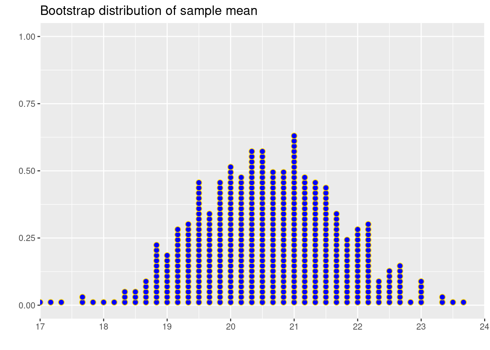

# Practice Problems 7


## Problem 1: Using Search Engines on the Internet

A 2012 survey of a random sample of 2253 US adults found that 1,329 of them reported using a search engine (such as Google) every day to find information on the Internet.  

### a).  Find the relevant proportion and give the correct notation with it.  

<details>
<summary><red>Click for answer</red></summary>
*Answer:* $\hat{p} = 1329/2253$


```r
p.hat <- 1329/2253
p.hat
```

```
[1] 0.5898802
```

</details><br>

### b).  Is your answer to part (a) a parameter or a statistic?  

<details>
<summary><red>Click for answer</red></summary>
*Answer:* Statistic
</details><br>

### c).  Give notation for and define the population parameter that we estimate using the result of part (a).

<details>
<summary><red>Click for answer</red></summary>
*Answer:* p = the proportion of all US adults that would report that they use an Internet search engine every day
</details><br>

## Problem 2: Bootstrapping mean

Let's visualize the distribution of the sample mean. The following is a vector X containing the $6$ data points:


```r
X <- c(20, 24, 19, 23, 22, 16)  # our data
```

We start by creating 500 bootstrap samples from our data. Bootstrapping is a resampling technique where we sample with replacement from the original data, usually the same number of observations as the original dataset, to create 'new' samples. This process mimics the sampling variability inherent in collecting data. For each bootstrap sample, we calculate the mean.


```r
bootstrapped_means <- sapply(1:500, function(i) mean(sample(X, replace = TRUE)))

# Or using replicate which is more concise for this case:
bootstrapped_means <- replicate(500, mean(sample(X, replace = TRUE)))

# To get a data frame similar to the tibble you created with purrr:
bootstrapped_means_df <- data.frame(
  iteration = 1:500,
  mean = bootstrapped_means
)
```


After calculating the bootstrap sample means, we visualize their distribution using a dot plot. This plot will give us a sense of the sampling distribution of the mean - showing us where the mean is most likely to fall and how much it can vary.


```r
library(ggplot2)
ggplot(bootstrapped_means_df, aes(x = mean)) +
  geom_dotplot(dotsize = 0.7, 
               stackratio = 0.9, 
               binwidth = .13, 
               color = "gold", 
               fill = "blue") +
  ggtitle("") + xlab("") + ylab("") +
  scale_x_continuous(limits = c(17, 24), 
                     expand = c(0, 0), 
                     breaks = seq(17, 24, 1)) +
  labs(title = "Bootstrap distribution of sample mean")
```




