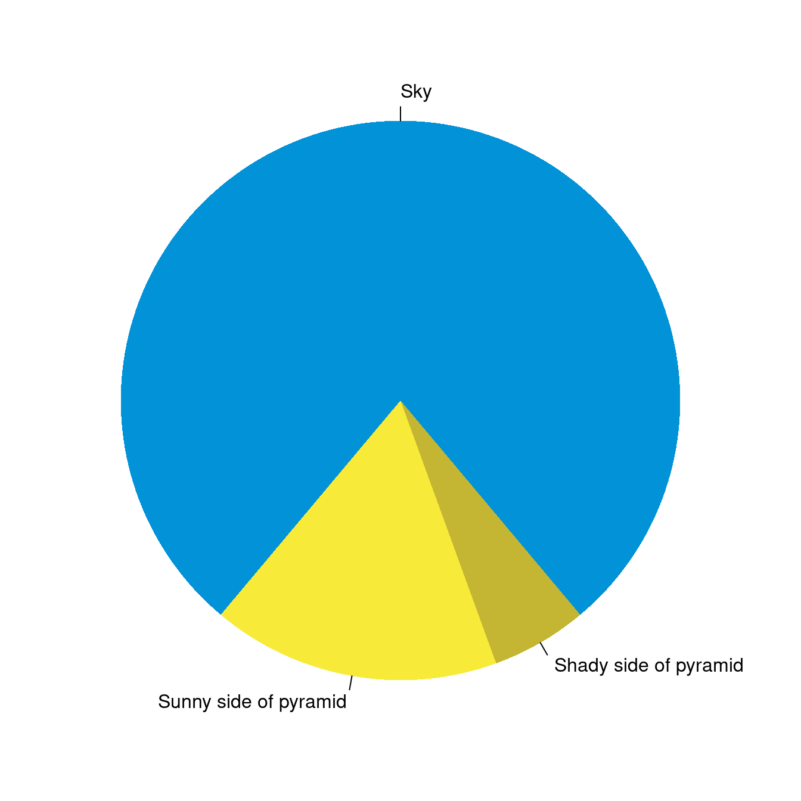

# What is R?

R is a free and open source statistical programming language that facilitates statistical computation. There are a myriad of application that can be done in R, thanks to a huge online support community and dedicated packages. However, R has no graphical user interface and it has to be run by typing commands into a text interface. 


## What is RStudio?

RStudio provides graphical interface to R! You can think of RStudio as a graphical front-end to R that that provides extra functionality. The use of the R programming language with the RStudio interface is an essential component of this course. 


## R Studio Server

The quickest way to get started is to go to [https://maize.mathcs.carleton.edu](https://maize.mathcs.carleton.edu), which opens an R Studio window in your web browser. Once logged in, I recommend that you do the following:

- Step 1: Create a folder for this course where you can save all of your work. In the Files window, click on New Folder.
- Step 2: Click on Tools -> Global Options -> R Markdown. Then uncheck the box that says "Show output inline..."

(It is also possible to download RStudio on your own laptop. Instructions may be found at the end of this document.)


## R Markdown Basics

An R Markdown file (.Rmd file) combines R commands and written analyses, which are 'knit' together into an HTML, PDF, or Microsoft Word document. 

An R Markdown file contains three essential elements:

- Header: The header (top) of the file contains information like the document title, author, date and your preferred output format (pdf_document, word_document, or html_document).

- Written analysis: You write up your analysis after the header and embed R code where needed. The online help below shows ways to add formatting details like bold words, lists, section labels, etc to your final pdf/word/html document. For example, adding ** before and after a word will bold that word in your compiled document. 

- R chunks: R chunks contain the R commands that you want evaluated. You embed these chunks within your written analysis and they are evaluated when you compile the document.

### R Markdown example:
- Simple R Markdown example
  + compiled pdf
  
The following handouts, written by Prof Katie St Clair, contain useful information for making the figured and tables in your compiled documents look nice:

- Graph Formatting: Markdown .Rmd file and pdf 
- Table Formatting: Markdown .Rmd file and pdf

## Installing R/RStudio (not needed if you are using the maize server)

-   Download the latest version of R: 
    - Windows: [http://cran.r-project.org/bin/windows/base/](http://cran.r-project.org/bin/windows/base/)
    - Mac: [http://cran.r-project.org/bin/macosx/](http://cran.r-project.org/bin/macosx/)

-   Download the free Rstudio desktop version (Windows or Mac): <https://www.rstudio.com/products/rstudio/download/>

  Use the default download and install options for each.

## Install LaTeX (for knitting R Markdown documents to PDF): 

If you want to compile R Markdown to .pdf files, you also need a LaTeX distribution (Note: this is not necessary if you choose to compile as a Word document.) Click [instructions for Windows](http://www.miktex.org/) or [instructions for Mac]( https://tug.org/mactex/), depending on your operating system to complete the installation.


## Updating R/RStudio (not needed if you are using the maize server)

If you have used a local version of R/RStudio before and it is still installed on your machine, then you should make sure that you have the most recent versions of each program.

-   To check your version of R, run the command `getRversion()` and compare your version to the newest version posted on  <https://cran.r-project.org/>. If you need an update, then install the newer version using the installation directions above.

-   In RStudio, check for updates with the menu option `Help > Check for updates`. Follow directions if an update is needed.


<!--chapter:end:RStudio.Rmd-->

# R Markdown

This is a R Markdown document. Markdown is a simple formatting syntax for authoring HTML, PDF, and MS Word documents. For more details on using R Markdown see <http://rmarkdown.rstudio.com>.

You can use asterisk mark to provide emphasis, such as `*italics* or **bold**`.

You can create lists with a dash:

```r
- Item 1
- Item 2
- Item 3
  + Subitem 1
* Item 4
```

- Item 1
- Item 2
- Item 3
  + Subitem 1
* Item 4


You can embed Latex equations in-line, $\frac{1}{n} \sum_{i=1}^{n} x_{i}$ or in a new line as

$$\text{Var}(X) = \frac{1}{n-1}\sum_{i-1}^{n} (x_{i} - \bar{x})^2 $$
## Embed an R code chunk:

```
Use back ticks to 
create a block of code
```

You can also evaluate and display the results of R code. Each tasks can be accomplished in a suitably labeled chunk like the following:


```r
summary(cars)
#>      speed           dist       
#>  Min.   : 4.0   Min.   :  2.00  
#>  1st Qu.:12.0   1st Qu.: 26.00  
#>  Median :15.0   Median : 36.00  
#>  Mean   :15.4   Mean   : 42.98  
#>  3rd Qu.:19.0   3rd Qu.: 56.00  
#>  Max.   :25.0   Max.   :120.00
fit <- lm(dist ~ speed, data = cars)
fit
#> 
#> Call:
#> lm(formula = dist ~ speed, data = cars)
#> 
#> Coefficients:
#> (Intercept)        speed  
#>     -17.579        3.932
```


## Including Plots

You can also embed plots. See Figure \@ref(fig:pie) for example:


```r
par(mar = c(0, 1, 0, 1))
pie(
  c(280, 60, 20),
  c('Sky', 'Sunny side of pyramid', 'Shady side of pyramid'),
  col = c('#0292D8', '#F7EA39', '#C4B632'),
  init.angle = -50, border = NA
)
```

<div class="figure">

<p class="caption">(\#fig:pie)A fancy pie chart.</p>
</div>

## Read in data files


```r
simple_data <- read.csv("https://deepbas.io/data/simple-1.dat", )
summary(simple_data) 
#>    initials            state                age      
#>  Length:3           Length:3           Min.   :45.0  
#>  Class :character   Class :character   1st Qu.:47.5  
#>  Mode  :character   Mode  :character   Median :50.0  
#>                                        Mean   :52.0  
#>                                        3rd Qu.:55.5  
#>                                        Max.   :61.0  
#>      time          
#>  Length:3          
#>  Class :character  
#>  Mode  :character  
#>                    
#>                    
#> 
```


```r
knitr::kable(simple_data, format = "html")
```

<table>
 <thead>
  <tr>
   <th style="text-align:left;"> initials </th>
   <th style="text-align:left;"> state </th>
   <th style="text-align:right;"> age </th>
   <th style="text-align:left;"> time </th>
  </tr>
 </thead>
<tbody>
  <tr>
   <td style="text-align:left;"> vib </td>
   <td style="text-align:left;"> MA </td>
   <td style="text-align:right;"> 61 </td>
   <td style="text-align:left;"> 6:01 </td>
  </tr>
  <tr>
   <td style="text-align:left;"> adc </td>
   <td style="text-align:left;"> TX </td>
   <td style="text-align:right;"> 45 </td>
   <td style="text-align:left;"> 5:45 </td>
  </tr>
  <tr>
   <td style="text-align:left;"> kme </td>
   <td style="text-align:left;"> CT </td>
   <td style="text-align:right;"> 50 </td>
   <td style="text-align:left;"> 4:19 </td>
  </tr>
</tbody>
</table>

## Hide the code

If we enter the `echo = FALSE` option in the R chunk (see the .Rmd file). This prevents the R code from being printed to your document; you just see the results.

```

<table>
 <thead>
  <tr>
   <th style="text-align:left;"> initials </th>
   <th style="text-align:left;"> state </th>
   <th style="text-align:right;"> age </th>
   <th style="text-align:left;"> time </th>
  </tr>
 </thead>
<tbody>
  <tr>
   <td style="text-align:left;"> vib </td>
   <td style="text-align:left;"> MA </td>
   <td style="text-align:right;"> 61 </td>
   <td style="text-align:left;"> 6:01 </td>
  </tr>
  <tr>
   <td style="text-align:left;"> adc </td>
   <td style="text-align:left;"> TX </td>
   <td style="text-align:right;"> 45 </td>
   <td style="text-align:left;"> 5:45 </td>
  </tr>
  <tr>
   <td style="text-align:left;"> kme </td>
   <td style="text-align:left;"> CT </td>
   <td style="text-align:right;"> 50 </td>
   <td style="text-align:left;"> 4:19 </td>
  </tr>
</tbody>
</table>
```


```r
knitr::kable(simple_data, format = "html")
```

<table>
 <thead>
  <tr>
   <th style="text-align:left;"> initials </th>
   <th style="text-align:left;"> state </th>
   <th style="text-align:right;"> age </th>
   <th style="text-align:left;"> time </th>
  </tr>
 </thead>
<tbody>
  <tr>
   <td style="text-align:left;"> vib </td>
   <td style="text-align:left;"> MA </td>
   <td style="text-align:right;"> 61 </td>
   <td style="text-align:left;"> 6:01 </td>
  </tr>
  <tr>
   <td style="text-align:left;"> adc </td>
   <td style="text-align:left;"> TX </td>
   <td style="text-align:right;"> 45 </td>
   <td style="text-align:left;"> 5:45 </td>
  </tr>
  <tr>
   <td style="text-align:left;"> kme </td>
   <td style="text-align:left;"> CT </td>
   <td style="text-align:right;"> 50 </td>
   <td style="text-align:left;"> 4:19 </td>
  </tr>
</tbody>
</table>

<!--chapter:end:Rmarkdown.Rmd-->

# Conclusion


<details>
<summary><red>Click for answer</red></summary>
The correct answer is a. If there is a difference, we expect the between group variability to be higher than within group variability. <blue>RIGHT TAIL test!</blue>
</details>


<br>

```r
Temperature  =  37.7 + 0.231 Chirps
Predictor       Coef    SE Coef      T    Pr(>|t|)    
Constant    37.67858    1.97817   19.05  7.35e-06 ***
Chirps       0.23067    0.01423   16.21  1.63e-05 ***
```

<br>


```r
survey <- read.csv("https://raw.githubusercontent.com/deepbas/statdatasets/main/StudentSurvey.csv")
mean(survey$Pulse) # the command `mean` computes an average
#> [1] 69.57459
```

<br>


ROCK | PAPER | SCISSORS | TOTAL
----| ---- | ------|-------
36 | 12 | 37 | 85 

<br>

<bql>
First year at Carleton
</bql>

- Originally from Nepal
- PhD in Applied Statistics from

**UC-Riverside**

- Diverse education background
- Avid learner and traveler


<!--chapter:end:Conclusion.Rmd-->

