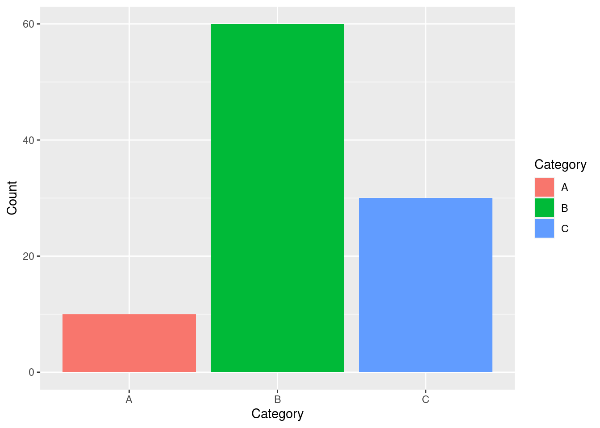

# Tutorial 2: Dive Deeper into Data Visualization and Statistics in R


## Introduction

This tutorial aims to enhance your data manipulation and visualization skills by introducing you to ggplot2, one of the most widely-used data visualization packages in R.

---

## ggplot2 Essentials

### Introduction to ggplot

`ggplot2` is a data visualization package built upon the principles of "The Grammar of Graphics." To use ggplot, you'll first need to install and load the package.


```r
# install.packages("ggplot2")   # uncomment to install
library(ggplot2)
```


### Simple Bar Graph Using `geom_bar()`

The `geom_bar()` function is used to create bar graphs. A simple usage might look like:


```r
# Create some example data
data <- data.frame(Category = c("A", "B", "C"), Count = c(10, 60, 30))

# Create the bar graph
ggplot(data, aes(x=Category, y=Count)) +
  geom_bar(stat="identity")
```


### Adding Aesthetics with `aes()`

The `aes()` function is used to map variables to visual properties (aesthetics) of the graph.


```r
# Create a graph with different colors for each bar
ggplot(data, aes(x=Category, y=Count, fill=Category)) +
  geom_bar(stat="identity")
```




### Facet Plots Using `facet_wrap()`

The `facet_wrap()` function splits the data into subplots based on a factor variable.


```r
# Create more complex data
data2 <- data.frame(Category = c("A", "A", "B", "B", "C", "C"),
                    Count = c(10, 20, 30, 40, 50, 60),
                    Type = c("big", "small", "big", "small", "big", "small"))

# Create the facet plot
ggplot(data2, aes(x=Category, y=Count, fill=Type)) +
  geom_bar(stat="identity") +
  facet_wrap(~Type)
```


## Working with Tables and Proportions

### Using `table()` Function

The `table()` function in R generates a table of frequencies of different combinations of factor variables.


```r
# Frequency table
# Replicating the gender and choice data
rep_gender <- rep(c("Male", "Female", "Female", "Female", "Male"), times = 20)
rep_choice <- rep(c("No", "No", "Yes", "No", "Yes"), times = 20)

# Generating the enlarged frequency table
data <- data.frame(gender = rep_gender, choice = rep_choice)
data
```

```
    gender choice
1     Male     No
2   Female     No
3   Female    Yes
4   Female     No
5     Male    Yes
6     Male     No
7   Female     No
8   Female    Yes
9   Female     No
10    Male    Yes
11    Male     No
12  Female     No
13  Female    Yes
14  Female     No
15    Male    Yes
16    Male     No
17  Female     No
18  Female    Yes
19  Female     No
20    Male    Yes
21    Male     No
22  Female     No
23  Female    Yes
24  Female     No
25    Male    Yes
26    Male     No
27  Female     No
28  Female    Yes
29  Female     No
30    Male    Yes
31    Male     No
32  Female     No
33  Female    Yes
34  Female     No
35    Male    Yes
36    Male     No
37  Female     No
38  Female    Yes
39  Female     No
40    Male    Yes
41    Male     No
42  Female     No
43  Female    Yes
44  Female     No
45    Male    Yes
46    Male     No
47  Female     No
48  Female    Yes
49  Female     No
50    Male    Yes
51    Male     No
52  Female     No
53  Female    Yes
54  Female     No
55    Male    Yes
56    Male     No
57  Female     No
58  Female    Yes
59  Female     No
60    Male    Yes
61    Male     No
62  Female     No
63  Female    Yes
64  Female     No
65    Male    Yes
66    Male     No
67  Female     No
68  Female    Yes
69  Female     No
70    Male    Yes
71    Male     No
72  Female     No
73  Female    Yes
74  Female     No
75    Male    Yes
76    Male     No
77  Female     No
78  Female    Yes
79  Female     No
80    Male    Yes
81    Male     No
82  Female     No
83  Female    Yes
84  Female     No
85    Male    Yes
86    Male     No
87  Female     No
88  Female    Yes
89  Female     No
90    Male    Yes
91    Male     No
92  Female     No
93  Female    Yes
94  Female     No
95    Male    Yes
96    Male     No
97  Female     No
98  Female    Yes
99  Female     No
100   Male    Yes
```


The `rep()` function in R replicates the specified elements in the input vector for the number of times provided in the times argument.


```r
table_data <- table(rep_gender, rep_choice)
table_data
```

```
          rep_choice
rep_gender No Yes
    Female 40  20
    Male   20  20
```


### Using `prop.table()` to Get Proportions


```r
# Proportion table
prop_table_data <- prop.table(table_data)
prop_table_data
```

```
          rep_choice
rep_gender  No Yes
    Female 0.4 0.2
    Male   0.2 0.2
```


## Combining All Together

Let's visualize this data using ggplot, geom_bar, and facet_wrap.


```r
ggplot(data, aes(x = gender, fill = choice)) + 
  geom_bar() + 
  labs(y="Proportion", title = "Choice by gender") + 
  scale_fill_manual(values=c("#4169E1", "#FFC72C")) +
  facet_wrap(~choice)
```


