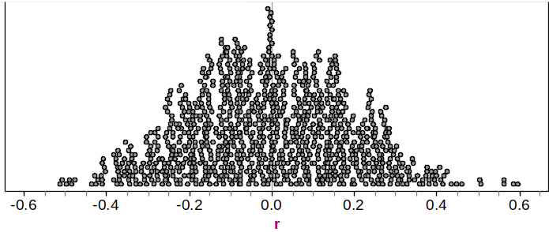
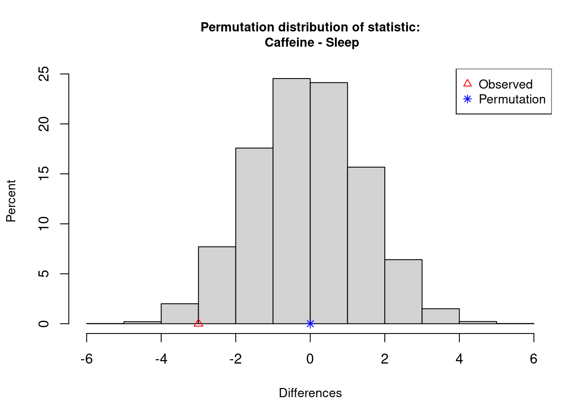
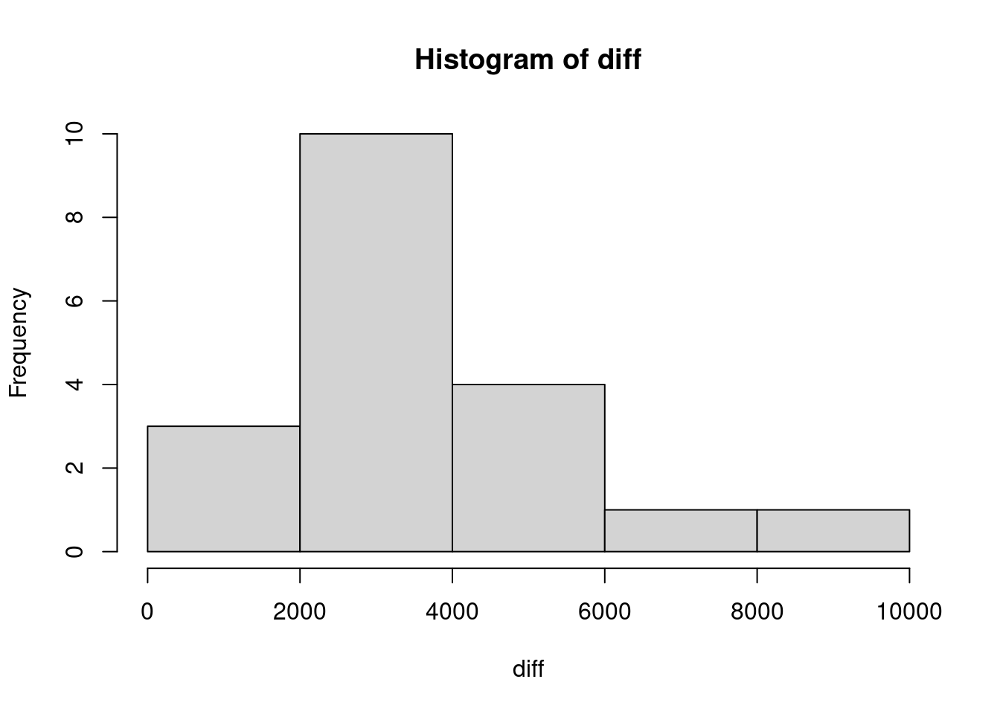
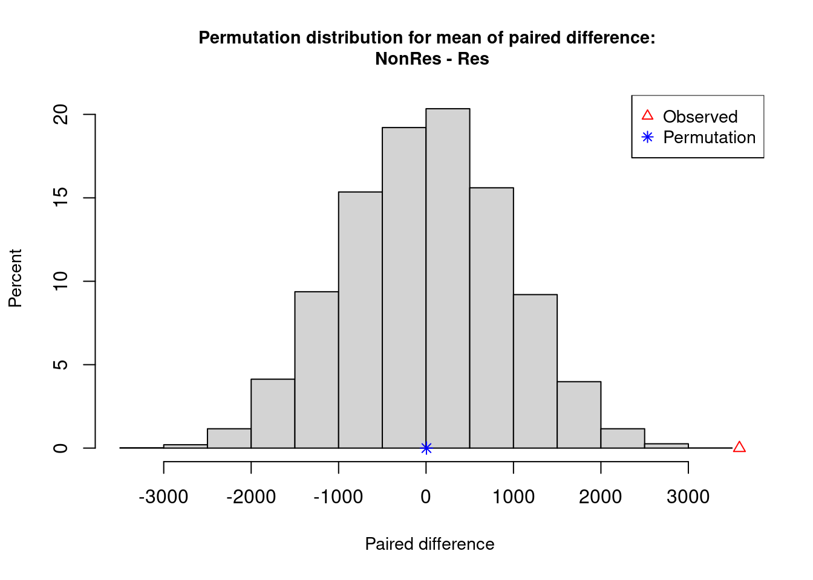
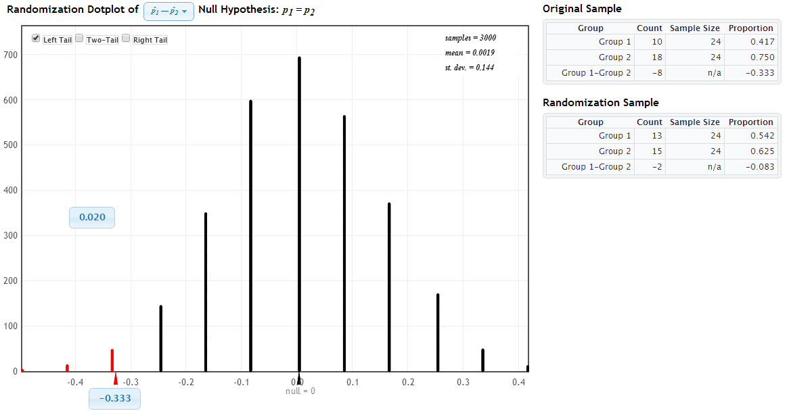

# Class Activity 12


### Example 1: ESP

In an ESP test, one person writes down one of the letters A, B, C, D, or E and tries to telepathically communicate the choice to a partner.  The partner then tries to guess what letter was selected. The null and alternative hypotheses for testing whether people have ESP are  $H_0: p=0.2$  and $H_A: p > 0.2$ where $p$ is the true proportion correct guesses. To test these hypotheses, we try this $n=10$ times and get 3 correct guesses.

 (a). 	Explain how to generate a randomization distribution for $\hat{p}$, the sample proportion of correct guesses, that is consistent with $H_0: p=0.2$.
<details><summary><red>Click for answer</red></summary>
*Answer:* To mimic one random guess, assuming no ESP, we could take 4 black cards and 1 red card and randomly select one card. The red card would be a correct guess. Repeat this a total of 10 times and compute the sample proportion of correct guesses. Plot the sample proportion on a dotplot and repeat lots more times.
</details><br>

 (b). Navigate to the Statkey website. 
Select the **Test for Single Proportion** option under **Randomization Hypothesis Tests**. Click **Edit Data** and enter a **count** of 3 and **sample size** of 10. Then select the **Null Hypothesis** proportion **p** and change its value to **0.20**. 

- **Generate 1 Sample** from this null randomization distribution. How many correct guesses were obtained in this sample? Repeat this a couple of times.
- **Generate 1000 Samples** a couple of times. How unusual is getting at least 3 correct guesses in 10 tries?

\vspace*{.5in}

 (c). 	Compute the randomization p-value
Select the **Right Tail** button at the top of the plot. Change the x-axis value to $\hat{p}$ = 0.3. What is the p-value: the proportion of resampled $\hat{p}$ values are 0.30 or above? 
<details><summary><red>Click for answer</red></summary>
*Answer:* The p-value is about 31%
</details><br>
 (d). 	Interpret + Conclusion
Interpret the p-value. Does the p-value support the alternative hypothesis (do you think 3 correct out of 10 tries are statistically significant results) or is it inconclusive? Explain.
<details><summary><red>Click for answer</red></summary>
*Answer:* In about 31% of all samples with 10 attempts, we would get at least 3 correct guesses, just by chance, if ESP does not exist. It is inconclusive; the data we observed is not that unusual if ESP does not exist.

### Example 2:  Which P-value shows more evidence?

Using the randomization distribution below to test $H_0: \rho = 0$ vs. $H_A: \rho > 0$.




 (a).	Match the p-value and sample statistic
Match the sample correlation and p-values given below, shading the area on the randomization distribution that corresponds to each sample correlation/p-value combo.

- Sample correlations: $r = 0.1,  r=0.3,  r = 0.5$
- P-values:  $0.005,   0.15,   0.35$
<details><summary><red>Click for answer</red></summary>
*Answer:*: $r=0.1$ and $p-value=0.35$; $r=0.3$ and $p-value=0.15$; $r=0.5$ and $p-value=0.005$; 
</details><br>
 (b).	Which sample correlation/p-value combo shows the most evidence for the alternative hypothesis?
<details><summary><red>Click for answer</red></summary>
*Answer:* The smaller the p-value and further the sample correlation is from 0, the stronger the evidence
</details><br>

### Example 3:  Sleep or Caffeine for Memory

In an experiment, 24 students were given words to memorize, then were randomly assigned to take a 90 minute nap or take a caffeine pill (12 in each group).  They were then tested on their recall ability.  We test to see if the sample provides evidence that there is a difference in mean number of words people can recall depending on whether they take a nap or have some caffeine.  The hypotheses are: 
$$
H_0: \mu_S - \mu_C = 0 \ \ H_A: \mu_S - \mu_C \neq 0
$$
The sample mean difference is $\bar{x}_S - \bar{x}_C = 3$. We want to know if this difference in sample means is statistically significant. 

 (a). Explain how to generate a randomization distribution for $\bar{x}_S - \bar{x}_C$ that is consistent with $H_0: \mu_S - \mu_C = 0$.
<details><summary><red>Click for answer</red></summary>
*Answer:* We could randomly reassign the treatment to the study participants since, under the null, their recall abilities would be the same under either treatment. For each reassignment, we recomputed the sample mean difference and plot it in the dotplot shown below
</details><br>

 (b). Navigate to the Statkey website. 
Select the **Test for Difference in Means** option under **Randomization Hypothesis Tests**. Change the data set from **Leniency and Smiles** to **Sleep Caffeine Words**. Note that the original sample data has a sample mean difference of 3 words.  

- **Generate 1 Sample** from this null randomization distribution. What is the difference in the average word recall of the two groups in this sample? Repeat this a couple of times.
- **Generate 1000 Samples** a few of times (get at least 3000 resamples). How unusual is getting a difference in means of 3 or more words?

\vspace*{.5in}

 (c). 	Compute the randomization p-value
Select the **Two-Tail** button at the top of the plot. Change the positive x-axis value to the observed difference of 3.0. The p-value is 2 times the proportion of resamples that have a difference of 3 or above. What is the p-value? 


<details><summary><red>Click for answer</red></summary>
*Answer:* We see in the image that the proportion in the tail beyond the sample statistic of 3.0 is 0.022.  Because this is a two-tail test, we have to account for both tails, so the p-value is 2(0.022) = 0.044.
</details><br>
 (d). 	Interpret + Conclusion
Interpret the p-value. Does the p-value support the alternative hypothesis (do you think difference of means of 3 is statistically significant) or is it inconclusive? Explain.
<details><summary><red>Click for answer</red></summary>
*Answer:* We would see a difference of at least 3 words recalled, on average, in about 4.4% of all possible samples if the influence of sleep and caffeine on recall was the same The results show some evidence of statistical significance, meaning that the caffeine and sleep may have some difference effects on word recall ability. 
</details><br>

 (e). Redo in Rstudio
First get the data from the Lock website and check important summary stats:


```r
wordData <- read.csv("http://math.carleton.edu/Stats215/Textbook/SleepCaffeine.csv")
boxplot(Words ~ Group , data=wordData)
```


```r
tapply(wordData$Words, wordData$Group, summary)
```

```
$Caffeine
   Min. 1st Qu.  Median    Mean 3rd Qu.    Max. 
   6.00   10.00   12.50   12.25   14.25   18.00 

$Sleep
   Min. 1st Qu.  Median    Mean 3rd Qu.    Max. 
   9.00   13.75   15.50   15.25   17.25   21.00 
```

Then load the `CarletonStats` package and run the `permTest(y ~ x, data=)` command where `y` is your quantitative (or 0/1 coded) response and `x` defines the two groups you are comparing. 


```r
library(CarletonStats)
permTest(Words ~ Group, data=wordData)
```



```

	** Permutation test **

 Permutation test with alternative: two.sided 
 Observed statistic
  Caffeine :  12.25 	 Sleep :  15.25 
 Observed difference: -3 

 Mean of permutation distribution: -0.01555 
 Standard error of permutation distribution: 1.50151 
 P-value:  0.054 

	*-------------*
```

- Why is the observed difference reported as -3?
<details><summary><red>Click for answer</red></summary>
*Answer:* The difference is computed alphabetically: Caffeine minus Sleep so the difference in now -3 instead of +3. 
</details><br>
- What is the p-value? Is it the same as the Statkey p-value? The same as your neighbors p-value? Why not?
<details><summary><red>Click for answer</red></summary>
*Answer:* The p-value is around 5%. Any difference between Statkey, neighbors or different runs of the `permTest` command stem from the fact that different resamples are obtained each time a randomization distribution is generated. There may be some small (inconsequential) difference in p-values due to this.
</details><br>

### Example 4:  Resident vs Non-resident Tuition

The lab manual data set `Tuition2006` is a random sample of state colleges and universities in the U.S. We want to know if the average tuition  charged to  non-residents is higher than residents  for all state colleges and universities:

$$
H_0: \mu_{Non-res} - \mu_{Res} = 0 \ \ H_A: \mu_{Non-res} - \mu_{Res} > 0
$$

 (a). Paired Data

Read in the data. Note that each case (school) has a response value for the resident and non-resident tuition variables. This makes this a paired data example. Contrast this with the word recall example in which each case (student) only had one response (word recall) and treatment (caffeine/sleep). 


```r
tuition <- read.csv("http://math.carleton.edu/Stats215/RLabManual/Tuition2006.csv")
head(tuition)
```

```
  X        Institution  Res NonRes  Diff
1 1 Univ of Akron (OH) 4200   8800 -4600
2 2  Athens State (AL) 1900   3600 -1700
3 3    Ball State (IN) 3400   8600 -5200
4 4  Bloomsburg U (PA) 3200   7000 -3800
5 5     UC Irvine (CA) 3400  12700 -9300
6 6 Central State (OH) 2600   5700 -3100
```


 (b). Permutation test for paired data
Let's compute the difference of non-resident and resident tuitions (NR minus R):


```r
diff <- tuition$NonRes - tuition$Res
summary(diff)
```

```
   Min. 1st Qu.  Median    Mean 3rd Qu.    Max. 
    200    2650    3100    3584    4500    9300 
```

```r
hist(diff)
```



- What is the average difference in tuition costs?
<details><summary><red>Click for answer</red></summary>
*Answer:* The observed mean difference is $3584
</details><br>

- Is this observed mean difference statistically significant? To test use the command `permTestPaired`:

```r
permTestPaired(NonRes ~ Res,data = tuition, alt = "greater")
```



```

	** Permutation test for mean of paired difference **

 Permutation test with alternative: greater 
 Observed mean
  NonRes :  6405.263 	 Res :  2821.053 
 Observed difference  NonRes - Res : 3584.211 

 Mean of permutation distribution: 0.7006 
 Standard error of permutation distribution: 944.6721 
 P-value:  1e-04 

	*-------------*
```
The `alt` of `greater` was used because the function `permTestPaired(A ~ B)` computes paired differences as "A" minus "B". 

- What is the p-value for this test?
<details><summary><red>Click for answer</red></summary>
*Answer:* Less than 0.0001
</details><br>
- Is this observed mean difference statistically significant? 
<details><summary><red>Click for answer</red></summary>
*Answer:* Yes, an observed mean difference of at least $3584 would rarely occur just by chance which provides us strong evidence that the mean tuition amount of non-residents is higher than residents in the population of state colleges and universities (in 2006).
</details><br>
### Example 5: Evaluating Drugs to Fight Cocaine Addition

In a randomized experiment on treating cocaine addiction, 48 cocaine addicts who were trying to quit were randomly assigned to take either desipramine (a new drug), or Lithium (an existing drug).  The response variable is whether or not the person relapsed (which means the person was unable to break out of the cycle of addiction and returned to using cocaine.)  **We are testing to see if desipramine is better than lithium at treating cocaine addiction.**  The results are shown in the two-way table.

\ | Relapse | No Relapse | total
---- | ---- | ----- | -----
Desipramine | 10 | 14 | 24
Lithium | 18 | 6 | 24

 (a). 	Using $p_D$ for the true proportion of desipramine users who relapse and $p_L$ for the true proportion of lithium users who relapse, write the null and alternative hypotheses.
<details><summary><red>Click for answer</red></summary>
*Answer:* $H_0: p_D - p_L =0$ vs. $H_A: p_D - p_L < 0$
</details><br>
 (b).	Compute the appropriate sample statistic needed to assess the hypotheses above. 
<details><summary><red>Click for answer</red></summary>
*Answer:* We see that $\hat{p}_D = \dfrac{10}{24} = 0.417$ and $\hat{p}_L = \dfrac{18}{24} = 0.75$ so we have $\hat{p}_D -\hat{p}_L =  0.417 - 0.75 = -0.333$. Be sure to compute the **difference** since we need one number (observed difference) to test the hypotheses, not two separate numbers. You could also compute the difference as $L-D$ and get +0.333. 
</details><br>

 (c).	How might we compute a randomization sample for this data? 
<details><summary><red>Click for answer</red></summary>
*Answer:* Since drug doesn’t matter, we combine all 48 patients together and see that 28 relapsed and 20 didn’t.  To see what happens by random chance, we randomly divide them into two groups and compute the difference in proportions of relapses between the two groups.  The difference in proportions is the statistic.
</details><br>
 (d). Navigate to the Statkey website. 
Select the **Test for Difference in Proportions** option under **Randomization Hypothesis Tests**. Click **Edit Data** and let Group 1 be "Desipramine" and 2 be "Lithium",  enter relapse **counts** of 10 and 18 and **sample sizes** of 24. Check that the null hypothesis matches yours in (a). Generate a couple thousand samples. Describe the resulting distribution.  Where is it centered? 

<details><summary><red>Click for answer</red></summary>
*Answer:* The resulting distribution, shown in Figure 1,  will be bell-shaped and centered at the value from the null hypothesis, which is zero.


</details><br>

 (e).	Compute and interpret the p-value for this test.  

<details><summary><red>Click for answer</red></summary>
*Answer:* This is a left-tail test when computing the difference as D - L, and we see on StatKey that the p-value (proportion of randomization samples with a difference -.333 or smaller) is about 2 (Figure 1).  About 2% of the time we would see at least 33% fewer relapse cases using despramine than lithium just due to chance if there was no difference in the relapse rates of the two treatments. 

Note the two key features of this “in context” interpretation of 2%: it assumes that the null is true (no treatment difference) and it uses the observed statistic (data) used to compute the p-value (rate of despramine relapse is .33 below the rate of lithium).
</details><br>
 (f).	Make a formal decision (reject or not) using a 5% significance level, then restate your conclusion in context for the problem (do not use words like “reject” or “hypothesis”).
<details><summary><red>Click for answer</red></summary>
*Answer:* We reject the null hypothesis since the p-value of 2% is less than 5%.  We can conclude that despramine is better at helping people kick the cocaine habit.
Note the “in context” conclusion: Just state your conclusion in english, no need to talk about the value of the p-value or “just by chance.”
</details><br>

 (g).	Use Statkey to compute and interpret a 95% bootstrap confidence interval for the difference in the relapse proportion for the two treatments.  Explain how this CI agrees with your test conclusion in (f).

<details><summary><red>Click for answer</red></summary>
*Answer:* I am 95% confident that the relapse rate for despramine will be between 8.3 to 58.3 percent less than the relapse rate for lithium.  This completely agrees with the test conclusion that despramine is a better treatment for cocaine addiction. (Figure 2 shows the bootstrap distribution that is centered at the sample difference of -0.333.)


</details><br>

