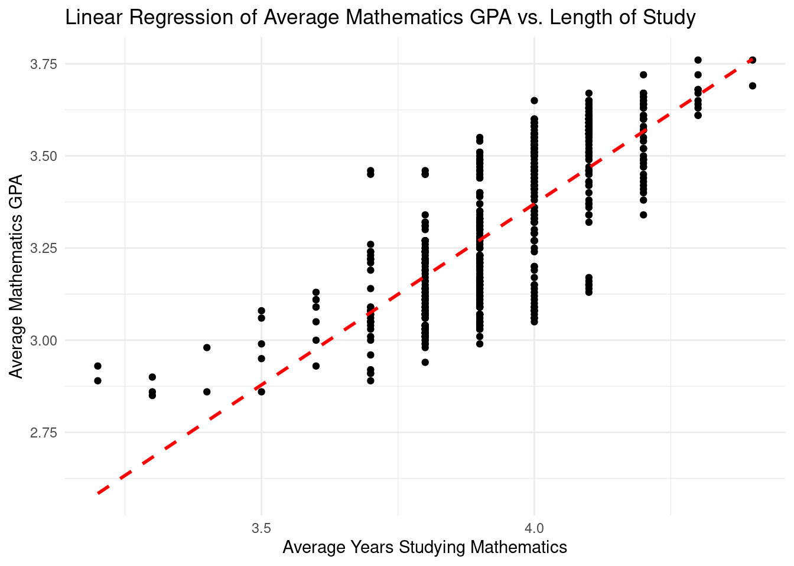
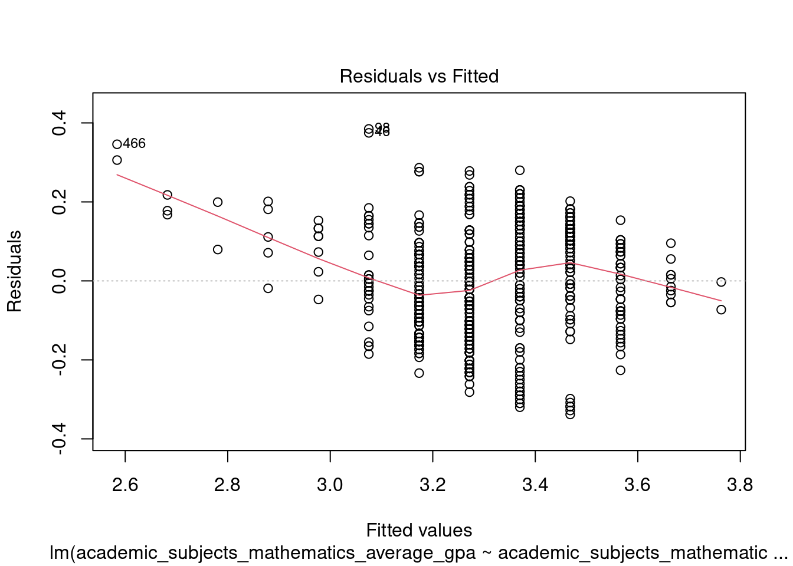
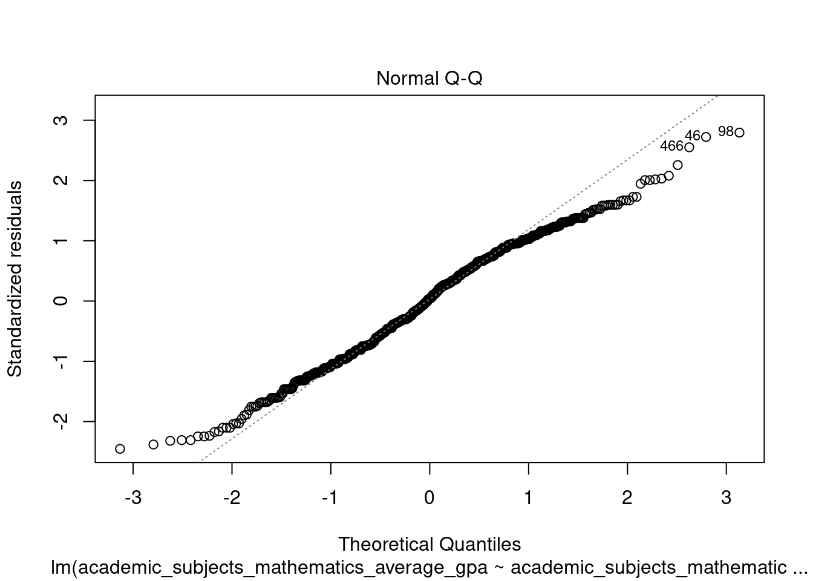
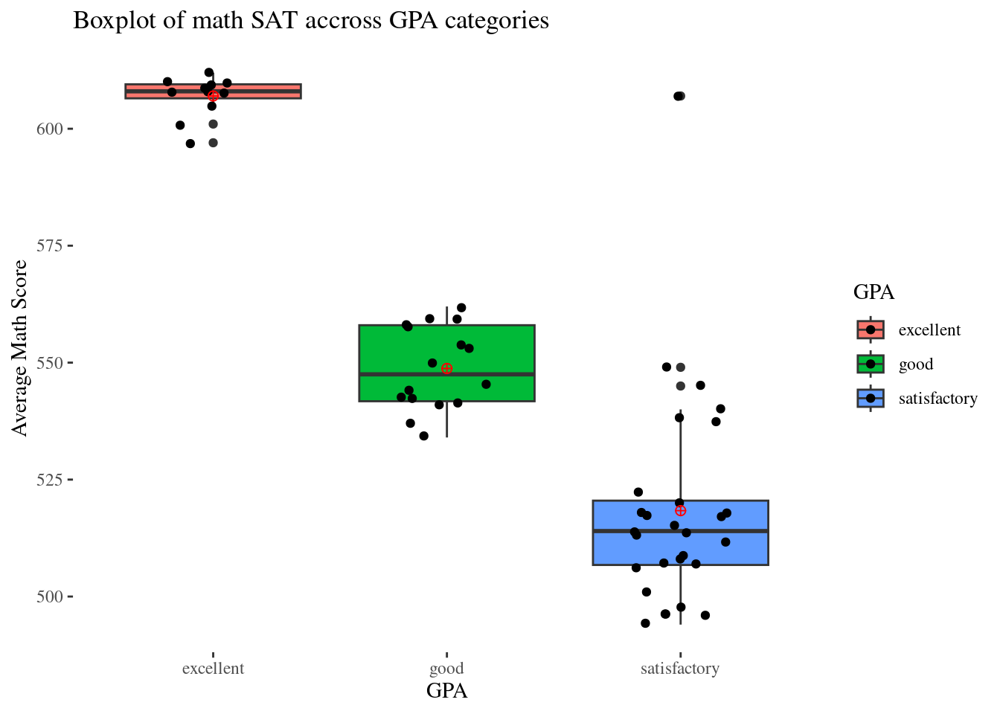
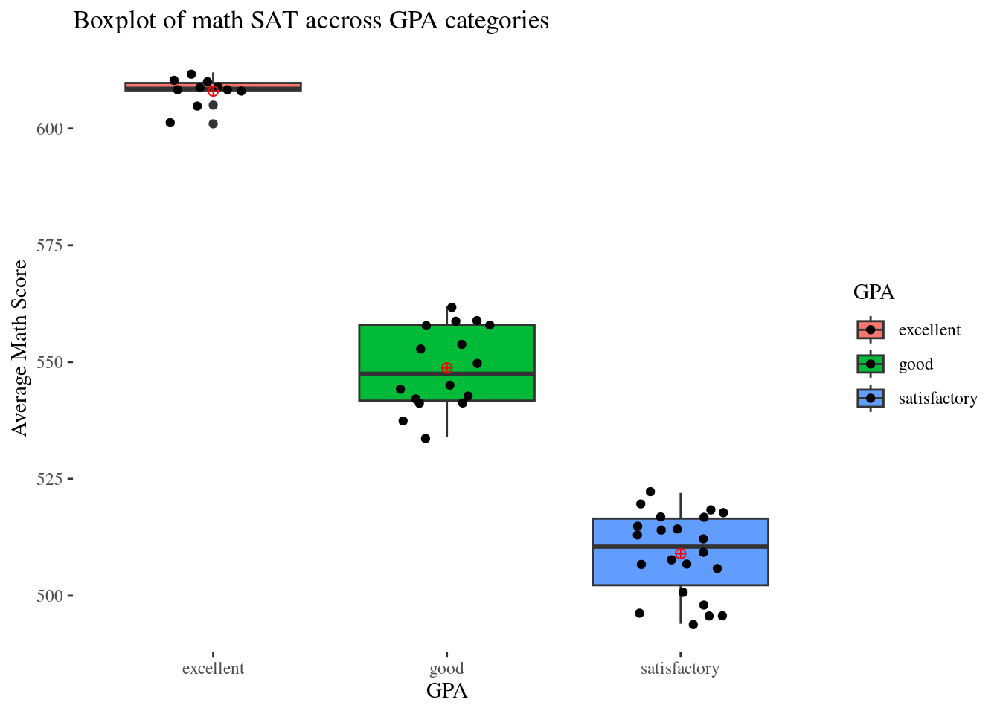

# Class Activity 25


```r
# load necessary libraries
library(readr) # read_csv
library(dplyr) # data manipulation
library(forcats) # categorical variables
library(janitor) # clean_names
library(tidyr) # drop_na
library(tidyverse) # functions form tidy ecosystem
```


## Linear Regression Analysis: Exploring the Relationship between Average Mathematics GPA and Length of Study in Mathematics

This class activity aims to guide you through a data analysis project involving a school score dataset. You will learn how to load a dataset, inspect its contents, manipulate and clean the data, perform exploratory analysis, and apply linear regression to identify relationships. Towards the end, you will deal with outliers and visualize data to comprehend the results better.


### Step 1: Load and Inspect the Data


```r
# Task: Load the school_scores.csv data file from your local directory
school_scores <- read_csv("~/Desktop/Insync/STAT120_Spring23/class_activities/data/school_scores.csv") 
```


```r
# Task: Use the glimpse() function to view the structure of your data.
# glimpse(school_scores)
```


### Step 2: Data Cleaning


```r
# Task: Use janitor's clean_names() function to standardize column names, 
# and tidyr's drop_na() to remove missing values.
school_scores_clean <- school_scores %>%
  janitor::clean_names() %>% 
  tidyr::drop_na()
```


### Step 3: Data Manipulation


```r
# Task: Select relevant variables from the dataset for further analysis.
school_new <- school_scores_clean %>% select(year, 
                                             state_name, 
                                             total_math, 
                                             total_verbal, 
                                             academic_subjects_mathematics_average_gpa, 
                                             academic_subjects_mathematics_average_years)
```


```r
# Task: Create a new categorical variable named 'GPA' from 
# the 'academic_subjects_mathematics_average_gpa' variable.
school_final <- school_new %>% 
  mutate(GPA = case_when(academic_subjects_mathematics_average_gpa < 3 ~ "low",
                         academic_subjects_mathematics_average_gpa >= 3.0 & academic_subjects_mathematics_average_gpa < 3.25 ~ "satisfactory",
                         academic_subjects_mathematics_average_gpa >= 3.25 & academic_subjects_mathematics_average_gpa < 3.5 ~ "good",
                         academic_subjects_mathematics_average_gpa >= 3.5 ~ "excellent"))
```


```r
# Task: Convert the new GPA variable into a factor variable.
school_final <- school_final %>% mutate(GPA = factor(GPA))
```


```r
# Task: Collapse the GPA variable levels into two broad categories.
school_final <- school_final %>% 
  mutate(collapsed_GPA = forcats::fct_collapse(GPA,
                                               Low = c("low", "satisfactory"),
                                               High = c("good", "excellent")))
```


### Step 4: Data Analysis - Linear Regression


```r
# Fit a linear model
ggplot(data = school_final, aes(x = academic_subjects_mathematics_average_years, 
                                y = academic_subjects_mathematics_average_gpa)) +
  geom_point() +
  geom_smooth(method = "lm", se = FALSE, color = "red", linetype = "dashed") +
  labs(x = "Average Years Studying Mathematics", y = "Average Mathematics GPA", 
       title = "Linear Regression of Average Mathematics GPA vs. Length of Study") +
  theme_minimal()
```




```r
# Task: Conduct a linear regression analysis with GPA as the response
# variable and average years studying mathematics as the predictor.
GPA.lm <- lm(academic_subjects_mathematics_average_gpa ~ academic_subjects_mathematics_average_years, 
             data = school_final)
summary(GPA.lm)
```

```

Call:
lm(formula = academic_subjects_mathematics_average_gpa ~ academic_subjects_mathematics_average_years, 
    data = school_final)

Residuals:
     Min       1Q   Median       3Q      Max 
-0.33812 -0.10344  0.00478  0.11188  0.38478 

Coefficients:
                                            Estimate
(Intercept)                                  -0.5592
academic_subjects_mathematics_average_years   0.9823
                                            Std. Error
(Intercept)                                     0.1348
academic_subjects_mathematics_average_years     0.0342
                                            t value
(Intercept)                                  -4.147
academic_subjects_mathematics_average_years  28.725
                                            Pr(>|t|)    
(Intercept)                                 3.87e-05 ***
academic_subjects_mathematics_average_years  < 2e-16 ***
---
Signif. codes:  
0 '***' 0.001 '**' 0.01 '*' 0.05 '.' 0.1 ' ' 1

Residual standard error: 0.138 on 575 degrees of freedom
Multiple R-squared:  0.5893,	Adjusted R-squared:  0.5886 
F-statistic: 825.1 on 1 and 575 DF,  p-value: < 2.2e-16
```


```r
# Task: Generate a Residual plot to assess the regression model's assumptions.
plot(GPA.lm, which = 1)
```




```r
# Task: Generate a QQ plot to visualize the normality of residuals.
plot(GPA.lm, which = 2)
```




### Step 5: Handling Outliers


```r
# Task: Filter the data to only include certain states.
school_selected <- school_final %>% 
  filter(state_name %in% c("Alabama", "California", "Montana", "Minnesota", "Nevada"))
```


```r
# Task: Visualize math SAT scores across GPA categories for the selected
# states using a boxplot, and identify potential outliers.
school_selected %>%
  ggplot(aes(x=GPA,y=total_math,fill=GPA)) +
  theme_bw() +
  geom_boxplot() +
  geom_jitter(width = 0.2) +
  labs(title ="Boxplot of math SAT accross GPA categories",
       y = "Average Math Score",
       x = "GPA") +
  stat_summary(fun=mean, geom="point", shape=10,
               size=2, color="red", fill="black") +
  ggthemes::theme_tufte()
```




```r
# Task: Remove outliers based on pre-determined conditions.
school_selected_no_outlier <-  school_selected %>% 
  filter(GPA == "excellent" & total_math >= 600 &  total_math <= 800 |
           GPA == "good" & total_math >= 525  &  total_math <= 575 |
           GPA == "satisfactory" & total_math >= 425  &  total_math <= 525)
```


### Step 6: Visualizing Cleaned Data


```r
# Task: Re-visualize the boxplot of math SAT scores across
# GPA categories after removing the outliers.
school_selected_no_outlier %>%
  ggplot(aes(x=GPA,y=total_math,fill=GPA)) +
  theme_bw() +
  geom_boxplot() +
  geom_jitter(width = 0.2) +
  labs(title ="Boxplot of math SAT accross GPA categories",
       y = "Average Math Score",
       x = "GPA") +
  stat_summary(fun=mean, geom="point", shape=10,
               size=2, color="red", fill="black") +
  ggthemes::theme_tufte()
```




By the end of this activity, you will have practiced various data analysis techniques, including data manipulation, data cleaning, linear regression, and outlier handling.
