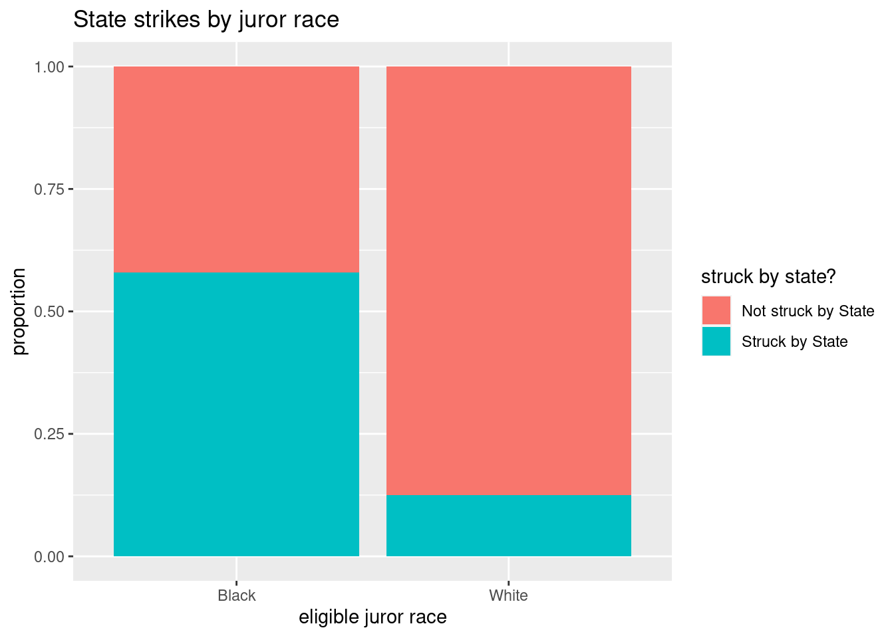
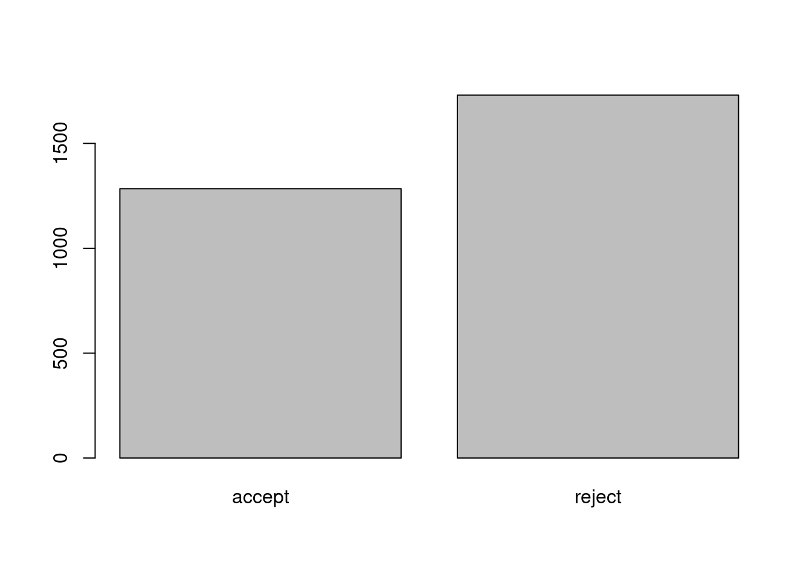
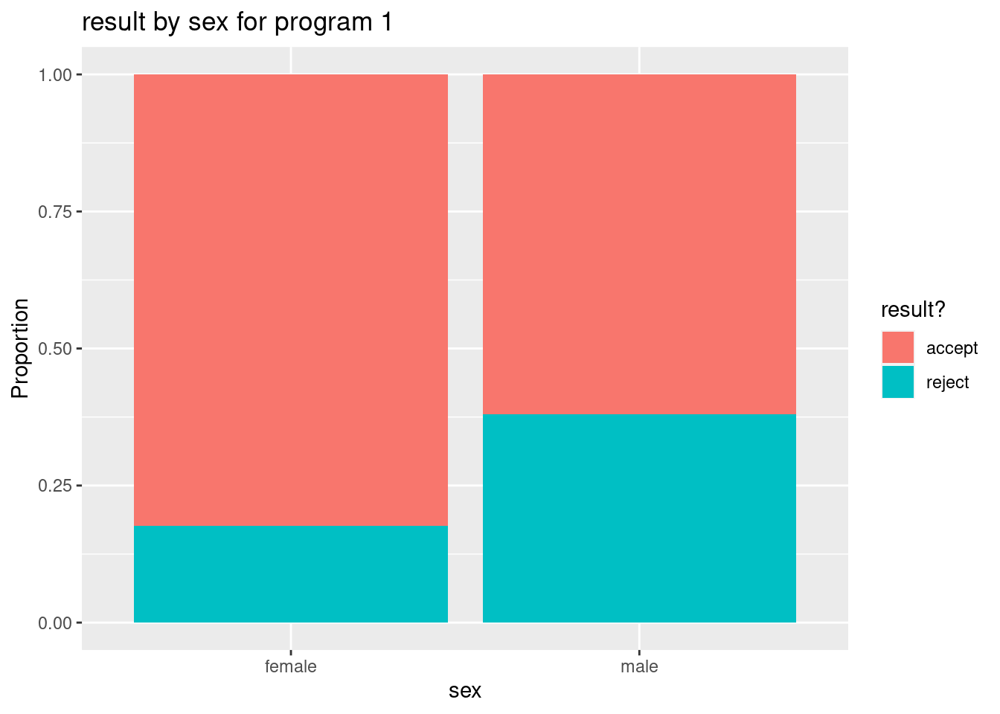

# Class Activity 4

## Your Turn 1

###  Flowers v. Mississippi

The data set `APM_DougEvensCases.csv` contains data from 1517 potential black and white jurors for 66 cases that Doug Evans was primary prosecutor for between 1992 and 2017. These jurors were available for Doug Evans to strike using his "peremptory strikes" during the jury selection phase. 


(a). Inspect data

Read in the data


```r
jurors <- read.csv("https://raw.githubusercontent.com/deepbas/statdatasets/main/APM_DougEvansCases.csv")
```


```r
# dimension of dataset
dim(jurors)
```

```
[1] 1517    6
```

Look at the first **three rows** of the data set


```r
jurors[c(1,2,3), ]
```

```
  trial__id  race        struck_state defendant_race
1         4 Black Not struck by State          White
2         4 Black     Struck by State          White
3         4 White Not struck by State          White
       same_race                     struck_by
1 different race Juror chosen to serve on jury
2 different race           Struck by the state
3      same race Juror chosen to serve on jury
```

To get the data from one variable, we use the command `dataset$variable`. For example, `jurors$struck_state` gives us the data values from the `struck_state` variable, which tells us if a juror was struck by the state from the jury pool. Here we can see the first 10 entries in this variable:


```r
jurors$struck_state[1:10]
```

```
 [1] "Not struck by State" "Struck by State"    
 [3] "Not struck by State" "Not struck by State"
 [5] "Struck by State"     "Not struck by State"
 [7] "Struck by State"     "Not struck by State"
 [9] "Not struck by State" "Not struck by State"
```
<br>

(b). Table of counts and proportions

The `summary` command used with a data frame gives summaries of each variable


```r
summary(jurors)
```

```
   trial__id         race           struck_state      
 Min.   :  4.0   Length:1517        Length:1517       
 1st Qu.: 52.0   Class :character   Class :character  
 Median : 82.0   Mode  :character   Mode  :character  
 Mean   :112.6                                        
 3rd Qu.:170.0                                        
 Max.   :301.0                                        
 defendant_race      same_race          struck_by        
 Length:1517        Length:1517        Length:1517       
 Class :character   Class :character   Class :character  
 Mode  :character   Mode  :character   Mode  :character  
                                                         
                                                         
                                                         
```

The `table` command gives the distribution of counts for a single categorical variable. To obtain the count table for `struck_state` you need to 


```r
counts <- table(jurors$struck_state)
counts
```

```

Not struck by State     Struck by State 
               1084                 433 
```

We can add the `prop.table` command to turn these counts into proportions:


```r
prop.table(counts)
```

```

Not struck by State     Struck by State 
          0.7145682           0.2854318 
```

- What proportion of eligible jurors were struck by the state from the jury pool?

<details>
<summary><red>Click for answer</red></summary>
*Answer:* about 28.5% of eligible jurors were struck by the state.
</details>
<br>

(c). Bar graph for one variable

You can create a simple bar graph for one categorical variable with the `barplot` command. Here we visualize the distribution of struck status for all eligible jurors:


```r
barplot(counts, ylab = "count")
```


(d). Two-way tables

First 10 entries of `race` and `struck_state` variable is


```r
jurors[(1:10),(2:3)]
```

```
    race        struck_state
1  Black Not struck by State
2  Black     Struck by State
3  White Not struck by State
4  White Not struck by State
5  Black     Struck by State
6  White Not struck by State
7  Black     Struck by State
8  White Not struck by State
9  White Not struck by State
10 White Not struck by State
```

The `table` command also gives two-way tables when two variables are included. Here is the two-way table for juror race and state struck status:


```r
mytable <- table(jurors$race, jurors$struck_state)
mytable
```

```
       
        Not struck by State Struck by State
  Black                 225             310
  White                 859             123
```
- How many jurors were white and were not struck by the state?

<details>
<summary><red>Click for answer</red></summary>
*answer:* 859
</details>
<br>

(e). Conditional proportions: state strike status by juror race

The `prop.table` command gives conditional proportions for a two-way table. We plug our two-way table into `prop.table` with a `margin=1` to get proportions grouped by the **row** variable:


```r
prop.table(mytable, margin = 1)
```

```
       
        Not struck by State Struck by State
  Black           0.4205607       0.5794393
  White           0.8747454       0.1252546
```

Of all eligible black jurors, about 57.9% were struck by the state.

- What proportion of eligible white jurors were struck by the state?
<details>
<summary><red>Click for answer</red></summary>
*answer:* about 12.5%
</details>

- Is there evidence of an association between juror race and state strikes?
<details>
<summary><red>Click for answer</red></summary>
*answer:* Yes, there is an association because the rate of state strikes varies greatly by juror race with
about 60% of black jurors were struck compared to only 13% of white jurors
</details><br>

(f). Stacked bar graph for two variables

We can visualize the conditional distribution from part (e) with a stacked bar graph created using the `ggplot2` graphing package. First, load this package's functions with the `library` command:


```r
library(ggplot2)
```

Now we can use the `geom_bar` command in this package. Here we get the conditional distribution of `struck_state` given `race`:


```r
ggplot(jurors, aes(x = race, fill = struck_state)) + 
  geom_bar(position = "fill") + 
  labs(title = "State strikes by juror race", y = "proportion", 
       x = "eligible juror race", fill = "struck by state?")
```



The basic syntax for this function is to let `ggplot` know your data set name (`jurors`), then specify the grouping or conditional variable on the x-axis (`race`) in the `aes` (aesthetic) argument. The `fill` variable is the response variable (`struck_state`). We add (`+`) the `geom_bar` geometry to get a bar graph with the `fill` position specified. Adding an informative label and title complete the graph.
<br>

(g). Conditional distribution of race grouped by strike status

We can "flip" our response and grouping variables easily (if we think it makes sense to do so). Here we specify the `margin=2` to get proportions grouped by the **column** variable:


```r
prop.table(mytable, margin = 2)
```

```
       
        Not struck by State Struck by State
  Black           0.2075646       0.7159353
  White           0.7924354       0.2840647
```

Notice that the proportions add to one **down** each column. Of all eligible jurors struck by the state, about 71.6% were black.

The stacked bar graph for this distribution is


```r
ggplot(jurors, aes(x = struck_state, fill = race)) + 
  geom_bar(position = "fill") + 
  labs(title = "Juror race by state strikes", y = "proportion", 
       fill = "eligible juror race", x = "struck by state?")
```


- What proportion of eligible jurors who were not struck by the state were black? were white?

<details>
<summary><red>Click for answer</red></summary>
*Answer:* Of all jurors not struck by the state, about 20.8% were black
</details>
<br>

---------------------------------------------------

## Your Turn 2

###  Graduate programs acceptance and sex

How are grad school program acceptance rates associated with sex? We will look at a classic data set from Berkeley grad school applications from 1973 (*Science*, 1975). The data cases are applicants to four graduate programs at Berkeley during 1973. The variable `result` tells us if the applicant was accepted to the graduate program, `sex` tells us the sex of the applicant (male or female), and  `program` tells us program type (programs 1,2,3 or 4). 


```r
grad <- read.csv("https://raw.githubusercontent.com/deepbas/statdatasets/main/BerkeleyGrad.csv")
```


```r
# dimension of the dataset
dim(grad)
```

```
[1] 3014    3
```


```r
# first 6 rows
head(grad)
```

```
   program  sex result
1 program1 male accept
2 program1 male accept
3 program1 male accept
4 program1 male accept
5 program1 male accept
6 program1 male accept
```


(a). Table of counts and proportions


```r
prop.table(table(grad$result))
```

```

   accept    reject 
0.4260119 0.5739881 
```

- What proportion of applicants were accepted?

<details>
<summary><red>Click for answer</red></summary>
*Answer:* About 43% (1284/3014) of applicants were accepted.
</details>
<br>

(b). Two-way tables

The `table` command also gives two-way tables when two variables are included. Here is the two-way table for result and sex:


```r
table(grad$sex, grad$result)
```

```
        
         accept reject
  female    262    587
  male     1022   1143
```

- How many applicants involved females who were accepted?

<details>
<summary><red>Click for answer</red></summary>
*Answer:* : 262 applicants involved females who were accepted.
</details>
<br>

(c). Conditional proportions: acceptance given sex

The `prop.table` command gives conditional proportions for a two-way table. First let's save the two-way table in an object named `mytable`:


```r
mytable <- table(grad$sex, grad$result)
```

Then use `prop.table` to get the distribution of result conditioned (grouped) on applicant's sex:


```r
prop.table(mytable, 1)
```

```
        
            accept    reject
  female 0.3085984 0.6914016
  male   0.4720554 0.5279446
```

The value of `1` in this command tell's R that you want *row* proportions (the denominator of the proportion is each row total). 

- What proportion of female were accepted? 

<details>
<summary><red>Click for answer</red></summary>
*Answer:* about 31% (262/(262+587))
</details>

- What proportion of males were accepted?

<details>
<summary><red>Click for answer</red></summary>
*Answer:* about 47% (1022/(1022+1143))
</details>
<br>

(d). Bar graph for one variable

You can create a simple bar graph for one categorical variable with the `barplot` command. Here we visualize the distribution of result:


```r
barplot(table(grad$result))
```



We can add in a title and x and y axis labels too:


```r
barplot(table(grad$result), xlab="application result", 
        ylab="Count", main = "Distribution of Results")
```


<br>

(e). Stacked bar graph for two variables

Now we can use the `geom_bar` command in this package. Here we get the conditional distribution of `result` given `sex`:


```r
library(ggplot2) # don't need if you already entered it for example 1
ggplot(grad, aes(x = sex, fill = result)) + 
  geom_bar(position = "fill") + 
  labs(y="Proportion", title = "result by sex", fill = "result?", x = "sex")
```


The basic syntax for this function is to let `ggplot` know your data set name (`grad`), then specify the grouping or conditional variable on the x-axis (`sex`) in the `aes` (aesthetic) argument. The `fill` variable is the response variable (`result`). We add (`+`) the `geom_bar` geometry to get a bar graph with the `fill` position specified. Adding an informative label and title complete the graph.

- Verify that this graph is plotting the conditional proportions from part (c)
<br>


(f). Subsetting by program type

Finally, we will repeat the previous analysis of result and sex, but this time we will divide (or subset) the data set by program type. To do this we need to know how the values of `program` are coded:


```r
table(grad$program)
```

```

program1 program2 program3 program4 
     933      585      782      714 
```

Here we use the `filter` command available from the `dplyr` package to get only the applicants to program 1:


```r
library(dplyr)
grad.p1 <- filter(grad, program == "program1")  # gets rows where program equal program1
head(grad.p1)
```

```
   program  sex result
1 program1 male accept
2 program1 male accept
3 program1 male accept
4 program1 male accept
5 program1 male accept
6 program1 male accept
```

```r
dim(grad.p1)
```

```
[1] 933   3
```

Verify that the number of rows in the subsetted program 1 data set matches the number of program 1 applicants shown in the `table` of counts above. 

- Repeat the `filter` command to get a data set for program 2 and call the new data set `grad.p2`. Verify that the number of rows in this dataset matches the number of program 2 applicants in the original data set. 


```r
# enter R code for (f) here
grad.p2 <- filter(grad, program == "program2") # gets rows where program equal program1
head(grad.p2)
```

```
   program  sex result
1 program2 male accept
2 program2 male accept
3 program2 male accept
4 program2 male accept
5 program2 male accept
6 program2 male accept
```
<br>

(g). Result by sex for program 1.

- Show the distribution of result conditioned on applicant's sex for the program 1 data set. Get both a table of conditional proportions (or percentages) and a stacked bar graph. 

<details>
<summary><red>Click for answer</red></summary>


```r
# enter R code for (g) here
ggplot(grad.p1, aes(x = sex, fill = result)) +
 geom_bar(position = "fill") +
 labs(y="Proportion", title = "result by sex for program 1",
 fill = "result?", x = "sex")
```




```r
prop.table(table(grad.p1$sex, grad.p1$result),1)
```

```
        
            accept    reject
  female 0.8240741 0.1759259
  male   0.6193939 0.3806061
```

</details>
<br>

(h). Result by sex for program 2.

- Repeat part (g) but this time use the program 2 data set. Compare the two bar graphs for (g) and (h) and explain how they show that females have a higher acceptance rate after accounting for program type (1 or 2). 

<details>
<summary><red>Click for answer</red></summary>

```r
# enter R code for (h) here
ggplot(grad.p2, aes(x = sex, fill = result)) +
 geom_bar(position = "fill") +
 labs(y="Proportion", title = "result by sex for program 2",
 fill = "result?", x = "sex")
```


```r
prop.table(table(grad.p2$sex, grad.p2$result),1)
```

```
        
            accept    reject
  female 0.6800000 0.3200000
  male   0.6285714 0.3714286
```

*Answer:* For both programs 1 and 2, we see that female applicants have a slightly higher rate of acceptance
than male applicants. After accounting for program type, we now see that black defendants have a higher
rate of death penalty than white defendants. Without accounting for program type, the opposite was true
(see parts (c) and (e)).

</details>
<br>

Why? the confounding affect of program type which is associated with both result and sex:

<details>
<summary><red>Click for answer</red></summary>

- females prefer to apply to programs 3 and 4 while males prefer programs 1 and 2 (more than 3 and
4).
  - 44% of females applied to program 3 and 40% to program 4
  - 38% of males applied to program 1 and 26% to program 2
  

```r
prop.table(table(grad$sex, grad$program), 1)
```

```
        
           program1   program2   program3   program4
  female 0.12720848 0.02944641 0.44169611 0.40164900
  male   0.38106236 0.25866051 0.18799076 0.17228637
```
-Programs 3 and 4 were much harder to get into than programs 1 and 2
  - 64% of applicants to program 1 were accepted and 63% of applicants to program 2 were accepted
  - 6% of applicants to program 4 were accepted and 34% of applicants to program 3 were accepted


```r
prop.table(table(grad$program, grad$result), 1)
```

```
          
               accept     reject
  program1 0.64308682 0.35691318
  program2 0.63076923 0.36923077
  program3 0.34398977 0.65601023
  program4 0.06442577 0.93557423
```


So since the majority of females applied to the toughest programs (as measured by acceptance rates),
there overall rate of acceptance was lower for females compared to males. But when we break down
these rates by program type, we see that females have higher acceptance rates than males (see the
visual in part (i)).

</details>
<br>

(i). A bar graph with three variables

If we simply want to graph the relationship between result and sex for each type of program, we can avoid subsetting the data by using the `facet_wrap` command in `ggplot2`. It is one simple addition to the stacked bar graph in part (e): 


```r
ggplot(grad, aes(x = sex, fill = result)) + 
  geom_bar(position = "fill") + 
  labs(y="Proportion", 
       title = "result by sex for each program", 
       fill = "result?", 
       x = "sex") + 
  facet_wrap(~program)
```


<br>

- Verify that this command creates side-by-side stacked bar graphs that match your graphs in parts (g) and (h) for programs 1 and 2.

<details>
<summary><red>Click for answer</red></summary>

*Answer:* The graphs match.

</details>


---------------------------------------------------------------------

## Quiz

**1.  A two-way table is shown for two groups, 1 and 2, and two possible outcomes, A and B.**

&nbsp;  | Outcome A |	Outcome B | 	Total
------------------|----------|--------------|------
Group 1 |	40 | 	10 |	50
Group 2 |	30 |	120 |	150
Total |	70 |	130 |	200

**What proportion of all cases are in Group 1?**


&emsp;  A. 0.33

&emsp;  B. 0.20

&emsp;  C. 0.25

&emsp;  D. 0.75


<details>
<summary><red>Click for answer</red></summary>
C. 0.25
</details><br>

**2. A disruption of a gene called DYXC1 on chromosome 15 for humans may be related to an increased risk of developing dyslexia. Researchers studied the gene in 109 people diagnosed with dyslexia and in a control group of 195 others who had no learning disorder. The DYXC1 break occurred in 10 of those with dyslexia and in 5 of those in the control group. Is this an experiment or an observational study?**

&emsp;A. Experiment

&emsp;B. Observational Study

<details>
<summary><red>Click for answer</red></summary>
Observational Study
</details><br>


**3. The data from question 2 can be summarized in a two way table as:**

&nbsp; | Gene Break |	No Break |	Total
------------------|----------|--------------|------
Dyslexia Group |	10 |	99 |	109
Control Group |	5 |	190 |	195
Total |	15	| 289 | 	304


**What is the proportion of Dyslexia group who have the break on the DYXC1 gene? Round your answer to 3 significant digits after the decimal.**

&emsp;A. 0.026

&emsp;B. 0.667

&emsp;C. 0.127

&emsp;D. 0.092


<details>
<summary><red>Click for answer</red></summary>
D. 0.092
</details><br>


