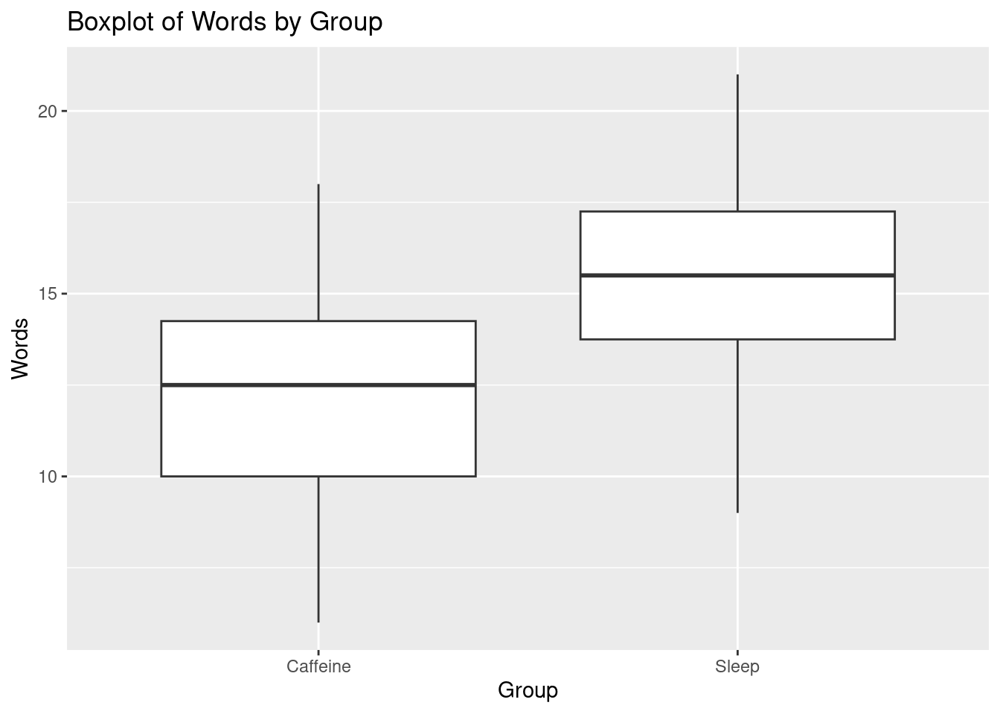

# Practice Problems 12


### Problem 1 Revisited: 

 (a). If the results of a test for ESP are statistically discernible, what does that mean in terms of ESP?
<details><summary><red>Click for answer</red></summary>
*Answer:* 

It means we can conclude that $p > 0.2$ and that the sample results were so strong that we can conclude that ESP does exist and get more right than would be expected by random chance.  
</details><br>

 (b). If the results are not statistically discernible, what does that mean in terms of ESP?
<details><summary><red>Click for answer</red></summary>
*Answer:* 

The sample results are inconclusive.  People may or may not have ESP. Sample results could be just random chance.
</details><br>


## Problem 2:  Sleep or Caffeine for Memory

In an experiment, 24 students were given words to memorize, then were randomly assigned to take a 90 minute nap or take a caffeine pill (12 in each group).  They were then tested on their recall ability.  We test to see if the sample provides evidence that there is a difference in mean number of words people can recall depending on whether they take a nap or have some caffeine.  The hypotheses are: 

$$
H_0: \mu_S - \mu_C = 0 \ \ H_A: \mu_S - \mu_C \neq 0
$$

The sample mean difference is $\bar{x}_S - \bar{x}_C = 3$. We want to know if this difference in sample means is statistically discernible. 

#### (a) Explain how to generate a randomization distribution for $\bar{x}_S - \bar{x}_C$ that is consistent with $H_0: \mu_S - \mu_C = 0$.

<details><summary><red>Click for answer</red></summary>
*Answer:* We could randomly reassign the treatment to the study participants since, under the null, their recall abilities would be the same under either treatment. For each reassignment, we recomputed the sample mean difference and plot it in the dotplot shown below
</details><br>


#### (b) Navigate to the Statkey website. 

Select the **Test for Difference in Means** option under **Randomization Hypothesis Tests**. Change the data set from **Leniency and Smiles** to **Sleep Caffeine Words**. Note that the original sample data has a sample mean difference of 3 words.  

- **Generate 1 Sample** from this null randomization distribution. What is the difference in the average word recall of the two groups in this sample? Repeat this a couple of times.
- **Generate 1000 Samples** a few of times (get at least 3000 resamples). How unusual is getting a difference in means of 3 or more words?

\vspace*{.5in}

#### (c) 	Compute the randomization p-value

Select the **Two-Tail** button at the top of the plot. Change the positive x-axis value to the observed difference of 3.0. The p-value is 2 times the proportion of resamples that have a difference of 3 or above. What is the p-value? 


<details><summary><red>Click for answer</red></summary>
*Answer:* We see in the image that the proportion in the tail beyond the sample statistic of 3.0 is 0.022.  Because this is a two-tail test, we have to account for both tails, so the p-value is 2(0.022) = 0.044.
</details><br>

#### (d) 	Interpret + Conclusion

Interpret the p-value. Does the p-value support the alternative hypothesis (do you think difference of means of 3 is statistically discernible) or is it inconclusive? Explain.

<details><summary><red>Click for answer</red></summary>
*Answer:* We would see a difference of at least 3 words recalled, on average, in about 4.4% of all possible samples if the influence of sleep and caffeine on recall was the same The results show some evidence of statistical significance, meaning that the caffeine and sleep may have some difference effects on word recall ability.
</details><br>


#### (e) Redo in Rstudio

First get the data from the Lock website and check important summary stats:


```r
library(readr)
wordData <- read_csv("http://math.carleton.edu/Stats215/Textbook/SleepCaffeine.csv")
# Create a boxplot using ggplot2
ggplot(wordData, aes(x = Group, y = Words)) +
  geom_boxplot() +
  labs(title = "Boxplot of Words by Group")
```




```r
# Summary statistics using dplyr
wordData %>%
  group_by(Group) %>%
  summarise_all(list(min, q1 = ~quantile(., 0.25), median, mean, q3 = ~quantile(., 0.75), max))
```

```
# A tibble: 2 × 7
  Group      fn1    q1   fn2   fn3    q3   fn4
  <chr>    <dbl> <dbl> <dbl> <dbl> <dbl> <dbl>
1 Caffeine     6  10    12.5  12.2  14.2    18
2 Sleep        9  13.8  15.5  15.2  17.2    21
```


Then load the `CarletonStats` package and run the `permTest(y ~ x, data=)` command where `y` is your quantitative (or 0/1 coded) response and `x` defines the two groups you are comparing. 


```r
library(CarletonStats)
permTest(Words ~ Group, data=wordData)
```

```

	** Permutation test **

 Permutation test with alternative: two.sided 
 Observed statistic
  Caffeine :  12.25 	 Sleep :  15.25 
 Observed difference: -3 

 Mean of permutation distribution: 0.01165 
 Standard error of permutation distribution: 1.50713 
 P-value:  0.0502 

	*-------------*
```


- Why is the observed difference reported as -3?

<details><summary><red>Click for answer</red></summary>
*Answer:* The difference is computed alphabetically: Caffeine minus Sleep so the difference in now -3 instead of +3. </details><br>


- What is the p-value? Is it the same as the Statkey p-value? The same as your neighbors p-value? Why not?

<details><summary><red>Click for answer</red></summary>
*Answer:* The p-value is around 5%. Any difference between Statkey, neighbors or different runs of the `permTest` command stem from the fact that different resamples are obtained each time a randomization distribution is generated. There may be some small (inconsequential) difference in p-values due to this.
</details><br>

