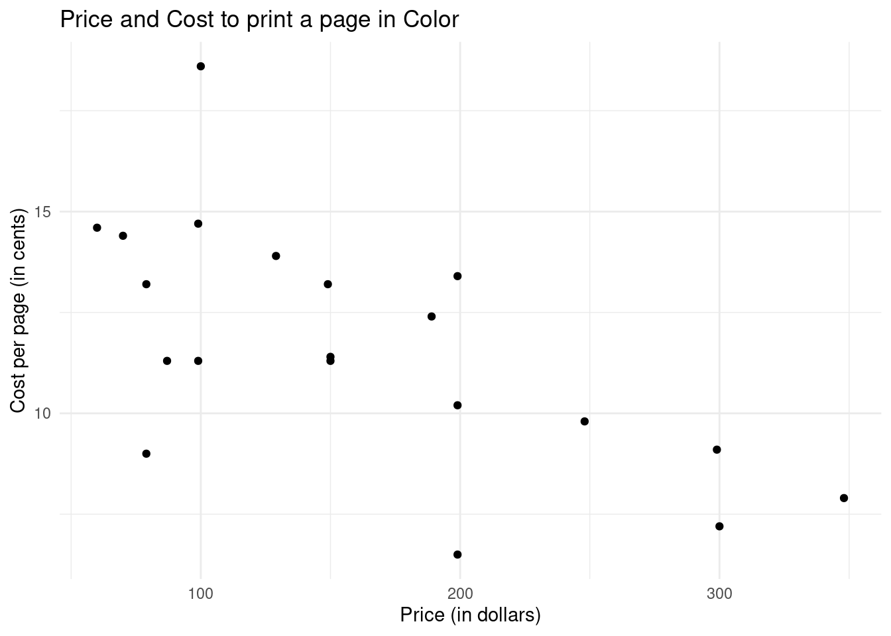
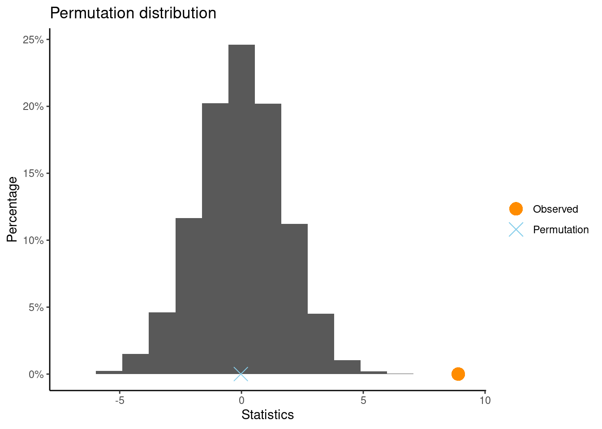

# Practice Problems 13

## Problem 1: Cost per page vs price of Inkjet printers


```r
library(ggplot2)
inkjet <- read.csv("https://www.lock5stat.com/datasets2e/InkjetPrinters.csv") 
ggplot(data = inkjet, aes(x = Price, y = CostColor)) + 
     geom_point(shape = 19) +
     labs(title = "Price and Cost to print a page in Color",
          x = "Price (in dollars)",
          y = "Cost per page (in cents)") +
     theme_minimal()
```



Any association between `CostColor` and `Price` appears to be strong! We will conduct a permutation test. Let $\rho$ denote the true correlation between the two variables. 

$$H_0: \rho=0 \text { versus } H_A: \rho \neq 0$$


```r
library(CarletonStats)
permTestCor(CostColor~Price, data= inkjet)
```


### (a) Observation and Conclusion

What is the observed correlation? What conclusion do you draw from the test?

<details><summary><red>Click for answer</red></summary>
*Answer:* Since the p-value is less than the significance level, it means that the observed correlation of -0.6502 is highly unlikely to occur just by random chance under the null hypothesis. In this case, we would reject the null hypothesis and conclude that there is statistically discernible non-zero population correlation between the cost of color and price of inkjet printers.

</details><br>


## Problem 2: New Teaching Method Effectiveness

A school is testing a new teaching method for math. They randomly assign 40 students to either the new method (NM) or the traditional method (TM), 20 in each group. After 3 months, the students take a standardized math test. We want to test if there is a difference in the mean test scores between NM and TM groups. The hypotheses are:


$$H_0: \mu_{N M}-\mu_{T M}=0 \mathrm{H}_A: \mu_{NM} - \mu_{TM} \neq 0$$
The sample mean difference is $\bar{x}_{NM} - \bar{x}_{TM} = 8.9$. We want to know if this difference in sample means is statistically discernible.

### (a) Randomization Distribution

Describe how you could generate a randomization distribution for $\bar{x}_{NM} - \bar{x}_{TM}$ that is consistent with $H_0: \mu_{NM} - \mu_{TM} = 0$.

<details><summary><red>Click for answer</red></summary>
*Answer:* To generate a randomization distribution for the sample proportion difference, we would randomly reassign the teaching method (new or traditional) to the classes. Under the null hypothesis, the proportion of students passing would be the same under either teaching method. For each reassignment, we would compute the sample proportion difference and plot it in the dotplot.

</details><br>

#### (b) Calculating the p-value

Using a statistical software, generate a randomization distribution for the difference in means and calculate the p-value for the two-tailed test. Is the observed difference of 8.9 points statistically discernible?

<details><summary><red>Click for answer</red></summary>
*Answer:* The p-value is the proportion of resamples that have a difference of 8.9 or above. Depending on the generated randomization distribution, the p-value is 0.0002. This means is interpreted in terms of how likely it is to observe a difference of 8.9 or greater under the null hypothesis, which is 0.02%.


```r
library(CarletonStats)
teaching <- read_csv("https://raw.githubusercontent.com/deepbas/statdatasets/main/teaching_method.csv")
permTest(Math_Test_Score~Group, data= teaching)
```

```

	** Permutation test **

 Permutation test with alternative: two.sided 
 Observed statistic
  New_Method :  91.05 	 Traditional_Method :  82.15 
 Observed difference: 8.9 

 Mean of permutation distribution: -0.00534 
 Standard error of permutation distribution: 1.73888 
 P-value:  1e-04 

	*-------------*
```



</details><br>

#### (c) Interpretation and Conclusion

Interpret the p-value and state your conclusion regarding the difference in the mean test scores between the new teaching method and the traditional teaching method groups.

<details><summary><red>Click for answer</red></summary>
*Answer:* Since the p-value is less than the chosen significance level (e.g., 0.05), the results are statistically discernible, and we would reject the null hypothesis in favor of the alternative. This would indicate that there is evidence suggesting the new teaching method is more effective than the traditional method. 


</details><br>


## Problem 3: Type I and Type II Error Rates

Consider the example of a new teaching method compared to a traditional teaching method. Suppose that the school administration wants to minimize the chances of making Type I and Type II errors when deciding whether to adopt the new teaching method.

### (a) Type I Error

Explain what a Type I error is in the context of this example, and describe the consequences of making such an error.

<details><summary><red>Click for answer</red></summary>
*Answer:* A Type I error occurs when we reject the null hypothesis when it's actually true. In this context, it means that we conclude the new teaching method is more effective than the traditional method when, in reality, there is no difference. The consequences of making a Type I error could include investing time and resources into a new teaching method that isn't actually more effective, leading to inefficient allocation of resources.

</details><br>

### (b) Type II Error

Explain what a Type II error is in the context of this example, and describe the consequences of making such an error.

<details><summary><red>Click for answer</red></summary>
*Answer:* A Type II error occurs when we fail to reject the null hypothesis when it's actually false. In this context, it means that we conclude that there is no difference between the new teaching method and the traditional method when, in reality, the new method is more effective. The consequences of making a Type II error could include missing out on the opportunity to improve students' learning outcomes by not adopting the more effective teaching method.

</details><br>

### (c) Adjusting the Significance Level

If the school administration believes that making a Type I error is much worse than making a Type II error, what adjustments could be made to the significance level to account for this? Explain your reasoning.

<details><summary><red>Click for answer</red></summary>
*Answer:* To decrease the chance of making a Type I error, the school administration could choose a smaller significance level, such as 0.01 instead of the typical 0.05. By using a smaller significance level, we require stronger evidence (smaller p-value) to reject the null hypothesis, thus reducing the probability of making a Type I error.

</details><br>

### (d) Balancing Error Rates

Discuss how the school administration could balance the Type I and Type II error rates when evaluating the effectiveness of the new teaching method. What factors should they consider?

<details><summary><red>Click for answer</red></summary>
*Answer:* Balancing the Type I and Type II error rates involves considering the consequences of each type of error and the desired level of confidence in the results. The administration should weigh the risks and benefits of adopting a new teaching method versus maintaining the traditional method. They should also consider factors such as the cost and feasibility of implementing the new method, as well as the potential impact on student learning outcomes. Ultimately, the administration should choose a significance level and sample size that balance the risks associated with Type I and Type II errors while taking into account practical constraints and priorities.

</details><br>

## (Extra) Problem 4: Job Interview Success

A study investigated the success rate of job applicants who used a career coaching service (CCS) compared to those who didn't (NCCS). Out of 120 applicants, 60 used the CCS and 60 did not. We want to test if there is a difference in the proportion of successful applicants between CCS and NCCS groups. out of the 60 applicants who used the career coaching service (CCS), 42 were successful and 18 were unsuccessful. Out of the 60 applicants who did not use the career coaching service (NCCS), 30 were successful and 30 were unsuccessful. The hypotheses are:

$$H_0: p_{C C S}-p_{N C C S}=0 H_A: p_{C C S}-p_{N C C S} \neq 0$$
The sample proportion difference is $\hat{p}{CCS} - \hat{p}{NCCS} = 0.20$. We want to know if this difference in sample proportions is statistically discernible.


(a) Randomization Distribution
Describe how you could generate a randomization distribution for $\hat{p}_{CCS} - \hat{p}_{NCCS}$ that is consistent with $H_0: p_{CCS} - p_{NCCS} = 0$.

<details><summary><red>Click for answer</red></summary>
*Answer:* To generate a randomization distribution for the sample proportion difference, we would randomly reassign the group (CCS or NCCS) to the job applicants. Under the null hypothesis, the proportion of successful applicants would be the same for both groups. For each reassignment, we would compute the sample proportion difference and plot it in the dotplot.

</details><br>

(b) Calculating the p-value

Using a statistical software, generate a randomization distribution for the difference in proportions and calculate the p-value for the two-tailed test. Is the observed difference of 0.20 statistically discernible?

<details><summary><red>Click for answer</red></summary>
*Answer:* Using *Statkey* to generate a randomization distribution for the difference in proportions and observing the p-value for the two-tailed test, we can compare the p-value to a chosen significance level (e.g., 0.05) to determine if the observed difference of 0.20 is statistically discernible. If the p-value is less than the significance level, the observed difference is statistically discernible; otherwise, it is not. The p-value based on this randomization distribution under null hypothesis is $2 \times 0.018 = 0.036$. So, the observed difference of 0.020 is statistically discernible.

<center>
<br>
</center>

</details><br>

(c) Interpretation and Conclusion
Interpret the p-value and state your conclusion regarding the difference in the proportion of successful job applicants between CCS and NCCS groups.

<details><summary><red>Click for answer</red></summary>
*Answer:* Since the p-value is less than the significance level, it means that the observed difference of 0.20 would occur with low chance under the null hypothesis. In this case, we would reject the null hypothesis and conclude that there is a statistically discernible difference in the proportion of successful job applicants between CCS and NCCS groups. 

</details><br>


