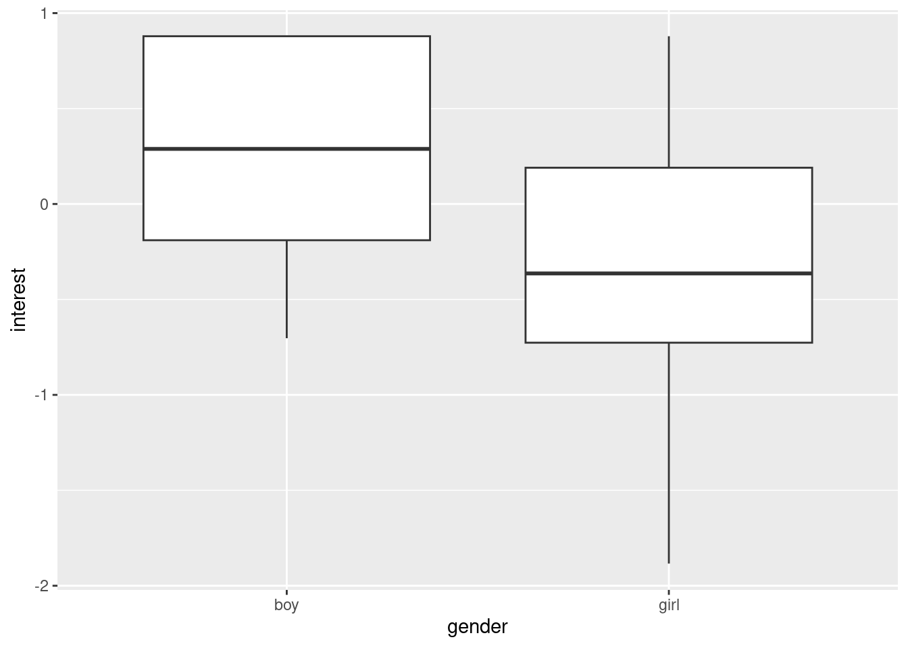

# Practice Problems 14

## Problem 1:  Gender stereotypes in children - study 4

The data for this example comes from study 4 described in this *Science* article: [https://www.science.org/doi/10.1126/science.aah6524](https://www.science.org/doi/10.1126/science.aah6524). This study involved asking children their interest level in a game that researcher described as for "children who are really, really smart." The higher the value of the variable `interest`, the more interested a child was in playing that game.   


```r
study4 <- read.csv("http://math.carleton.edu/kstclair/data/Stereo4.csv")
head(study4)
```

```
    study subj gender   age    interest race     race2
1 Study 4   65   girl age 6  0.37953534    5     white
2 Study 4   66   girl age 6 -0.78071539    5     white
3 Study 4   67   girl age 6 -0.47631654    5     white
4 Study 4   68   girl age 6 -0.07234632    5     white
5 Study 4   69    boy age 6 -0.70319450    6 non-white
6 Study 4   70   girl age 6  0.52467564    5     white
  eduave income        ses        age2
1     16  90000 -0.1543908 age 6 and 7
2     16 125000  0.2298424 age 6 and 7
3     18  25000 -0.3446883 age 6 and 7
4     17 125000  0.4914816 age 6 and 7
5     19 125000  1.0147600 age 6 and 7
6     12  65000 -1.4753998 age 6 and 7
```


#### (a) Interest in 5 year olds - test

Let's compare the mean interest level in 5 year old boys and girls. Generate the randomization distribution for this test: 

$$
H_0: \mu_{B5} - \mu_{G5} = 0 \ \ H_0: \mu_{B5} - \mu_{G5} \neq 0
$$


```r
library(CarletonStats)
library(ggplot2)
library(dplyr)
study4age5 <- filter(study4, age2 == "age 5")
ggplot(study4age5, aes(x=gender, y=interest)) + 
  geom_boxplot()
```


```r
permTest(interest ~ gender, data = study4age5)
```

```

	** Permutation test **

 Permutation test with alternative: two.sided 
 Observed statistic
  boy :  -0.1043526 	 girl :  0.02905667 
 Observed difference: -0.13341 

 Mean of permutation distribution: -0.00278 
 Standard error of permutation distribution: 0.26478 
 P-value:  0.6206 

	*-------------*
```


- What is the SE of this randomization distribution?

<details><summary><red>Click for answer</red></summary>
*Answer:* SE is about 0.26.
</details><br>

- What is the z-score for the observed difference in means using this distribution? Interpret the value. 

<details><summary><red>Click for answer</red></summary>
*Answer:* The distribution has a center of 0 and SE of 0.26. The z-score is
$$
z = \dfrac{-0.13341 - 0}{0.26051} = -0.51
$$
This means the observed difference of -0.133 is about 0.51 SEs below the hypothesized difference of 0.


```r
-0.13341/0.26051
```

```
[1] -0.5121109
```

</details><br>

- How large or small would the observed difference in sample means need to be to reject the null hypothesis using a 5% significance level. 

<details><summary><red>Click for answer</red></summary>
*Answer:* Since the distribution is bell-shaped, we can use the fact that about 5% of sample differences are further than 2 SE's above/below the center difference of 0. Any sample difference this extreme will lead to a two-sided p-value that is less than the significance level of 5%. For this data, 2 SE's is a sample difference of 0.521 so any observed difference that is more extreme than 0.521 would lead to rejecting the null hypothesis of no difference.


```r
2*0.26051
```

```
[1] 0.52102
```
</details><br>


#### (b) Interest in 5 year olds - CI

Consider the 95% (bootstrap) CI for the true difference in mean interest $\mu_{B5} - \mu_{G5}$. 

- Will this interval contain the difference of 0?

<details><summary><red>Click for answer</red></summary>
*Answer:* Yes, since we didn't reject the null difference of 0 using a 5% significance level (p-value = 0.617).
</details><br>

- Compute the bootstrap distribution. Does the CI capture 0?


```r
set.seed(7)
boot(interest ~ gender, data = study4age5)
```

```

	** Bootstrap interval for difference of mean 

 Observed difference of mean : boy - girl = -0.13341 
 Mean of bootstrap distribution: -0.13776 
 Standard error of bootstrap distribution: 0.25939 

 Bootstrap percentile interval
      2.5%      97.5% 
-0.6459180  0.3652884 

		*--------------*
```


<details><summary><red>Click for answer</red></summary>
*Answer:* Yes, the CI captures the difference of 0.
</details><br>

- What is the bootstrap SE? Is it similar to the randomization distribution SE?

<details><summary><red>Click for answer</red></summary>
*Answer:* SE is about 0.26, which is very similar to the randomization distribution SE.
</details><br>


#### (c) Interest in 6 and 7 year olds - test

Redo part (a) for the age group `age 6 and 7`. 


```r
study4age67 <- filter(study4, age2 == "age 6 and 7")
ggplot(study4age67, aes(x=gender, y=interest)) + 
  geom_boxplot()
```



```r
permTest(interest ~ gender, data = study4age67)
```

```

	** Permutation test **

 Permutation test with alternative: two.sided 
 Observed statistic
  boy :  0.2163512 	 girl :  -0.3186948 
 Observed difference: 0.53505 

 Mean of permutation distribution: -0.00312 
 Standard error of permutation distribution: 0.22035 
 P-value:  0.0112 

	*-------------*
```


- What is the SE of this randomization distribution?

<details><summary><red>Click for answer</red></summary>
*Answer:* SE is about 0.225.
</details><br>


- What is the z-score for the observed difference in means using this distribution? Interpret the value. 

<details><summary><red>Click for answer</red></summary>
*Answer:* The distribution has a center of 0 and SE of 0.225. The z-score is

$$
z = \dfrac{0.53505 - 0}{0.22539 } = 2.37
$$
This means the observed difference of 0.535 is about 2.37 SEs above the hypothesized difference of 0.


```r
0.53505/0.22539
```

```
[1] 2.373885
```

</details><br>

- How large or small would the observed difference in sample means need to be to reject the null hypothesis using a 5% significance level. 

<details><summary><red>Click for answer</red></summary>
*Answer:* Since the distribution is bell-shaped, we can use the fact that about 5% of sample differences are further than 2 SE's above/below the center difference of 0. Any sample difference this extreme will lead to a two-sided p-value that is less than the significance level of 5%. For this data, 2 SE's is a sample difference of 0.451 so any observed difference that is more extreme than 0.451 would lead to rejecting the null hypothesis of no difference.


```r
2*0.22539
```

```
[1] 0.45078
```

</details><br>


#### (d) Interest in 6 and 7 year olds - CI

Redo part (b) for 6 and 7 year olds. 

- Will this interval contain the difference of 0?

<details><summary><red>Click for answer</red></summary>
*Answer:* No, since we rejected the null difference of 0 using a 5% significance level (p-value = 0.015).
</details><br>


- Compute the bootstrap distribution. Does the CI capture 0?


```r
boot(interest ~ gender, data = study4age67)
```

```

	** Bootstrap interval for difference of mean 

 Observed difference of mean : boy - girl = 0.53505 
 Mean of bootstrap distribution: 0.53468 
 Standard error of bootstrap distribution: 0.20659 

 Bootstrap percentile interval
     2.5%     97.5% 
0.1259895 0.9348764 

		*--------------*
```


<details><summary><red>Click for answer</red></summary>
*Answer:* No, the CI does not capture the difference of 0.
</details><br>


- What is the bootstrap SE? Is it similar to the randomization distribution SE?

<details><summary><red>Click for answer</red></summary>
*Answer:* SE is about 0.21, which is very similar to the randomization distribution SE.
</details><br>


#### (e) Interest in 5 year olds

Redo the randomization test and bootstrap CI for 5 year olds, but this time omit the outlier boy case that has a very low interest level. Recall how to use the `which` command:


```r
ggplot(study4age5, aes(x=gender, y=interest)) + 
  geom_boxplot()
```


```r
# Identify which rows have 'interest' less than -2 using dplyr
which(study4age5$interest < -2)
```

```
[1] 39
```

Then to omit this case, add the argument `subset = -39` to the `permTest` and `boot` commands used in (a) and (b). 


```r
set.seed(7)
permTest(interest ~ gender, data = study4age5, subset = -39)
```

```

	** Permutation test **

 Permutation test with alternative: two.sided 
 Observed statistic
  boy :  0.01417256 	 girl :  0.02905667 
 Observed difference: -0.01488 

 Mean of permutation distribution: -0.00265 
 Standard error of permutation distribution: 0.2469 
 P-value:  0.9516 

	*-------------*
```


```r
boot(interest ~ gender, data = study4age5, subset = -39)
```

```

	** Bootstrap interval for difference of mean 

 Observed difference of mean : boy - girl = -0.01488 
 Mean of bootstrap distribution: -0.01565 
 Standard error of bootstrap distribution: 0.23826 

 Bootstrap percentile interval
      2.5%      97.5% 
-0.4751690  0.4520149 

		*--------------*
```


- Does the observed difference get closer or further from 0 with the case omitted? Explain why it changes.

<details><summary><red>Click for answer</red></summary>
*Answer:* The very low case pulls down the mean response for boys (with: $\bar{x}_{B5} = -0.10435$, without: $\bar{x}_{B5} = 0.01417$). Since the girl mean response doesn't change ($\bar{x}_{G5} = 0.02906$), omitting this case will make the *two means closer together* which makes their difference closer to 0 (with: $\bar{x}_{B5} - \bar{x}_{G5} = -0.13341$, without: $\bar{x}_{B5}  - \bar{x}_{G5} = -0.01488$).
</details><br>

- Do the SEs of the distributions (bootstrap and randomization) get smaller or larger with the case omitted? Explain why these change. 

<details><summary><red>Click for answer</red></summary>
*Answer:* The very low case creates larger variability in the sample mean for boys, which in turn makes the SE for the sample mean difference more variable  (with: SE about 0.26, without: SE about 0.24).
</details><br>


- Compute the z-score for the observed difference in means using randomization distribution. Is this value futher or closer to a z-score of 0 with the case omitted? Explain why it changes. 

<details><summary><red>Click for answer</red></summary>
*Answer:* The z-score is closer to 0 with the case removed (with: $z = -0.51$, without: $z = -0.061$)
$$
z = \dfrac{-0.01488  - 0}{0.24569} = -0.061
$$
The z-score is closer to 0 because the sample mean difference is closer to 0 with the case removed, and this change is greater than the relatively small decrease in SE that we noted with the case removed.
</details><br>


\vspace*{.5in}

- Does the p-value get smaller or larger (or doesn't change) with the case omitted? Explain why it changes. 

<details><summary><red>Click for answer</red></summary>
*Answer:* The p-value is larger with the case removed (with: p-value = 0.617, without: p-value = 0.944). This is because the observed difference is closer to 0 (fewer SE away) with the case omitted.
</details><br>

