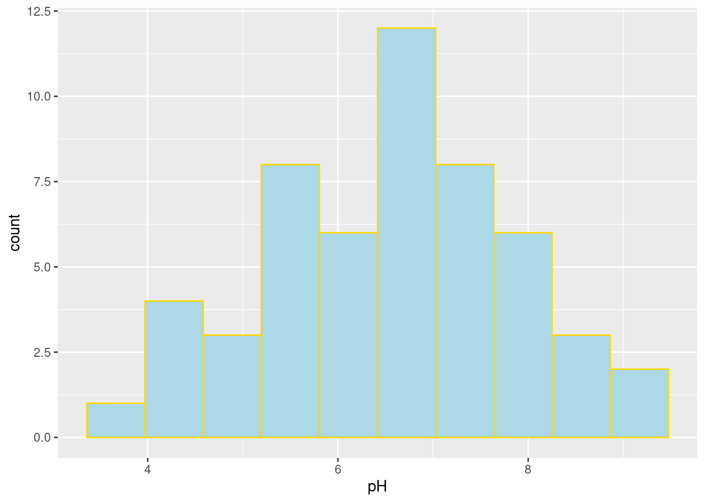

# Practice Problems 19


## Problem 1: Florida Lakes pH

The textbook dataset `FloridaLakes` contains data on 53 lakes in Florida. We want to know if the average pH of lakes in Florida is different from a neutral value of 7. 


```r
lakes <- read.csv("http://www.lock5stat.com/datasets1e/FloridaLakes.csv")
head(lakes)
```

```
  ID         Lake Alkalinity  pH Calcium Chlorophyll
1  1    Alligator        5.9 6.1     3.0         0.7
2  2        Annie        3.5 5.1     1.9         3.2
3  3       Apopka      116.0 9.1    44.1       128.3
4  4 Blue Cypress       39.4 6.9    16.4         3.5
5  5        Brick        2.5 4.6     2.9         1.8
6  6       Bryant       19.6 7.3     4.5        44.1
  AvgMercury NumSamples MinMercury MaxMercury
1       1.23          5       0.85       1.43
2       1.33          7       0.92       1.90
3       0.04          6       0.04       0.06
4       0.44         12       0.13       0.84
5       1.20         12       0.69       1.50
6       0.27         14       0.04       0.48
  ThreeYrStdMercury AgeData
1              1.53       1
2              1.33       0
3              0.04       0
4              0.44       0
5              1.33       1
6              0.25       1
```

#### (a) EDA 

Always plot your data and get summary stats:


```r
hist(lakes$pH)
```



```r
mean(lakes$pH)
```

```
[1] 6.590566
```

```r
sd(lakes$pH)
```

```
[1] 1.288449
```

- What are the sample mean and standard deviation? Use appropriate notation.
- Can we use t-inference methods with the pH variable?


<details><summary><red>Click for answer</red></summary>

*Answer:* The average pH was $\bar{x} = 6.591$ with a standard deviation of $s=1.288$. The distribution of pH is symmetric with no outliers, so we can use t-inference methods.  
</details><br>

#### (b) SE for the sample mean

What is the estimated SE for the sample mean?
<details><summary><red>Click for answer</red></summary>

*Answer:* The estimated SE for the sample mean is $SE_{\bar{x}} = 0.1770$.


```r
sd(lakes$pH)/sqrt(53)
```

```
[1] 0.1769821
```

</details><br>

#### (c) t-test statistic

Using your SE from (b) to compute the t-test statistic for testing if the population mean pH is equal, or not, to 7. Write down your hypotheses then show how the t test statistic is calculated. Interpret this value in context. 

<details><summary><red>Click for answer</red></summary>

*Answer:* The hypotheses are $H_0: \mu = 7$ vs $H_A: \mu \neq 7$. The test stat is 

$$
t = \dfrac{6.591 - 7}{1.288/\sqrt{53}} = -2.3134
$$

The observed mean of 6.591 is 2.3 SEs below the hypothesized mean of 7.


```r
(mean(lakes$pH) - 7)/(sd(lakes$pH)/sqrt(53)) 
```

```
[1] -2.31342
```

### (d) One-sample t-test

The function `t.test(x, mu=)` can be used for a one sample test comparing the sample mean of `x` to the hypothesized value given to  `mu=`. Here we are testing whether the population mean is equal to 7 or not:


```r
t.test(lakes$pH, mu = 7)
```

```

	One Sample t-test

data:  lakes$pH
t = -2.3134, df = 52, p-value = 0.02469
alternative hypothesis: true mean is not equal to 7
95 percent confidence interval:
 6.235425 6.945707
sample estimates:
mean of x 
 6.590566 
```
</details><br>


- What is the t test stat given in the output? Verify that it matches your answer to (c), within reasonable rounding error.

<details><summary><red>Click for answer</red></summary>

*Answer:* The test stat  is -2.31. 

</details><br>

- What is the p-value for the test? Interpret this value.

<details><summary><red>Click for answer</red></summary>

*Answer:* The p-value is 0.025. If the mean pH of all lakes is 7, then we would see a sample mean that is at least 2.31 SEs away from 7 about 2.5% of the time in samples of 53 lakes. 

</details><br>


- What is your test conclusion?

<details><summary><red>Click for answer</red></summary>

*Answer:* There is a statistically significant difference between the observed mean pH of 6.591 and the hypothesized mean of 7 (t=-2.31, df=52, p=0.025).

</details><br>

#### (e) One-sample t confidence interval

What is the 95% confidence interval for the population mean pH? Interpret this CI. 

<details><summary><red>Click for answer</red></summary>

*Answer:* We are 95% confident that the mean pH of all lakes in Florida is between 6.24 and 6.95.

</details><br>


#### (f) `qt` and `pt`

Show how to compute the p-value for your test in (d) using the `pt` command. Then show how the confidence interval in (e) is computed with a `qt` value. 
<details><summary><red>Click for answer</red></summary>

*Answer:* For the two-sided test, the p-value is twice the proportion below the test stat $t=-2.313$ under a t-distribution with $df=53-1=52$


```r
2*pt(-2.313,df=52)
```

```
[1] 0.02471195
```

For a 95% CI, we get the 97.5th percentile from the same t-distribution


```r
qt(.975,52)
```

```
[1] 2.006647
```

</details><br>


## Problem 2: Nutrition Study

The dataset `NutritionStudy` contains data on daily calorie intake and other variables for 315 individuals. We want to know if the average daily calorie intake is different from the recommended 2000 calories.


```r
#install.packages("Lock5Data")
library(Lock5Data)
library(dplyr)
data(NutritionStudy)
glimpse(NutritionStudy)
```

```
Rows: 315
Columns: 17
$ ID            <int> 1, 2, 3, 4, 5, 6, 7, 8, 9, 10, 11, 1…
$ Age           <int> 64, 76, 38, 40, 72, 40, 65, 58, 35, …
$ Smoke         <chr> "No", "No", "No", "No", "No", "No", …
$ Quetelet      <dbl> 21.4838, 23.8763, 20.0108, 25.1406, …
$ Vitamin       <int> 1, 1, 2, 3, 1, 3, 2, 1, 3, 3, 1, 2, …
$ Calories      <dbl> 1298.8, 1032.5, 2372.3, 2449.5, 1952…
$ Fat           <dbl> 57.0, 50.1, 83.6, 97.5, 82.6, 56.0, …
$ Fiber         <dbl> 6.3, 15.8, 19.1, 26.5, 16.2, 9.6, 28…
$ Alcohol       <dbl> 0.0, 0.0, 14.1, 0.5, 0.0, 1.3, 0.0, …
$ Cholesterol   <dbl> 170.3, 75.8, 257.9, 332.6, 170.8, 15…
$ BetaDiet      <int> 1945, 2653, 6321, 1061, 2863, 1729, …
$ RetinolDiet   <int> 890, 451, 660, 864, 1209, 1439, 802,…
$ BetaPlasma    <int> 200, 124, 328, 153, 92, 148, 258, 64…
$ RetinolPlasma <int> 915, 727, 721, 615, 799, 654, 834, 8…
$ Sex           <chr> "Female", "Female", "Female", "Femal…
$ VitaminUse    <chr> "Regular", "Regular", "Occasional", …
$ PriorSmoke    <int> 2, 1, 2, 2, 1, 2, 1, 1, 1, 2, 2, 1, …
```


### (a) EDA 

Always plot your data and get summary stats:


```r
hist(NutritionStudy$Calories)
```


```r
mean(NutritionStudy$Calories)
```

```
[1] 1796.655
```

```r
sd(NutritionStudy$Calories)
```

```
[1] 680.3474
```


### (b) SE for the sample mean

What is the estimated SE for the sample mean?


<!-- <details><summary><red>Click for answer</red></summary> -->

<!-- *Answer:* -->

<!-- ```{r} -->
<!-- n <- length(NutritionStudy$Calories) -->
<!-- SE <- sd(NutritionStudy$Calories) / sqrt(n) -->
<!-- SE -->
<!-- ``` -->

<!-- </details><br> -->

### (c) t-test statistic

Compute the t-test statistic for testing if the population mean calorie intake is equal, or not, to 2000.

<!-- <details><summary><red>Click for answer</red></summary> -->

<!-- *Answer:* -->

<!-- ```{r} -->
<!-- t_stat <- (mean(NutritionStudy$Calories) - 2000) / SE -->
<!-- t_stat -->
<!-- ``` -->

<!-- </details><br> -->

### (d) One-sample t-test

Perform a one-sample t-test to test whether the population mean calorie intake is equal to 2000 or not.

<!-- <details><summary><red>Click for answer</red></summary> -->

<!-- *Answer:* -->

<!-- ```{r} -->
<!-- t.test(NutritionStudy$Calories, mu = 2000) -->
<!-- ``` -->

<!-- </details><br> -->

### (e) One-sample t confidence interval

What is the 95% confidence interval for the population mean calorie intake?

<!-- <details><summary><red>Click for answer</red></summary> -->

<!-- *Answer:* -->

<!-- ```{r} -->
<!-- ci <- t.test(NutritionStudy$Calories, mu = 2000)$conf.int -->
<!-- ci -->
<!-- ``` -->

<!-- </details><br> -->

### (f) `qt` and `pt`

Show how to compute the p-value for the test in (d) using the pt command. Then show how the confidence interval in (e) is computed with a qt value.

<!-- <details><summary><red>Click for answer</red></summary> -->

<!-- *Answer:* -->

<!-- ```{r} -->
<!-- p_value <- 2 * pt(-abs(t_stat), df = n - 1) -->
<!-- p_value -->
<!-- ``` -->


<!-- ```{r} -->
<!-- t_star <- qt(0.975, df = n - 1) -->
<!-- t_star -->
<!-- ``` -->

<!-- </details><br> -->
