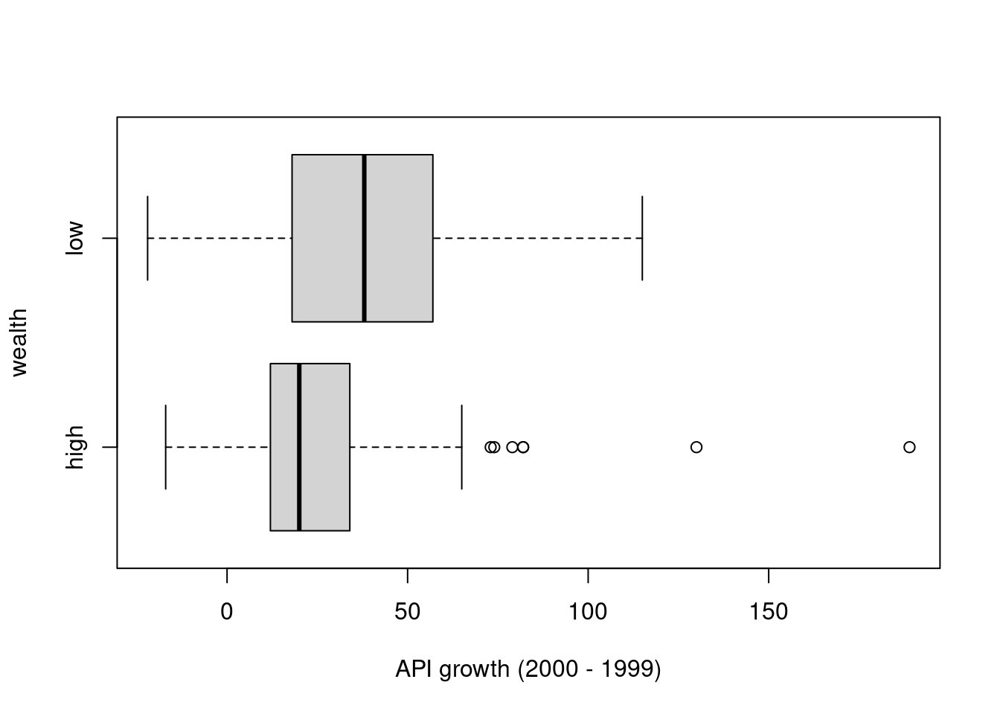

# Practice Problems 21

## Problem 1:  API

The Academic Performance Index (API) is computed for all California schools. It is a number, ranging from a low of 200 to a high of 1000, that reflects a school's performance on a statewide standardized test (http://api.cde.ca.gov). We have a SRS of 200 schools and are interested in how a school's performance is related to the wealth of its students. The variable `growth` measures the growth in API from 1999 to 2000 (API 2000 - API 1999). 


```r
api <- read.csv("http://people.carleton.edu/~kstclair/data/api.csv")
```

#### (a) Categorizing wealth

Let's define a school as "low wealth" if over 50% of its students are eligible for subsidized `meals` and "high wealth" otherwise. We can use an `ifelse` command to create a variable `wealth` that measures this:


```r
api$wealth <- ifelse(api$meals > 50, "low","high")
table(api$wealth)
```

```

high  low 
 102   98 
```

```r
library(dplyr)
api %>% group_by(wealth) %>% summarize(mean(growth), sd(growth))
```

```
# A tibble: 2 × 3
  wealth `mean(growth)` `sd(growth)`
  <chr>           <dbl>        <dbl>
1 high             25.2         28.8
2 low              38.8         30.0
```

```r
boxplot(growth ~ wealth, data=api, xlab="API growth (2000 - 1999)" , horizontal=T)
```



- How many schools are "low" and "high" wealth.
- Are wealth and API growth related?
- What is the observed difference in mean API growth between high and low wealth schools. Use correct notation. 
- Can we use t-inference methods to compare mean growths?

<details><summary><red>Click for answer</red></summary>
*Answer:* There are $n_h = 102$ "high" wealth and $n_l = 98$ "low" wealth schools. The low wealth schools tend to have higher (and more variable) growth than high wealth schools. The difference in observed mean API growth between high and low growth schools is $\bar{x}_h - \bar{x}_l = 25.24510 - 38.82653  = -13.58$. We can use t-methods since both samples sizes (98 and 102) can be deemed large and there isn't severe skewness,  but there are two extreme outliers that will be addressed below.
</details><br>

#### (b) SE for the sample mean difference

What is the estimated SE for the sample mean difference?
<details><summary><red>Click for answer</red></summary>

*Answer:* The SE for the mean difference is 4.1544:

$$
SD_{\bar{x}_h - \bar{x}_l} = \sqrt{\dfrac{28.75380^2}{102} + \dfrac{29.95048^2}{98}} = 4.1544
$$

```r
sqrt(28.75380^2/102 +  29.95048^2/98)
```

```
[1] 4.154404
```
</details><br>


#### (c) t-test statistic

Using your SE from (b) to compute the t-test statistic that can be used to determine if mean API growth differs for low and high wealth schools. Write down your hypotheses then show how the t test statistic is calculated. Interpret this value in context. 
<details><summary><red>Click for answer</red></summary>

*Answer:* The hypotheses are $H_0: \mu_h - \mu_l = 0$ vs $H_A: \mu_h - \mu_l \neq 0$. The test stat is 

$$t = \dfrac{(25.24510 - 38.82653) - 0}{4.154404} = -3.2692$$

The observed mean difference  is 3.3 SEs below the hypothesized mean difference of 0.


```r
((25.24510 - 38.82653) - 0)/4.154404 
```

```
[1] -3.269164
```
</details><br>


#### (d) Two-sample t-test

Is there evidence that mean API growth differs for low and high wealth schools? Give the hypotheses for this test, then run the `t.test(y ~ x, data=)` command below to conduct a t-test to give a p-value and conclusion. 


```r
t.test(growth ~ wealth, data=api)
```

```

	Welch Two Sample t-test

data:  growth by wealth
t = -3.2692, df = 196.71, p-value = 0.001273
alternative hypothesis: true difference in means between group high and group low is not equal to 0
95 percent confidence interval:
 -21.774321  -5.388544
sample estimates:
mean in group high  mean in group low 
          25.24510           38.82653 
```

- What is the t test stat given in the output? Verify that it matches your answer to (c), within reasonable rounding error.

<details><summary><red>Click for answer</red></summary>

*Answer:* The test stat matches, $t = -3.2692$.
</details><br>

- What is the p-value for the test? Interpret this value.
<details><summary><red>Click for answer</red></summary>

*Answer:* The p-value is 0.001273. If there is no difference between mean growth in the two populations, then there is just a 0.13% chance of seeing a sample mean difference that is 3.27 standard errors or more away from 0.
</details><br>

- What is your test conclusion?
<details><summary><red>Click for answer</red></summary>

*Answer:* We have strong evidence to suggest that the average API growth in low and high wealth schools are not the same.
</details><br>


#### (e)  Consider outliers

The boxplot in (a) shows a number of outliers for the `high` wealth group, but two cases in particular were very high. Suppose we omitted these two (most) extreme cases when running the test in (d). Will the p-value for this test be smaller or larger than the p-value computed in part (d)? Explain.

<details><summary><red>Click for answer</red></summary>

*Answer:* Removing the two large outliers which will both reduce the mean in the high group and reduce the SD in the high group. Both actions will magnify the difference in mean growth between the high and low groups (increasing the difference and decreasing the SE), so the test stat will increase in magnitude and the p-value will decrease.
</details><br>

#### (f) Check outlier influence

To omit these cases we have to find their row numbers, then `subset` them out of the data:

```r
which(api$growth > 120 )
```

```
[1]  74 119
```

```r
api %>% slice(74,119)  # another dplyr package command
```

```
           cds stype            name                 sname
1 5.471911e+13     E Lincoln Element    Lincoln Elementary
2 1.975342e+13     E Washington Elem Washington Elementary
  snum                   dname dnum       cname cnum flag
1 5873 Exeter Union Elementary  226      Tulare   53   NA
2 2543   Redondo Beach Unified  585 Los Angeles   18   NA
  pcttest api00 api99 target growth sch.wide comp.imp both
1      98   693   504     15    189      Yes      Yes  Yes
2     100   745   615      9    130      Yes      Yes  Yes
  awards meals ell yr.rnd mobility acs.k3 acs.46 acs.core
1    Yes    50  18   <NA>        9     18     NA       NA
2    Yes    41  20   <NA>       16     19     30       NA
  pct.resp not.hsg hsg some.col col.grad grad.sch avg.ed
1       93      28  23       27       14        8   2.51
2       81      11  26       32       16       16   2.99
  full emer enroll api.stu    pw  fpc wealth
1   91    9    196     177 30.97 6194   high
2  100    3    391     313 30.97 6194   high
```

```r
t.test(growth ~ wealth, data = api, subset = -c(74,119))
```

```

	Welch Two Sample t-test

data:  growth by wealth
t = -4.395, df = 174.97, p-value = 1.916e-05
alternative hypothesis: true difference in means between group high and group low is not equal to 0
95 percent confidence interval:
 -23.571116  -8.961945
sample estimates:
mean in group high  mean in group low 
          22.56000           38.82653 
```

- How does the t-test stat change when omitting these two changes? Why does it change in this direction?
- Check your answer here with your anwer in part (e)!
<details><summary><red>Click for answer</red></summary>

*Answer:* Without these outliers, the p-value decreases to 0.00001916 and we have even stronger evidence for a difference in mean API growth. Why does the p-value decrease? Omitting the two outliers will  decrease the sample SD for the high group, which in turn will (slightly) decrease the SE for the difference in means. Omitting the two outliers will also decrease the sample mean for the high group (from 25.24510 to 22.56000), which will make the observed difference in means larger in magnitude (from -13.58 to -16.27). The test stat gets even further from 0  (drops from -3.2692 to -4.395), meaning the observed difference with outliers omitted is further away from 0 (in terms of SEs) than it was when all data points were included. This means that the p-value will decrease  (from 0.0013 to 0.00002) since the data is deemed more ``extreme" under the null hypothesis.
</details><br>

#### (g)  95% confidence interval

Compare the two 95% CI given in the output (with and without outliers). Explain how and why the CIs change after omitting these two outliers.  
<details><summary><red>Click for answer</red></summary>

*Answer:* Without outliers: -23.57 to -8.96 and with outliers: -21.77 to  -5.39. An mentioned above, omitting the two points makes the difference in means further away from 0. This shifts the CI further from a difference of 0. Removing the outliers also decrease the SE of our sample difference, so the margin of error for the interval without outliers is, roughly, 7 while the margin of error with outliers is, roughly, 8.
</details><br>

#### (h)  Interpret two-sample CI

Using the results without the two outliers, interpret the 95% CI given in this output. Do not use the word ``difference'' in your answer.

<details><summary><red>Click for answer</red></summary>

*Answer:* We are 95% confident that the mean API growth between 1999 and 2000 for all low wealth schools is anywhere from 8.96 points to 23.57 points higher than the mean API growth for all high wealth schools in California.
</details><br>


## Problem 2: Matched Pairs


A study is conducted to determine the effect of a home meter for helping diabetics control their blood glucose levels. Researchers would like to determine if the home meter is effective in helping patients  reduce their blood glucose levels. A random sample of 36 diabetics had their blood glucose levels measured before they were taught to use the meter and again after they had utilized the meter for 2 weeks. Researchers observed an average decrease (before - after) of blood glucose level of 2.78 mmol/liter with a standard deviation of 6.05 mmol/liter. Analysis results are shown below:
```
  Sample mean:  2.78 ; sample standard deviation:  6.05 ; sample size: 36
  Standard error:  1.0083
  95 percent confidence interval for true mean:  1.0763  , Infinity
  Hypothesis test H0: mu =  0  Alternative is  greater
  t statistic =  2.757 ; degrees of freedom =  35 ; p-value= 0.0046
```

#### (a) What conditions need to be met by this data to use $t$ inference procedures?

<details><summary><red>Click for answer</red></summary>

*Answer:* There is a moderate sample size of $n=36$ so we need to assume that the observed differences (before-after) are not strongly skewed and that there are no outliers. If these assumptions are not met, then the t-inference procedures above may not be appropriate.

</details><br>


#### (b)  Define the unknown parameter of interest (be very specific), then state the null and alternative hypotheses for this test. Make sure your hypotheses agree with the output!

<details><summary><red>Click for answer</red></summary>

*Answer:* Let the $\mu$ represent the population mean decrease in glucose levels measured before and after the treatment (before - after). A positive value of $\mu$ implies that the home meter is effective in reducing blood glucose levels. The alternative hypothesis (the research statement) will be that $\mu$ is greater than 0 and the null statement will be that $\mu$ is equal to 0, meaning there is no benefit to using the treatment.
$$
H_0:  \mu = 0 \textrm{ vs. } H_A: \mu > 0
$$

</details><br>


#### (c)   What is the test statistic value for this test? What does this value indicate? 

<details><summary><red>Click for answer</red></summary>

*Answer:* The test stat value is 2.757.  The mean glucose level decrease in the sample was 2.757 SE's above the hypothesized mean decrease of 0.

</details><br>


#### (d)   Is there sufficient evidence to claim that the monitor is effective in helping patients  reduce their blood glucose levels? 

<details><summary><red>Click for answer</red></summary>

*Answer:* You  reject $H_0$ when the $p$-value is small. Since the P-value of 0.3% is quite small, we can conclude that there is strong evidence that the use of home meters  lowers blood glucose levels, on average ($H_A$).

</details><br>


#### (e)   What type of error (1 or 2) could you have made in part (d)? If you did make this error, what are its implications for people with diabetes?  

<details><summary><red>Click for answer</red></summary>

*Answer:* Since we rejected, we may have made a type 1 error of rejecting the null when it is actually true. This means we would have claimed that the home meter was useful in reducing blood glucose levels, on average, when in fact it doesn't reduce levels. People with diabetes would be encouraged to use these meters (at a cost to themselves or their insurance company) to help control their glucose levels and not see any real benefit.

</details><br>


#### (f)  Compute and interpret a 95% confidence interval for the true average decrease in blood glucose levels. (Note that this CI is not given above, the CI given in the  output is a ``one-sided" CI.)   

<details><summary><red>Click for answer</red></summary>

*Answer:* The 95% CI for the population mean decrease in glucose level is
$$
\bar{x} \pm t^*_{n-1} \dfrac{s}{\sqrt{n}} = 2.78\pm 2.042 \dfrac{6.05}{\sqrt{36}} = 2.78 \pm 2.017 = (0.72, 4.84)
$$
where $t^*$ is based on 36-1=35 degrees of freedom. Using the green table, we round df down to 30 so we get $t^*_{30} = 2.042$. Or using R command `qt(.975,df=35)` we get the exact value $t^*_{35}=2.0301$.
We are 95% confident that, after learning to use a home meter,  the average decrease in blood glucose in this population is between 0.72 and 4.84 mmol/liter.

</details><br>


## Problem 3

### Beer Example Revisited

A study of 16 Ohio State University students looked at the relationship between the number of beers a student consumes and their blood alcohol content (BAC) 30 minutes after their last beer.  The regression information from R to predict BAC from number of beers consumed is given below. 


```r
library(ggplot2); library(dplyr)
bac <- read.csv("https://raw.githubusercontent.com/deepbas/statdatasets/main/BAC.csv")
ggplot(data = bac, aes(x = Beers, y = BAC)) + geom_point(shape = 19) + labs(title = "Beer and BAC", x = "Number of beers", y = "Blood Alcohol Content") + theme_minimal()
```


We use the `lm(y ~ x, data=mydata)` function to fit a **l**inear (regression) **m**odel for a response y given an explanatory variable x. This command creates a **linear model object** that needs to be assigned a name, here we call it `bac.lm`. You can get the slope and intercept by typing out the object name:


```r
bac.lm <- lm(BAC ~ Beers, data=bac)
bac.lm
```

```

Call:
lm(formula = BAC ~ Beers, data = bac)

Coefficients:
(Intercept)        Beers  
   -0.01270      0.01796  
```

 The fitted regression equation to predict BAC from number of beers is: $\hat{y} = -0.01270 + 0.01796*x$. We can add this regression line to your scatterplot by creating the plot and using the `geom_smooth()` function: 


```r
ggplot(data = bac, aes(x = Beers, y = BAC)) + 
  geom_point(shape = 19) + 
  geom_smooth(method = "lm", se = FALSE, color = "blue") + 
  labs(title = "Beer and BAC", x = "Number of beers", y = "Blood Alcohol Content") + 
  theme_minimal()
```


```r
summary(bac.lm)
```

```

Call:
lm(formula = BAC ~ Beers, data = bac)

Residuals:
      Min        1Q    Median        3Q       Max 
-0.027118 -0.017350  0.001773  0.008623  0.041027 

Coefficients:
             Estimate Std. Error t value Pr(>|t|)    
(Intercept) -0.012701   0.012638  -1.005    0.332    
Beers        0.017964   0.002402   7.480 2.97e-06 ***
---
Signif. codes:  
0 '***' 0.001 '**' 0.01 '*' 0.05 '.' 0.1 ' ' 1

Residual standard error: 0.02044 on 14 degrees of freedom
Multiple R-squared:  0.7998,	Adjusted R-squared:  0.7855 
F-statistic: 55.94 on 1 and 14 DF,  p-value: 2.969e-06
```

If we were to test whether the slope parameter in a simple linear regression is statistically different from zero, we could do a formal hypothesis test. If the slope is statistically different from zero, it means that the explanatory variable has a significant effect on the response variable. We want to test the null and alternative hypotheses:

- $H_0: \beta_1=0$ (The slope parameter is zero, implying no relationship between $\mathrm{X}$ and $\mathrm{Y}$ )

- $H_1: \beta_1 \neq 0$ (The slope parameter is different from zero, implying a relationship between $\mathrm{X}$ and $Y$ )

The t-statistic for the slope parameter $\beta_1$ in simple linear regression, as also provided on the `summary` output is calculated as:

\begin{align*}
t=\frac{\hat{\beta}_1-\beta_{1,0}}{S E\left(\hat{\beta}_1\right)}
\end{align*}

where

- $\hat{\beta}_1$ is the estimated slope from the sample

- $\beta_{1,0}$ is the hypothesized slope under the null hypothesis (usually 0 )

- $S E\left(\hat{\beta}_1\right)$ is the standard error of the estimated slope $\hat{\beta}_1$


The `summary(bac.1m)` output provides the following relevant information:

- Estimate of $\hat{\beta}_1$ (Beers) $=0.017964$
- Std. Error for $\hat{\beta}_1$ (Beers) $=0.002402$
- $\mathrm{t}$ value $=7.480$
- $\operatorname{Pr}(>|t|)=2.97 \times 10^{-6}$

We can double-check the calculated t-value using the formula:

\begin{align*}
\begin{aligned}
t & =\frac{0.017964-0}{0.002402} \\
& =7.480
\end{aligned}
\end{align*}

This value matches the $t$-value in the output, confirming our calculation. Since the p-value $\left(2.97 \times 10^{-6}\right)$ is much smaller than the commonly used alpha level of 0.05 , we reject the null hypothesis. This suggests that the number of beers consumed is a significant predictor of $\mathrm{BAC} 30$ minutes later.

