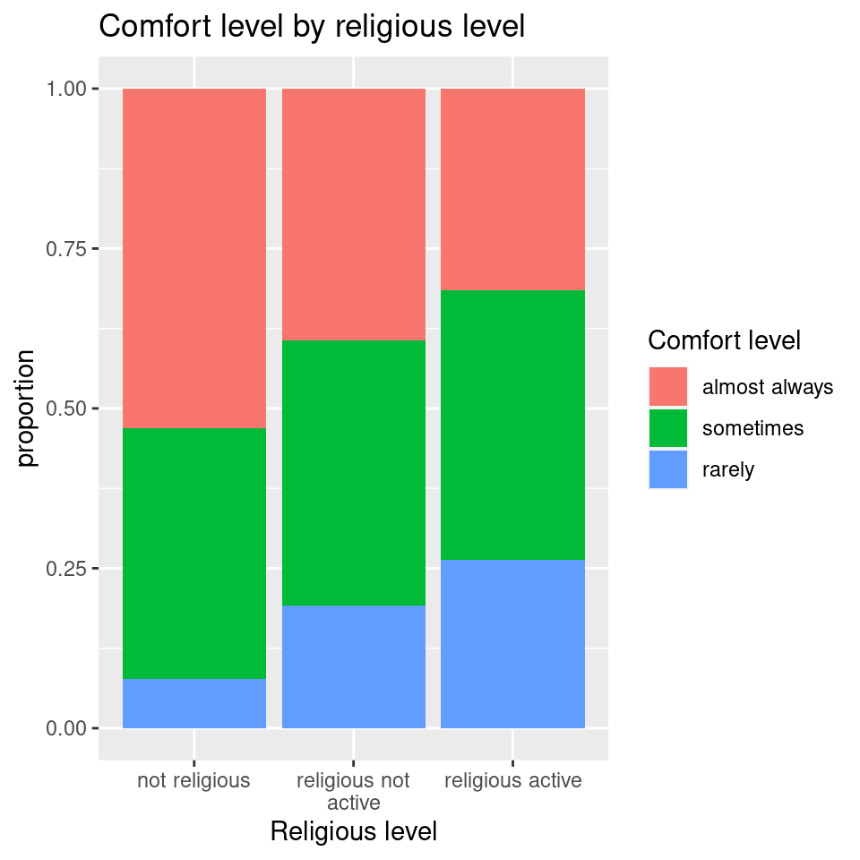

# Practice Problems 23


## Problem 1: Perry Preschool Project

In a 1962 social experiment, 123 3- and 4-year-old children from poverty-level families in Ypsilanti, Michigan, were randomly assigned either to a treatment group receiving 2 years of preschool instruction or to a control group receiving no preschool. The participants were followed into their adult years. The following table shows how many in each group were arrested for some crime by the time they were 19 years old. (*Time*, July 29, 1991).

&nbsp; | Arrested | Not Arrested | Total
- | -------- | ------------ | -----
Preschool | 19 | 42 | 61
Control | 32 | 30 | 62 
Total | 51 | 72 | 123 

Is a statistically significant difference between the rate of arrest (or no arrest) in the two treatment groups.

#### (a) Test choice

There are two categorical variables, each with two levels. We could either use a two sample test to compare proportions (groups: treatment, response: arrest outcome) OR we could use a chi-square test of independence. These tests will give identical results. For this example, we will use the chi-square test. State your hypotheses needed to test the question above.

<details><summary><red>Click for answer</red></summary>

*Answer:* The null hypothesis is that the treatment (preschool/control) is not related to the arrest outcome.
</details><br>

#### (b) Chi-square test with summarized data

This example differs from example 2 because we have data in a summarized two-way table. (Example 2 had the raw categorical variables available.) To run the chi-square test, we first must create a matrix of counts using the `cbind` command that **binds** together **c**olumns of counts:


```r
counts <- cbind(c(19,32), c(42,30))
colnames(counts) <- c("arrested", "not arrested") # adds column names
rownames(counts) <- c("preschool", "control")  # adds row names
counts
```

```
          arrested not arrested
preschool       19           42
control         32           30
```

We then use this in the `chisq.test` command:


```r
preschool.test <- chisq.test(counts)
preschool.test
```

```

	Pearson's Chi-squared test with Yates' continuity
	correction

data:  counts
X-squared = 4.4963, df = 1, p-value = 0.03397
```

- Are the expected counts large enough to trust these results?

<details><summary><red>Click for answer</red></summary>

*Answer*: Yes, they are all above 25.


```r
51/123  # overall arrest rate
```

```
[1] 0.4146341
```

```r
72/123  # overall non arrest rate
```

```
[1] 0.5853659
```

```r
preschool.test$expected
```

```
          arrested not arrested
preschool 25.29268     35.70732
control   25.70732     36.29268
```
</details><br>

- What is your conclusion? 

<details><summary><red>Click for answer</red></summary>

*Answer:* There is some evidence of an association between the treatment (preschool/control) and the arrest outcome ($\chi^2 = 4.50$, df=1, p-value=0.034).
</details><br>

#### (c) How different?

How do the arrest rates differ for each treatment group? Compute a 95% confidence interval for the difference in arrest rates between those who had the preschool and control treatments.


```r
prop.table(counts,1)
```

```
           arrested not arrested
preschool 0.3114754    0.6885246
control   0.5161290    0.4838710
```

<details><summary><red>Click for answer</red></summary>

*Answer:* About 52% of the control group were arrested while only about 31% of the preschool group were arrested.

$$
\hat{p}_{control} = \dfrac{32}{62} = 0.516129, \ \ \ \hat{p}_{preschool} = \dfrac{19}{61} = 0.3114754
$$


The 95% for the difference in true arrest rates $p_{control} - p_{preschool}$ is

\begin{align*}
0.516129 - 0.3114754 \pm & 1.96 \sqrt{\dfrac{0.516129(1-0.516129)}{62} + \dfrac{0.3114754(1-0.3114754)}{61}} \\
0.2046536 \pm & 1.96(0.0868549) \\
(0.034418, 0.3748892) \\
\end{align*}

We are 95% confident that the true rate of arrest for the preschool treatment is 3.4 to 37.5 percentage points lower than the arrest rate for the control group. This is evidence that the preschool treatment lowered the risk of arrest.


#### Comment

The `chisq.test` command uses a test stat "correction" when both of your categorical variables have only 2 levels. With this correction, your chi-square test results won't exactly match a two-sample test for the difference of two proportions. If you turn off the correct with `correct=FALSE` you will obtain identical results.

```r
chisq.test(counts, correct=FALSE) # exact same as two-sample proportion test
```

```

	Pearson's Chi-squared test

data:  counts
X-squared = 5.3059, df = 1, p-value = 0.02125
```
</details><br>


## Problem 2:  College graduates and exercise

A survey of college graduates was done to study how frequently they exercised. The survey was completed by 470 graduates. They were asked where they lived their senior year. Use the following data to determine whether there is an association between exercise on campus and students' living arrangements. 


\begin{tabular}{|c|c|c|c|c|} \hline
 & No regular exercise & Sporadic exercise & Regular exercise & Total \\  \hline
Dormitory & 32 & 30 & 28 & 90  \\ \hline 
On-Campus Apartment & 74 & 64 & 42 & 180  \\ \hline 
Off-campus Apartment & 110 & 25 & 15 & 150 \\ \hline 
At Home & 39 & 6 & 5 &  50 \\ \hline 
Total & 255 & 125 & 90 & 470 \\ \hline 
\end{tabular}


```r
counts3 <- cbind(c(32, 74, 110, 39), c(30,64,25,6), c(28,42,15,5))
colnames(counts3) <- c("No regular exercise", "Sporadic exercise", "Regular exercise") 
rownames(counts3) <- c("Dormitory", "On-Campus Apartment", "Off-campus Apartment", "At Home") 
```


```r
knitr::kable(counts3)
```


|                     | No regular exercise| Sporadic exercise| Regular exercise|
|:--------------------|-------------------:|-----------------:|----------------:|
|Dormitory            |                  32|                30|               28|
|On-Campus Apartment  |                  74|                64|               42|
|Off-campus Apartment |                 110|                25|               15|
|At Home              |                  39|                 6|                5|


```r
test3 <- chisq.test(counts3)
```

<details><summary><red>Click for answer</red></summary>

*Answer:*


### Step 1:

\begin{align*}
H_0 &: \text{exercise and living arrangements independent of each other}\\
H_A &: \text{exercise and living arrangements dependent of each other}
\end{align*}


### Step 2:

The observed and expected values from the chi square test are:


```r
test3$observed
```

```
                     No regular exercise Sporadic exercise
Dormitory                             32                30
On-Campus Apartment                   74                64
Off-campus Apartment                 110                25
At Home                               39                 6
                     Regular exercise
Dormitory                          28
On-Campus Apartment                42
Off-campus Apartment               15
At Home                             5
```

```r
round(test3$expected,2)
```

```
                     No regular exercise Sporadic exercise
Dormitory                          48.83             23.94
On-Campus Apartment                97.66             47.87
Off-campus Apartment               81.38             39.89
At Home                            27.13             13.30
                     Regular exercise
Dormitory                       17.23
On-Campus Apartment             34.47
Off-campus Apartment            28.72
At Home                          9.57
```


All of the expected counts are greater than 5.


### Step 3:

The test statistics is calculated as:

\begin{align*}
\chi^2 & = \sum \frac{(O- E)^2}{E}\\
&= \frac{(32 - 48.83)^2}{48.83} +  \frac{(30 - 23.94)^2}{23.94} +  \frac{(28 - 17.23)^2}{17.23} +\\
& \qquad \frac{(74 - 97.66)^2}{97.66} + \frac{(64 - 47.87)^2}{47.87} + \frac{(42 - 34.47)^2}{34.47} + \\
& \qquad \frac{(110 - 81.38)^2}{81.38} + \frac{(25 - 39.89)^2}{39.89} + \frac{(15 - 28.72)^2}{28.72} + \\
& \qquad \frac{(39 - 27.13)^2}{27.13} + \frac{(6 - 13.30)^2}{13.30} + \frac{(5 - 9.57)^2}{9.57} \\
&= 5.80 + 1.53 + 6.73 + 5.73 + 5.44 + 1.64 + 10.06 + 5.56 + 6.55 + 5.19 + 4.01 + 2.18\\
&= 60.42
\end{align*}


```r
(32 - 48.83)^2/48.83 + (30 - 23.94)^2/23.94 + (28 - 17.23)^2/17.23 + (74 - 97.66)^2/97.66 + (64 - 47.87)^2/47.87 + (42 - 34.47)^2/34.47 + (110 - 81.38)^2/81.38 + (25 - 39.89)^2/39.89 + (15 - 28.72)^2/28.72 + (39 - 27.13)^2/27.13+(6 - 13.30)^2/13.30+(5 - 9.57)^2/9.57
```

```
[1] 60.43885
```


```r
5.80 + 1.53 + 6.73 + 5.73 + 5.44 + 1.64 + 10.06 + 5.56 + 6.55 + 5.19 + 4.01 + 2.18
```

```
[1] 60.42
```


The degree of freedom of $\chi^2$ is $df = (4-1)*(3-1) = 6$.


```r
test3
```

```

	Pearson's Chi-squared test

data:  counts3
X-squared = 60.439, df = 6, p-value = 3.664e-11
```


### Step 4:

The p-value can also be calculated as


```r
1 - pchisq(60.43, df = 6)
```

```
[1] 3.680733e-11
```


### Step 5:

There is significant evidence of an association between the exercise and living arrangements ($\chi^2 = 60.43$, df=6, p-value $\approx$ 0).


</details><br>


## Problem 3 : Does political comfort level depend on religion?

Consider survey questions about political comfort level and religion. We want know if the response to the comfort level question is associated with their religious practice. To test this question about **two categorical** variables with one variable containing at least **3 levels**, we must conduct a chi-square test for association. 

#### (a) Hypotheses
State the hypotheses for this test.

<details><summary><red>Click for answer</red></summary>

*Answer:* The null can be stated a couple of equivalent ways: There is no association between religion and comfort level;  the variables comfort level and religion are independent of one another; the distribution of comfort level is the same for all three religion types. 

The alternatives are just "not the null" statements: There is an association between religion and comfort level;  the variables comfort level and religion are dependent; the distribution of comfort level is the different for at least one religion type. 

</details><br>


#### (b) Data
Does the data suggest that there is an association between comfort level and religion? 


```r
library(dplyr)
library(ggplot2)

# read the data 
survey <- read.csv("https://raw.githubusercontent.com/deepbas/statdatasets/main/Survey.csv") 

# and drop the rows containing missing values using the tidyr package
survey <- survey %>% tidyr::drop_na()

# rename comfort level using fct_recode() from the forcats package
survey <- survey %>% mutate(comfortness = forcats::fct_recode(Question.9, 
                          `rarely` = "rarely, if ever, comfortable",
                          `sometimes` = "sometimes comfortable",
                          `almost always` = "almost always comfortable"),
                          comfortness = forcats::fct_relevel(comfortness, 
                                                             "almost always",
                                                             "sometimes", 
                                                             "rarely"))

# rename comfort level using fct_recode() from the forcats package
survey <- survey %>%mutate(religiousness = forcats::fct_recode(Question.8, 
                          `not religious` = "not religious",
                          `religious not active` = "religious but not actively practicing",
                          `religious active` = "religious and actively practicing my religion"),
                          religiousness = forcats::fct_relevel(religiousness,
                                                               "not religious",
                                                               "religious not active",
                                                               "religious active"))
```


```r
# Make a two way table
library(kableExtra)
counts <- table(survey$religiousness, survey$comfortness)
prop.table(counts,1)  # dist of comfort level given religious level
```

```
                      
                       almost always  sometimes     rarely
  not religious           0.53092784 0.39175258 0.07731959
  religious not active    0.39393939 0.41414141 0.19191919
  religious active        0.31578947 0.42105263 0.26315789
```


#### Formatted tables in R


```r
kableExtra::kable(table(survey$religiousness, survey$comfortness), 
                  caption = "A two way table of religious preference and political comfortness") %>%
  kable_styling(position = "center")
```

<table class="table" style="margin-left: auto; margin-right: auto;">
<caption>(\#tab:unnamed-chunk-17)A two way table of religious preference and political comfortness</caption>
 <thead>
  <tr>
   <th style="text-align:left;">   </th>
   <th style="text-align:right;"> almost always </th>
   <th style="text-align:right;"> sometimes </th>
   <th style="text-align:right;"> rarely </th>
  </tr>
 </thead>
<tbody>
  <tr>
   <td style="text-align:left;"> not religious </td>
   <td style="text-align:right;"> 103 </td>
   <td style="text-align:right;"> 76 </td>
   <td style="text-align:right;"> 15 </td>
  </tr>
  <tr>
   <td style="text-align:left;"> religious not active </td>
   <td style="text-align:right;"> 39 </td>
   <td style="text-align:right;"> 41 </td>
   <td style="text-align:right;"> 19 </td>
  </tr>
  <tr>
   <td style="text-align:left;"> religious active </td>
   <td style="text-align:right;"> 18 </td>
   <td style="text-align:right;"> 24 </td>
   <td style="text-align:right;"> 15 </td>
  </tr>
</tbody>
</table>


```r
ggplot(survey, aes(x=religiousness, fill=comfortness)) +
  geom_bar(position="fill") +
  labs(fill = "Comfort level", x = "Religious level", y = "proportion", 
       title="Comfort level by religious level") +
    scale_x_discrete(labels = function(x) stringr::str_wrap(x, width = 16))
```




<details><summary><red>Click for answer</red></summary>

*Answer:* Yes, there is a much higher rate of "almost always" comfortable for the not religious respondents (53.1%) than those that are religious (not active: 39.4%; active: 31.6%).  
</details><br>

#### (c) Expected counts

Compute the expected number of "not religious" people who are "almost always comfortable".

<details><summary><red>Click for answer</red></summary>

*Answer:* There are 194 "not religious" respondents and the overall rate (ignoring religion) of "almost always" comfortable is about  45.7%. If the null is true (and religion doesn't relate to comfort level), the expected number is about

$$194 \times \dfrac{160}{350} = 88.686$$


```r
table(survey$religiousness)
```

```

       not religious religious not active 
                 194                   99 
    religious active 
                  57 
```

```r
table(survey$comfortness)
```

```

almost always     sometimes        rarely 
          160           141            49 
```


</details><br>


#### (d) Chi-square contribution

What is the contribution to the chi-square test statistic from the "not religious"/"almost always comfortable" cell?

<details><summary><red>Click for answer</red></summary>

*Answer:* The contribution to the chi-square test stat from this category is 2.31.

$$
\dfrac{(103 - 88.6857143)^2}{88.6857143} = 2.31
$$
</details><br>


#### (e) Chi-square test

The `chisq.test(x,y)` can be used to give chi-square test results. For this version, `x` and `y` are categorical variables from a data set.


```r
ComfortReligion <- chisq.test(survey$religiousness, survey$comfortness)
ComfortReligion
```

```

	Pearson's Chi-squared test

data:  survey$religiousness and survey$comfortness
X-squared = 19.33, df = 4, p-value = 0.0006768
```

- What is the chi-square test stat value?

<details><summary><red>Click for answer</red></summary>

*Answer:* The test stat value is 19.33
</details><br>

- How is the degrees of freedom of 4 calculated?

<details><summary><red>Click for answer</red></summary>

*Answer:* There are 3 categories for each variable, so the degrees of freedom will be $df = (3-1)(3-1) = 4$. 
</details><br>

- Interpret the p-value for this test.

<details><summary><red>Click for answer</red></summary>

*Answer:* If there is no association between comfort level and religiousness, then we would see a chi-square test stat of 19.33, or one even larger, only about 0.07% of the time. 
</details><br>

#### (f) Conclusion

What is your conclusion for this test?

<details><summary><red>Click for answer</red></summary>

*Answer:* We have strong evidence that there is an association between political comfort level and religiousness ($\chi^2 = 19.33$, df = 4, p-value = 7\times 10^{-4}).
</details><br>

#### (g) Expected counts

Are the expected counts large enough to use the chi-square distribution to compute the p-value?


```r
ComfortReligion$expected
```

```
                      survey$comfortness
survey$religiousness   almost always sometimes rarely
  not religious             88.68571  78.15429  27.16
  religious not active      45.25714  39.88286  13.86
  religious active          26.05714  22.96286   7.98
```

<details><summary><red>Click for answer</red></summary>

*Answer:* Yes, all expected counts are 5 or greater. 
</details><br>

#### (h) Simulated p-value

If you were concerned that the expected counts weren't large enough to trust using a chi-square distribution to compute a p-value, you can add a `simulate.p.value = TRUE` argument to use a randomization distribution to compute the p-value:


```r
chisq.test(survey$religiousness, survey$comfortness, simulate.p.value = TRUE)
```

```

	Pearson's Chi-squared test with simulated p-value
	(based on 2000 replicates)

data:  survey$religiousness and survey$comfortness
X-squared = 19.33, df = NA, p-value = 0.0004998
```

The p-value is slightly different, but your conclusion should be the same.


#### (i) Where is the difference?

Use the grouped bar graph and conditional percents from part (b) to describe the association you (should have) found in part (f). To help quantify differences, compute a 95% confidence interval for the difference in the true proportions of "rarely comfortable" people in the not religious and actively religious groups. 

<details><summary><red>Click for answer</red></summary>

*Answer:* The largest test stat contributions comes from the not religious/rarely comfortable group and the active religious/rarely comfortable group. We can see that the not religious respondents have a low "rarely" comfortable level compared to religious groups (7.7% vs. 26.3% for active and 19.2% for not active) and they have a very high almost always comfortable level compared to religious groups (53.1% vs. 31.6% for active and 39.4% for not active).

If $p_{not.rel}$ and $p_{active.rel}$ denote the true proportions of "rarely comfortable" for the not religious and active religious groups. We want a 95% CI for $p_{not.rel} - p_{active}$. The sample proportions are computed from the `counts` table (or the `prop.table` output). Of the 194 "not religious" respondents, 15 are rarely comfortable so 
$$\hat{p}_{not.rel} = \frac{15}{194} = 0.077$$
$$\hat{p}_{active.rel} = \frac{15}{57} = 0.263$$


So a 95% CI for the difference in the true rates of rarely comfortable is
\begin{align*}
CI &= (0.077 - 0.263) \pm 1.96\cdot\sqrt{\frac{0.077(1-0.077)}{194} + \frac{0.263(1-0.263)}{57}}\\
&= (-0.306, -0.066)
\end{align*}


```r
round((0.077 - 0.263) + c(-1,1)* 1.96* sqrt(0.077*(1-0.077)/194  + 0.263*(1-0.263)/57),3)
```

```
[1] -0.306 -0.066
```


- I am 95% confident that the percentage of all non-religious students who are rarely comfortable is between 7 and 31 percentage points lower than the actively religious students. 
</details><br>

