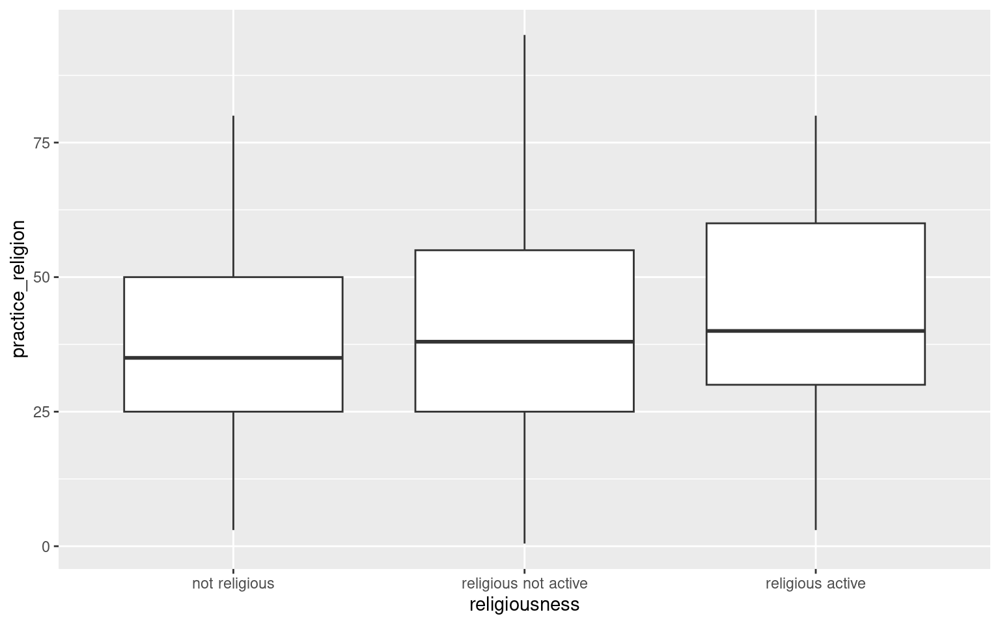
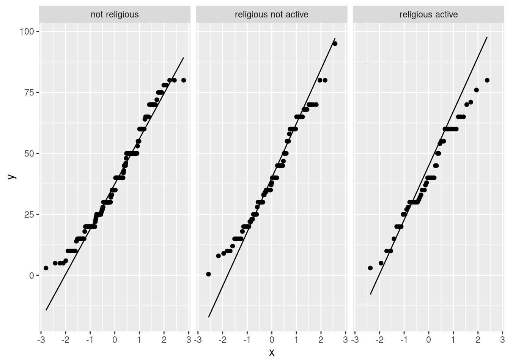
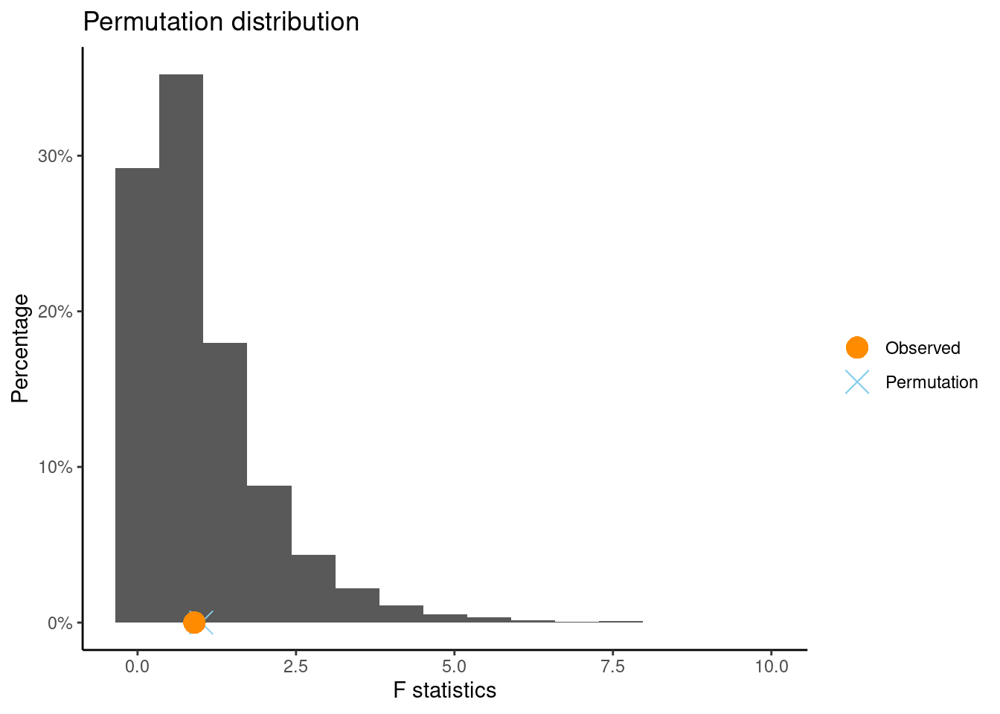
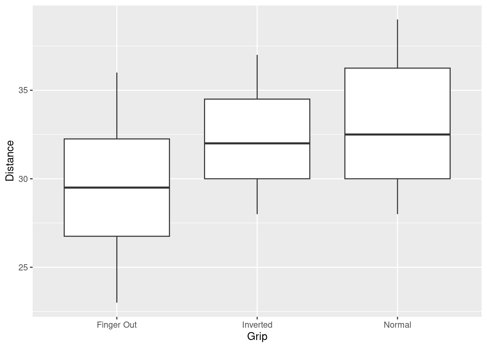
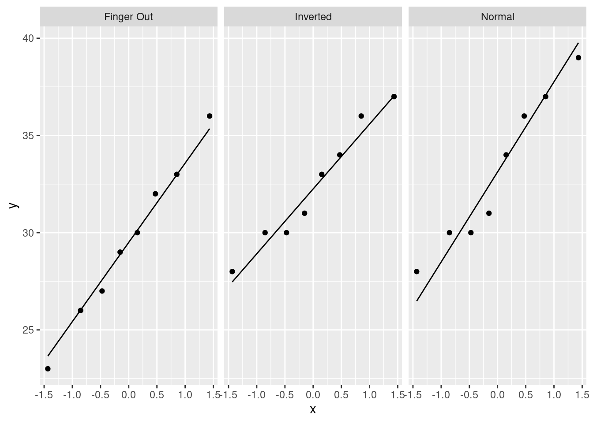

# Practice Problems 24

## Problem 1: Comparing % religious guess by religion

One of the class survey questions asked respondents to give their best guess at the percentage of students at Carleton who practice a religion. Here we can compare responses to this question by the religiousness of the respondent:


```r
library(dplyr)
# read the data 
survey <- read.csv("https://raw.githubusercontent.com/deepbas/statdatasets/main/Survey.csv") 

# and drop the rows containing missing values using the tidyr package
survey <- survey %>% tidyr::drop_na()

# make a new variable called `practice_religion_percentage` (more informative variable name)
survey <- survey %>%  mutate(practice_religion = Question.7)

# rename comfort level using fct_recode() from the forcats package
survey <- survey %>%mutate(religiousness = forcats::fct_recode(Question.8, 
                          `not religious` = "not religious",
                          `religious not active` = "religious but not actively practicing",
                          `religious active` = "religious and actively practicing my religion"),
                          religiousness = forcats::fct_relevel(religiousness,
                                                               "not religious",
                                                               "religious not active",
                                                               "religious active"))
ggplot(data = survey, aes(x = religiousness, y = practice_religion)) +
    geom_boxplot()
```



```r
tapply(survey$practice_religion, survey$religiousness, summary)
```

```
$`not religious`
   Min. 1st Qu.  Median    Mean 3rd Qu.    Max. 
   3.00   25.00   35.00   38.05   50.00   80.00 

$`religious not active`
   Min. 1st Qu.  Median    Mean 3rd Qu.    Max. 
   0.50   25.00   38.00   40.19   55.00   95.00 

$`religious active`
   Min. 1st Qu.  Median    Mean 3rd Qu.    Max. 
   3.00   30.00   40.00   41.32   60.00   80.00 
```

#### (a) One-way ANOVA hypotheses

We want to determine if the differences in observed mean guesses are statistically significant. State the hypotheses for this test.

<!-- <details> -->

<!-- <summary><red>Click for answer</red></summary> -->

<!-- *Answer:* Let $\mu$ be the true mean religous % guess in a given religiousness group. Then $H_0: \mu_{notRelig} = \mu_{Relig,Act} = \mu_{Relig,NotAct}$ vs. $H_A:$ at least one mean is different. -->

<!-- </details> -->

<br>

#### (b) Check assumptions

Can use trust the results from a one-way ANOVA test?


```r
table(survey$religiousness)  
```

```

       not religious religious not active 
                 194                   99 
    religious active 
                  57 
```

```r
tapply(survey$practice_religion, survey$religiousness, sd, na.rm=TRUE)  #need na.rm with a missing value  
```

```
       not religious religious not active 
            17.96535             19.22239 
    religious active 
            18.33143 
```

```r
ggplot(survey, aes(sample = practice_religion)) + geom_qq() + geom_qq_line() + facet_wrap(~religiousness)
```




<!-- <details> -->

<!-- <summary><red>Click for answer</red></summary> -->

<!-- *Answer:* Yes, the assumptions are met. The distributions within each group are slightly skewed or roughly symmetric, and the sample sizes within each group are all at least 30. In addition, the SD in each group are close to each other (18% to 19.2%). -->

<!-- </details> -->

<br>

#### (c) One-way ANOVA test

Assuming part (b) checks out, run the one-way ANOVA test to compare means:


```r
guess.aov <- aov(practice_religion ~ religiousness, data = survey)
summary(guess.aov)
```

```
               Df Sum Sq Mean Sq F value Pr(>F)
religiousness   2    607   303.6   0.898  0.408
Residuals     347 117321   338.1               
```

-   What is the F test stat value?

<!-- <details> -->

<!-- <summary><red>Click for answer</red></summary> -->

<!-- *Answer:* $F = 0.898$ -->

<!-- </details> -->

<br>

-   Interpret the p-value.

<!-- <details> -->

<!-- <summary><red>Click for answer</red></summary> -->

<!-- *Answer:* If there is no difference in true mean guess in all three groups, we would see an F test stat of at least 0.898 about 40.8% of the time. -->

<!-- </details> -->

<br>

-   What is your conclusion?

<!-- <details> -->

<!-- <summary><red>Click for answer</red></summary> -->

<!-- *Answer:* The differences in mean guesses that we've observed in our sample are not statistically significant. We don't have evidence that the true mean guesses for the three religiousness groups are different. -->

<!-- </details> -->

<br>

#### (d) Describe the association?

If you found a statistically significant difference in means in part (c), describe how the groups differ. If you did not find a statistically significant difference in part (c), estimate the average guess for all students in the (hypothetical) population of 215 students.

<details>

<summary><red>Click for answer</red></summary>

*Answer:* We didn't find a statistically significant difference in part (c). So what is our best estimate of the average guess for all students, since responses don't seem to differ by religiousness?


```r
t.test(survey$practice_religion)
```

```

	One Sample t-test

data:  survey$practice_religion
t = 39.882, df = 349, p-value < 2.2e-16
alternative hypothesis: true mean is not equal to 0
95 percent confidence interval:
 37.25428 41.11927
sample estimates:
mean of x 
 39.18677 
```


We are 95% confident that the mean guess at the percentage of religious students at Carleton is between 37.3% to 41.1% for all math 215 students.


```
       not religious religious not active 
            38.05155             40.18556 
    religious active 
            41.31579 
```

**What if there was a difference?!**

Use EDA to describe how the sample means differ. Does it look like all three means are different, or does one mean look different from the rest? The sample mean responses from the two religious groups look similar (active: 41.3%; not active: 40.2%) but the mean response of the not religious group is lower (38.1%).


```r
survey$religion <- ifelse(survey$religiousness == "not religious", "not religious", "religious")
result <-t.test(practice_religion ~ religion, data=survey)
```

</details>


(e) The conditions for using the theoretical ANOVA are met in this example. However, if we were to use a *randomization approach* using R, we would use the `permTestAnova()` function from `CarletonStats` package in R as follows:


```r
set.seed(7)
library(CarletonStats)
permTestAnova(practice_religion ~ religiousness, data=survey)
```

```

	** Permutation test **

 Permutation test with alternative: greater 
 Observed F statistic: 0.89787 
 Mean of permutation distribution: 1.0044 
 Standard error of permutation distribution: 1.01157 
 P-value:  0.4127 

	*-------------*
```




<br>

## Problem 2: Frisbee grip

The data set `Frisbee.csv` contains data on `Distance` thrown (in paces) for three different frisbee `Grip` types. There are 24 difference cases (throws) Here we can compare responses to this question by the religiousness of the respondent:


```r
frisbee <- read.csv("https://raw.githubusercontent.com/deepbas/statdatasets/main/Frisbee.csv")
ggplot(frisbee, aes(x = Grip, y = Distance)) + geom_boxplot()
```


```r
tapply(frisbee$Distance, frisbee$Grip, summary)
```

```
$`Finger Out`
   Min. 1st Qu.  Median    Mean 3rd Qu.    Max. 
  23.00   26.75   29.50   29.50   32.25   36.00 

$Inverted
   Min. 1st Qu.  Median    Mean 3rd Qu.    Max. 
  28.00   30.00   32.00   32.38   34.50   37.00 

$Normal
   Min. 1st Qu.  Median    Mean 3rd Qu.    Max. 
  28.00   30.00   32.50   33.12   36.25   39.00 
```

The question we want to answer is whether or not the differences in observed mean distance thrown are statistically significant.  To test this question comparing **means** for a **quantitative** response broken up into **at least 2 groups**, we can conduct a **one-way ANOVA test**. 

#### (a) One-way ANOVA hypotheses

State the hypotheses for this test. 

<details><summary><red>Click for answer</red></summary>

*Answer:* Let $\mu$ be the true mean distance thrown using a certain grip. Then
$H_0: \mu_{fout} = \mu_{invert} = \mu_{normal}$
vs. $H_A:$ at least one mean is different.
</details><br>

#### (b) One-way ANOVA test

You can obtain the one-way ANOVA table and test results with the `aov(y ~ x, data=)` command. Running the `summary` function on this anova result gives you the ANOVA table:

```r
frisbee.anova <- aov(Distance ~ Grip, data = frisbee)
summary(frisbee.anova)
```

```
            Df Sum Sq Mean Sq F value Pr(>F)
Grip         2  58.58   29.29   2.045  0.154
Residuals   21 300.75   14.32               
```

- What is the F test stat value?

<details><summary><red>Click for answer</red></summary>

*Answer:* $F = 2.045$
</details><br>

- Interpret the p-value.

<details><summary><red>Click for answer</red></summary>

*Answer:* If grip does not affect distance thrown, then we would see mean differences as larger, or larger, than those observed about 15.4% of the time. 
</details><br>

- What is your conclusion?

<details><summary><red>Click for answer</red></summary>

*Answer:* This study does not provide evidence that these three grips affect the mean distance thrown. 
</details><br>

#### (c) Checking assumptions
Can we trust the p-value obtained above using the F distribution? 


```r
table(frisbee$Grip)  # check n's
```

```

Finger Out   Inverted     Normal 
         8          8          8 
```

```r
tapply(frisbee$Distance, frisbee$Grip, sd)  # similar SD's?
```

```
Finger Out   Inverted     Normal 
  4.174754   3.159453   3.943802 
```

```r
library(ggplot2)  # shape?
ggplot(frisbee, aes(x = Grip, y = Distance)) + geom_boxplot()
```



```r
ggplot(frisbee, aes(sample = Distance)) + geom_qq() + geom_qq_line() + facet_wrap(~Grip)
```



<details><summary><red>Click for answer</red></summary>

*Answer:* Sample sizes in all three groups are small (8) but the observed distances thrown within each group are roughly normally distributed. There are small differences in variation of the three groups, but the SD rule is met since largest SD (4.17) is less than twice the smallest SD (3.16). The assumptions are met. 
</details><br>
