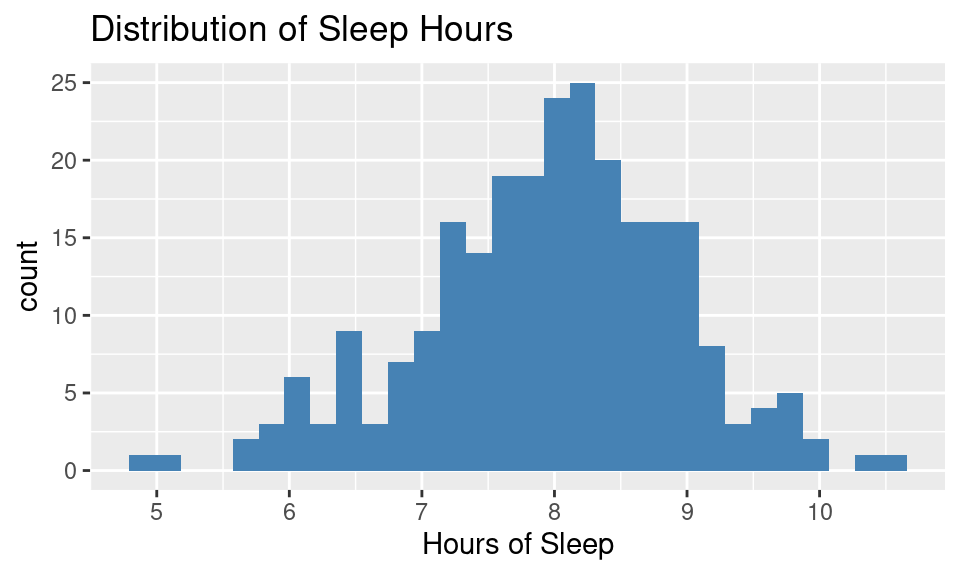
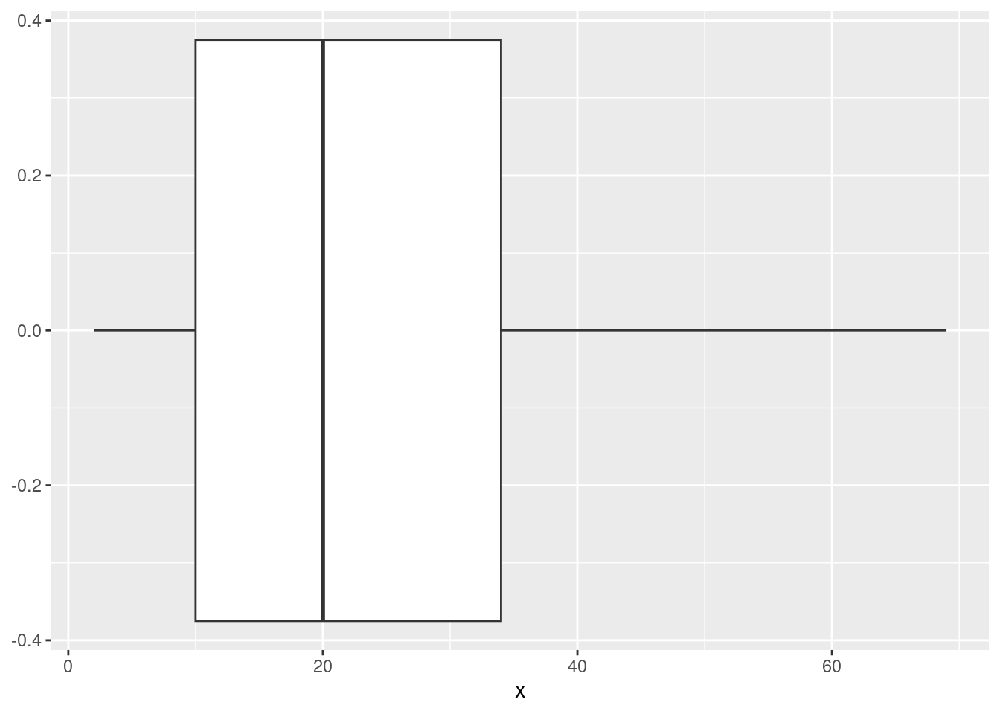
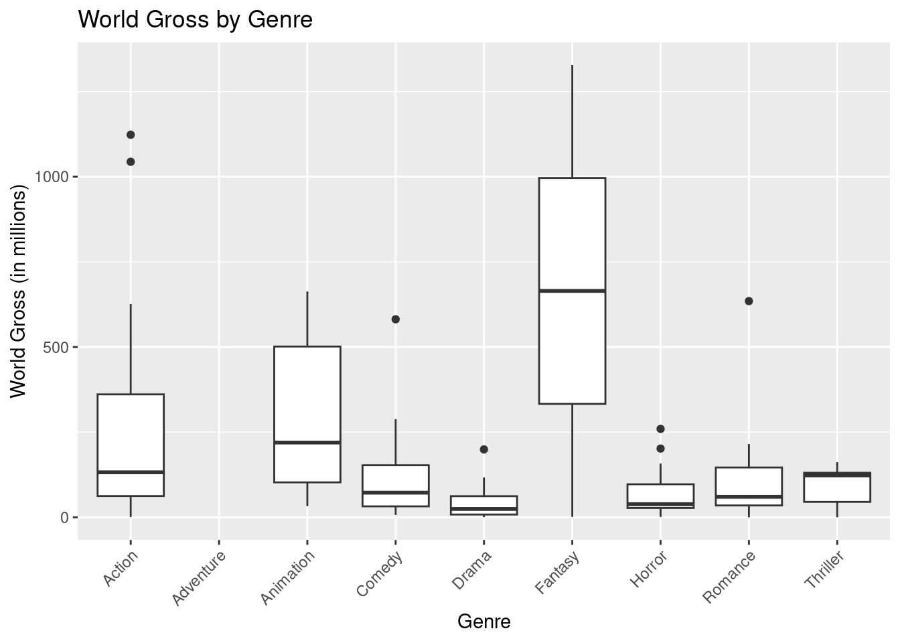

# Practice Problems 5

## Problem 1: Sleep

This histogram shows the distribution of hours or sleep per night for a large sample of students. 


```r
library(ggplot2)
sleep <- read.csv("http://math.carleton.edu/Stats215/Textbook/SleepStudy.csv")
ggplot(sleep, aes(x=AverageSleep)) +
  geom_histogram(fill="steelblue", bins = 30) +
  labs(title = "Distribution of Sleep Hours", x = "Hours of Sleep")
```



### (a)  Estimate the average hours of sleep per night.

<details>
<summary><red>Click for answer</red></summary>
*Answer:* The mean is around 8 hours

</details>

### (b)	Use the 95% rule to estimate the standard deviation for this data.

<details>
<summary><red>Click for answer</red></summary>
*Answer:* Most of the data is between about 6 and 10, with a mean around 8 (due to the roughly symmetric
distribution). So two standard deviations is about 2 hours of sleep, making one standard deviation about
1 hours of sleep.

Let’s check the rule! Here are the actual mean and SD:


```r
mean(sleep$AverageSleep)
```

```
[1] 7.965929
```


```r
sd(sleep$AverageSleep)
```

```
[1] 0.9648396
```

</details>

## Problem 2: Z-scores for Test Scores

The ACT test has a population mean of 21 and standard deviation of 5.  The SAT has a population mean of 1500 and a standard deviation of 325.  You earned 28 on the ACT and 2100 on the SAT. 

### (a)  Which test did you do better on? 

<details>
<summary><red>Click for answer</red></summary>
*Answer:*

- ACT: The z-score for the score of 28 is z = (28 - 21)/5 = 1.4.
- SAT: The z-score for the score of 2100 is z = (2100 - 1500)/325 = 1.85.
- The SAT score is 1.85 standard deviations above average while the ACT score is only 1.4 standard
deviations above. You did better on the SAT.


```r
z_ACT <- (28 - 21) / 5
z_SAT <- (2100 - 1500) / 325
z_ACT
```

```
[1] 1.4
```

```r
z_SAT
```

```
[1] 1.846154
```

</details>


### (b)	For each test, find the interval that is likely to contain about 95% of all test scores. 

<details>
<summary><red>Click for answer</red></summary>
*Answer:*

- ACT: Two standard deviations is 2(5) = 10. About 95% of ACT scores are between 21 - 10 = 11
and 21 + 10 = 31. This claim assumes that ACT scores follow a bell-shaped distribution.
- SAT: Two standard deviations is 2(325) = 650. About 95% of SAT scores are between 1500 - 650 =
850 and 1500 + 650 = 2150. This claim assumes that SAT scores follow a bell-shaped distribution.


```r
ACT_lower <- 21 - 2 * 5
ACT_upper <- 21 + 2 * 5
SAT_lower <- 1500 - 2 * 325
SAT_upper <- 1500 + 2 * 325
c(ACT_lower, ACT_upper)
```

```
[1] 11 31
```

```r
c(SAT_lower, SAT_upper)
```

```
[1]  850 2150
```

</details>

------------------------------------

## Problem 3: 5 number summaries

For the given vector of observations indicate whether the resulting data appear to be symmetric, skewed to the right, or skewed to the left.

 (2, 10, 15, 20, 69, 34, 23, 2, 45)


```r
my_vector <- c(2, 10, 15, 20, 69, 34, 23, 2, 45)
summary(my_vector)
```

```
   Min. 1st Qu.  Median    Mean 3rd Qu.    Max. 
   2.00   10.00   20.00   24.44   34.00   69.00 
```

<details>
<summary><red>Click for answer</red></summary>
*Answer:* Skewed right. It has a longer right tail than left since max -Q3 >> Q1 - min


```r
ggplot(data.frame(x=my_vector), aes(x)) + geom_boxplot()
```



</details>


## Problem 4:  Hot dog

This boxplot shows the number of hot dogs eaten by the winners of Nathan’s Famous hot dog eating contests from 2002-2011. 


```r
hotdogs <- read.csv("https://raw.githubusercontent.com/deepbas/statdatasets/main/HotDogs.csv")
ggplot(hotdogs, aes(x = "", y = HotDogs)) +
  geom_boxplot() +
  labs(title = "Number of Hot Dogs Consumed", y = "Number of Hot Dogs") 
```


### (a)  Use the boxplot to estimate the 5 number summary and IQR for this data. Verify that there are no outliers in this data.

<details>
<summary><red>Click for answer</red></summary>
*Answer:*

```r
hotdog_q1 <- quantile(hotdogs$HotDogs, 0.25); hotdog_q1
```

```
25% 
 54 
```

```r
hotdog_q3 <- quantile(hotdogs$HotDogs, 0.75); hotdog_q3
```

```
75% 
 65 
```

```r
hotdog_iqr <- IQR(hotdogs$HotDogs); hotdog_iqr
```

```
[1] 11
```

```r
lower_fence <- hotdog_q1 - 1.5 * hotdog_iqr; lower_fence
```

```
 25% 
37.5 
```

```r
upper_fence <- hotdog_q3 + 1.5 * hotdog_iqr; upper_fence
```

```
 75% 
81.5 
```

```r
library(dplyr)
outliers <- filter(hotdogs, HotDogs < lower_fence | HotDogs > upper_fence)
outliers
```

```
[1] Year    HotDogs
<0 rows> (or 0-length row.names)
```

</details>

## Problem 5: Hollywood Movies World Gross

Let's visit the `WorldGross` analysis from the Hollywood movies data set:


```r
movies <- read.csv("https://raw.githubusercontent.com/deepbas/statdatasets/main/HollywoodMovies2011.csv")
```

### (a) Draw a boxplot of `WorldGross`.

<details>
<summary><red>Click for answer</red></summary>
*Answer:* 

```r
ggplot(movies, aes(x = WorldGross, y = "")) +
  geom_boxplot() +
  labs(title = "World Gross of Hollywood Movies", x = "World Gross (in millions)", y ="") 
```


</details>

How many movies are identified as outliers for world gross? 

### (b) Calculating boxplot values

Use the boxplot outlier rule to find the "fence" (cutoff) between an outlier and non-outlier for `WorldGross`. Then determine the value (of `WorldGross`) that the upper "whisker" (non-outlier) extends to. 

<details>
<summary><red>Click for answer</red></summary>
*Answer:* 

```r
library(tidyr)
movies_no_na <- drop_na(movies)   # drop missing values
q1_world_gross <- quantile(movies_no_na$WorldGross, 0.25)
q3_world_gross <- quantile(movies_no_na$WorldGross, 0.75)
iqr_world_gross <- IQR(movies_no_na$WorldGross)
lower_fence_world_gross <- q1_world_gross - 1.5 * iqr_world_gross
upper_fence_world_gross <- q3_world_gross + 1.5 * iqr_world_gross

outliers <- filter(movies_no_na, WorldGross < lower_fence_world_gross | WorldGross > upper_fence_world_gross)
outliers
```

```
                                          Movie
1   Harry Potter and the Deathly Hallows Part 2
2                          The Hangover Part II
3                       Twilight: Breaking Dawn
4                Transformers: Dark of the Moon
5                                           Rio
6                Rise of the Planet of the Apes
7                                    The Smurfs
8                               Kung Fu Panda 2
9  Pirates of the Caribbean:\nOn Stranger Tides
10                           Mission Impossible
11                            Sherlock Holmes 2
12                                         Thor
13                                       Cars 2
                LeadStudio RottenTomatoes AudienceScore
1              Warner Bros             96            92
2       Legendary Pictures             35            58
3              Independent             26            68
4      DreamWorks Pictures             35            67
5         20th Century Fox             71            73
6         20th Century Fox             83            87
7  Sony Pictures Animation             23            50
8     DreamWorks Animation             82            80
9                   Disney             34            61
10               Paramount             93            86
11             Warner Bros             60            79
12                  Disney             77            80
13                   Pixar             38            56
               Story     Genre TheatersOpenWeek
1            Rivalry   Fantasy             4375
2             Comedy    Comedy             3615
3               Love   Romance             4061
4              Quest    Action             4088
5              Quest Animation             3826
6            Revenge    Action             3648
7  Fish Out Of Water Animation             3395
8            Rivalry Animation             3925
9              Quest    Action             4155
10           Pursuit    Action             3448
11           Pursuit    Action             3703
12     Monster Force    Action             3955
13 Fish Out Of Water Animation             4115
   BOAverageOpenWeek DomesticGross ForeignGross WorldGross
1              38672        381.01       947.10   1328.111
2              23775        254.46       327.00    581.464
3              34012        260.80       374.00    634.800
4              23937        352.39       770.81   1123.195
5              10252        143.62       341.02    484.634
6              15024        176.70       304.52    481.226
7              10489        142.61       419.54    562.158
8              12142        165.25       497.78    663.024
9              21697        241.07       802.80   1043.871
10              8672        197.80       336.70    534.500
11             10704        179.04       261.00    440.040
12             16618        181.03       267.48    448.512
13             16072        191.45       360.40    551.850
   Budget Profitability OpeningWeekend
1     125     10.624888         169.19
2      80      7.268300          85.95
3     110      5.770909         138.12
4     195      5.759974          97.85
5      90      5.384822          39.23
6      93      5.174473          54.81
7     110      5.110527          35.61
8     150      4.420160          47.66
9     250      4.175484          90.15
10    145      3.686207          29.55
11    125      3.520320          39.63
12    150      2.990080          65.72
13    200      2.759250          66.14
```

</details>

(c) Create a new dataset called `movies_no_outliers` that contains only the rows from `movies_no_na` where the W`orldGross` values are within the range defined by the lower and upper fences.

<details>
<summary><red>Click for answer</red></summary>
*Answer:* 

```r
library(dplyr)
movies_no_outliers <- filter(movies_no_na, WorldGross >= lower_fence_world_gross & WorldGross <= upper_fence_world_gross)
```

</details>


### (d) Side-by-side boxplot

We can compare boxplots of `WorldGross` across `Genre` categories:


```r
ggplot(movies, aes(x = Genre, y = WorldGross)) +
  geom_boxplot() +
  labs(title = "World Gross by Genre", x = "Genre", y = "World Gross (in millions)") +
  theme(axis.text.x = element_text(angle = 45, hjust = 1))
```



- What does this type of graph illustrate well about the relationship between `WorldGross` and `Genre`?

<details>
<summary><red>Click for answer</red></summary>
*Answer:* Does a good job comparing median values and extremes
</details>

- What does this type of graph not illustrate well about the relationship between `WorldGross` and `Genre`?

<details>
<summary><red>Click for answer</red></summary>
*Answer:* It doesn't illustrate sample sizes well, e.g. the fantasy genre only has 2 movies in it
</details>


