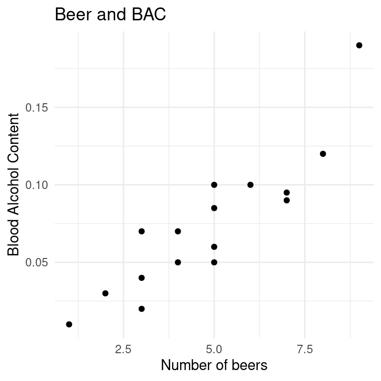
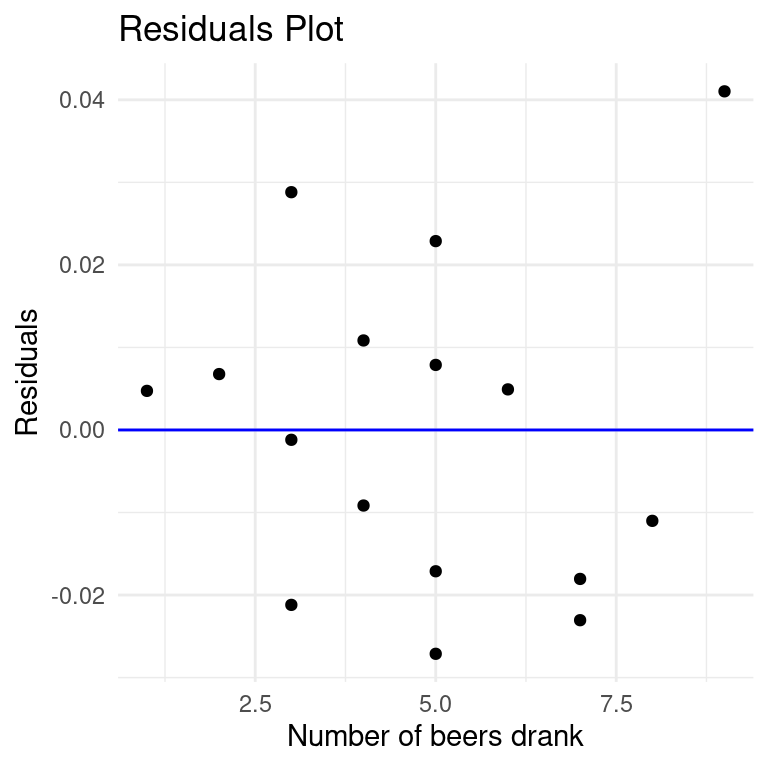
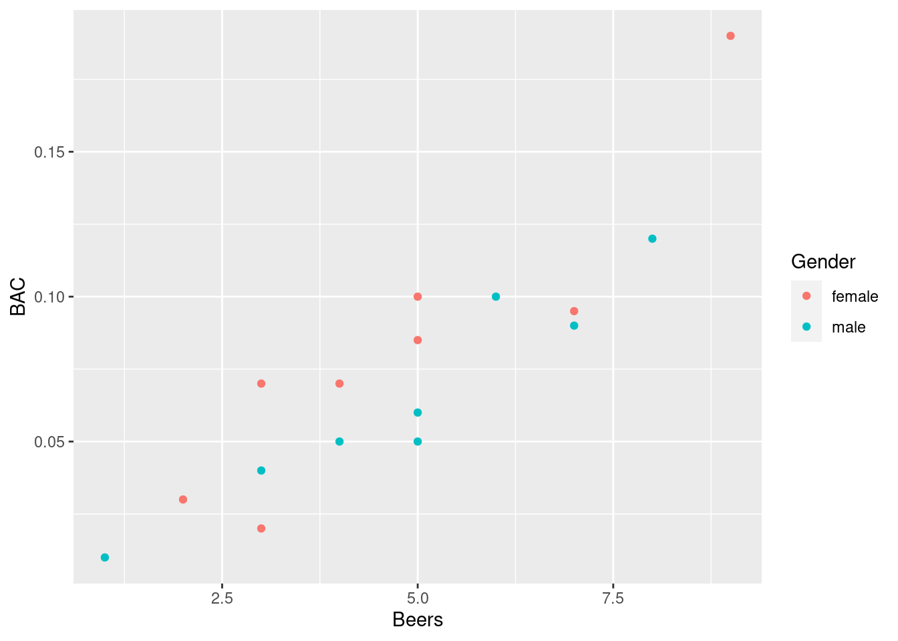
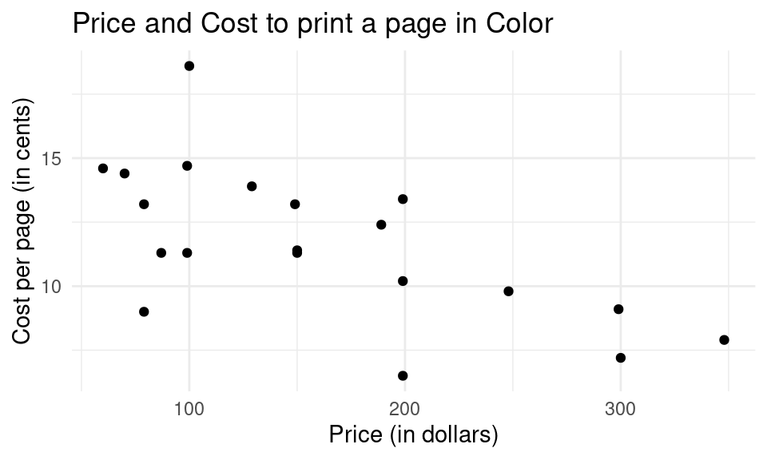

# Practice Problems 6

## Problem 1

### Beer Example

A study of 16 Ohio State University students looked at the relationship between the number of beers a student consumes and their blood alcohol content (BAC) 30 minutes after their last beer.  The regression information from R to predict BAC from number of beers consumed is given below. 


```r
library(ggplot2); library(dplyr)
bac <- read.csv("https://raw.githubusercontent.com/deepbas/statdatasets/main/BAC.csv")
ggplot(data = bac, aes(x = Beers, y = BAC)) + geom_point(shape = 19) + labs(title = "Beer and BAC", x = "Number of beers", y = "Blood Alcohol Content") + theme_minimal()
```




- Is there a relationship?
    + direction?
    + strength?
    + form?


### (a) Computing correlation

Compute correlation and account for missing values.


```r
cor(bac$BAC, bac$Beers, use = "complete.obs")
```

```
[1] 0.8943381
```

`Note`: If there are any missing values (`NA`'s) on either of the variables involved in the correlation calculation, use `use = "complete.obs"` as an extra argument to the `cor` function.


### (b)	Fitting a regression line

We use the `lm(y ~ x, data=mydata)` function to fit a **l**inear (regression) **m**odel for a response y given an explanatory variable x. This command creates a **linear model object** that needs to be assigned a name, here we call it `bac.lm`. You can get the slope and intercept by typing out the object name:


```r
bac.lm <- lm(BAC ~ Beers, data=bac)
bac.lm
```

```

Call:
lm(formula = BAC ~ Beers, data = bac)

Coefficients:
(Intercept)        Beers  
   -0.01270      0.01796  
```

### (c) Write down the fitted regression equation to predict BAC from number of beers. 

<details>

<summary><red>Click for answer</red></summary>
*Answer:* $\hat{y} = -0.01270 + 0.01796*x$
</details><br>


- You can add this regression line to your scatterplot from part (a) by creating the plot and using the `abline` command: 


```r
ggplot(data = bac, aes(x = Beers, y = BAC)) + 
  geom_point(shape = 19) + 
  geom_smooth(method = "lm", se = FALSE, color = "blue") + 
  labs(title = "Beer and BAC", x = "Number of beers", y = "Blood Alcohol Content") + 
  theme_minimal()
```


### (d)	Interpret the slope in context.

<details>
<summary><red>Click for answer</red></summary>
*Answer:* Drinking one more beer is associated with a 0.0180 unit increase in predicted BAC.
</details><br>

### (e)	Interpret the intercept in context, if it makes sense to do so. 

<details>
<summary><red>Click for answer</red></summary>
*Answer:* The intercept is -0.0127.  A student who drinks 0 beers would be predicted to have a negative blood alcohol content. This is not possible so the intercept does not make sense in this context, but the intercept is included in the model to get the best fit line for the data collected.
</details><br>


### (f)	If your friend at Ohio State drank 2 beers, what would you predict their BAC to be?

<details>
<summary><red>Click for answer</red></summary>
*Answer:* The predicted BAC is 0.0233.

$$
\widehat{BAC} = -0.0127 + 0.0180(2) = 0.0233.
$$


```r
BAC.hat <- -0.0127 + 0.0180*(2) 
BAC.hat
```

```
[1] 0.0233
```

</details><br>

### (g)	Find the residual for the student in the dataset who drank 2 beers and had a BAC of 0.03.

<details>
<summary><red>Click for answer</red></summary>
*Answer:* The residual is 0.0067.

$$
BAC - \widehat{BAC} = .03 - .0233=0.0067
$$


```r
0.03 - (-0.0127 + 0.0180*(2)) 
```

```
[1] 0.0067
```

</details><br>

### (h) Getting residuals in R

We can use the `resid` command to get the residuals for each case in the data set:


```r
# Residuals 
residuals <- data.frame(Beers = bac$Beers, Residuals = resid(bac.lm))
residuals
```

```
   Beers    Residuals
1      5  0.022881795
2      2  0.006773080
3      9  0.041026747
4      8 -0.011009491
5      3 -0.001190682
6      7 -0.018045729
7      3  0.028809318
8      5 -0.017118205
9      3 -0.021190682
10     5 -0.027118205
11     4  0.010845557
12     6  0.004918033
13     5  0.007881795
14     7 -0.023045729
15     1  0.004736842
16     4 -0.009154443
```


### (i) Getting $R^2$ value

You can use the `summary` command on an `lm` object to get a more detailed print out of your linear model, along with the $R^2$ value for your model:


```r
summary(bac.lm)
```

```

Call:
lm(formula = BAC ~ Beers, data = bac)

Residuals:
      Min        1Q    Median        3Q       Max 
-0.027118 -0.017350  0.001773  0.008623  0.041027 

Coefficients:
             Estimate Std. Error t value Pr(>|t|)    
(Intercept) -0.012701   0.012638  -1.005    0.332    
Beers        0.017964   0.002402   7.480 2.97e-06 ***
---
Signif. codes:  
0 '***' 0.001 '**' 0.01 '*' 0.05 '.' 0.1 ' ' 1

Residual standard error: 0.02044 on 14 degrees of freedom
Multiple R-squared:  0.7998,	Adjusted R-squared:  0.7855 
F-statistic: 55.94 on 1 and 14 DF,  p-value: 2.969e-06
```


### (j) Making a residuals plot

The regression of `BAC` on `Beers` has a residuals plot that plots the model's residuals on the y-axis and the explanatory ("predictor") on the x-axis. We add a horizontal reference line (the detrended regression line) with the `geom_hline()` command:


```r
# code for residual plot
ggplot(data = residuals, aes(x = Beers, y = Residuals)) +
           geom_point(shape = 19) +
           geom_hline(yintercept = 0, color = "blue") +
           labs(title = "Residuals Plot",
                x = "Number of beers drank",
                y = "Residuals") +
           theme_minimal()
```



**Interpret:** There is one case of 9 beers with a large residual (much higher BAC than predicted), but since there is no clear pattern (trend) in this plot it looks like our regression model adequately describes the relationship between number of beers and BAC. 

- Is the magnitude of the scatter around the horizontal 0-line in the residuals plot greater than, less than, or the same as the magnitude of the scatter around the regression line in the scatterplot?

<details>
<summary><red>Click for answer</red></summary>
*Answer:* The same! The residuals plot is only a "detrended" scatterplot, meaning the vertical distances between a point and the regression line on the scatterplot or a point and the 0-line on the residuals plot are exactly the same. The residual plot looks more scattered because the trend is removed and the scale of the y-axis compressed. 
</details><br>

### (k) Identifying points

To find rows where the number of Beers is 9, we can use the `filter` function from the `dplyr` package.


```r
# Use `filter` to find rows where Beers equals 9
filtered_data <- filter(bac, Beers == 9)
filtered_data
```

```
  X ID_OSU Gender Weight Beers  BAC
1 3      3 female    110     9 0.19
```


<details>
<summary><red>Click for answer</red></summary>
*Answer:* Row 3. 
</details><br>

What is the row number of the case with the most negative residual? We could eyeball the graph to see that the most negative residual is less than -0.02:

To find the row number of the case with the most negative residual, you can identify residuals less than -0.02, and then pinpoint the one that also drank 5 beers:


```r
# Use `filter` to identify rows with residuals less than -0.02 and 5 beers
filtered_resid <- filter(bac, resid(bac.lm) < -0.02 & Beers == 5)
filtered_resid
```

```
   X ID_OSU Gender Weight Beers  BAC
1 10     10   male    275     5 0.05
```

### (l) Checking outlier influence


You can examine the influence of removing specific cases on your model by using the `subset` parameter in the `lm` function. For instance, to remove row 3:


```r
# Fit a linear model without row 3
bac.lm2 <- lm(BAC ~ Beers, data = bac, subset = -3)
```


```r
# Compare the two models
summary(bac.lm2)
```

```

Call:
lm(formula = BAC ~ Beers, data = bac, subset = -3)

Residuals:
      Min        1Q    Median        3Q       Max 
-0.023685 -0.010068 -0.003685  0.011985  0.027208 

Coefficients:
             Estimate Std. Error t value Pr(>|t|)    
(Intercept) 2.481e-05  1.088e-02   0.002    0.998    
Beers       1.455e-02  2.216e-03   6.568  1.8e-05 ***
---
Signif. codes:  
0 '***' 0.001 '**' 0.01 '*' 0.05 '.' 0.1 ' ' 1

Residual standard error: 0.01624 on 13 degrees of freedom
Multiple R-squared:  0.7684,	Adjusted R-squared:  0.7506 
F-statistic: 43.14 on 1 and 13 DF,  p-value: 1.802e-05
```

```r
summary(bac.lm)
```

```

Call:
lm(formula = BAC ~ Beers, data = bac)

Residuals:
      Min        1Q    Median        3Q       Max 
-0.027118 -0.017350  0.001773  0.008623  0.041027 

Coefficients:
             Estimate Std. Error t value Pr(>|t|)    
(Intercept) -0.012701   0.012638  -1.005    0.332    
Beers        0.017964   0.002402   7.480 2.97e-06 ***
---
Signif. codes:  
0 '***' 0.001 '**' 0.01 '*' 0.05 '.' 0.1 ' ' 1

Residual standard error: 0.02044 on 14 degrees of freedom
Multiple R-squared:  0.7998,	Adjusted R-squared:  0.7855 
F-statistic: 55.94 on 1 and 14 DF,  p-value: 2.969e-06
```

- After removing case 3, how has the slope changed? Explain the why the change occurred.

<details>
<summary><red>Click for answer</red></summary>
*Answer:* The slope drops from 0.0180 to 0.0146. Explanation given above.
</details><br>


- After removing case 3, how has the $R^2$ changed? Explain the why the change occurred.

<details>
<summary><red>Click for answer</red></summary>
*Answer:* The $R^2$ descreases from 79.9% to 76.8%. This small decrease happens because case 3 actually enhances the overall linear trend and removing it results is a slight decrease to correlation and $R^2$. 
</details><br>

### (m) Adding a categorical variable to your plot

To color-code points by a categorical variable like `Gender`, you can use the `ggplot2` package as follows:


```r
ggplot(bac, aes(x = Beers, y = BAC, color = Gender)) + 
  geom_point() + 
  geom_smooth(method = "lm", se = FALSE)
```



- Are the associations similar? (form, strength, direction)

<details>
<summary><red>Click for answer</red></summary>
*Answer:* Both females and males have similar strong, positive linear associations.
</details><br>

### (n) Regression lines by groups

To investigate the relationship of `Beers` and `BAC` for different genders, we can fit separate linear models.

#### For Females:


```r
# Use `filter` to get female data
bac_female <- filter(bac, Gender == "female")

# Fit the model for females
bac_lm_female <- lm(BAC ~ Beers, data = bac_female)
summary(bac_lm_female)
```

```

Call:
lm(formula = BAC ~ Beers, data = bac_female)

Residuals:
      Min        1Q    Median        3Q       Max 
-0.034000 -0.008583  0.003667  0.014167  0.023667 

Coefficients:
             Estimate Std. Error t value Pr(>|t|)   
(Intercept) -0.015667   0.019008  -0.824  0.44135   
Beers        0.020667   0.003641   5.676  0.00129 **
---
Signif. codes:  
0 '***' 0.001 '**' 0.01 '*' 0.05 '.' 0.1 ' ' 1

Residual standard error: 0.0223 on 6 degrees of freedom
Multiple R-squared:  0.843,	Adjusted R-squared:  0.8168 
F-statistic: 32.21 on 1 and 6 DF,  p-value: 0.001289
```


#### For Males:


```r
# Use `filter` to get male data
bac_male <- filter(bac, Gender == "male")

# Fit the model for males
bac_lm_male <- lm(BAC ~ Beers, data = bac_male)
summary(bac_lm_male)
```

```

Call:
lm(formula = BAC ~ Beers, data = bac_male)

Residuals:
      Min        1Q    Median        3Q       Max 
-0.016918 -0.007088  0.001093  0.005099  0.017742 

Coefficients:
             Estimate Std. Error t value Pr(>|t|)    
(Intercept) -0.009785   0.010323  -0.948 0.379786    
Beers        0.015341   0.001947   7.881 0.000221 ***
---
Signif. codes:  
0 '***' 0.001 '**' 0.01 '*' 0.05 '.' 0.1 ' ' 1

Residual standard error: 0.0115 on 6 degrees of freedom
Multiple R-squared:  0.9119,	Adjusted R-squared:  0.8972 
F-statistic: 62.11 on 1 and 6 DF,  p-value: 0.0002211
```


- What is the regression line for females? for males?

<details>
<summary><red>Click for answer</red></summary>
*Answer:* For females: $\widehat{BAC} = -0.016 +0.021(BAC)$ and for males:  $\widehat{BAC} = -0.01 +0.015(BAC)$
</details><br>

- Which gender has the largest slope? What does this suggest about the relationship between number of beers and BAC for this gender?

<details>
<summary><red>Click for answer</red></summary>
*Answer:* The slope for females is slightly higher. This shows that the effect of one more beer on predicted BAC in females is larger than males (a 0.021 increase vs. a 0.015 increase).


---


## Problem 2: Inkjet Example

The following `Inkjet` dataset deals with 20 observations on the following 6 variables:

- `Model` Model name of printer
- `PPM` Printing rate (pages per minute) for a benchmark set of print jobs
- `PhotoTime` Time (in seconds) to print $4 \times 6$ color photos
- `Price` Typical retail price (in dollars)
- `CostBW` Cost per page (in cents) for printing in black \& white
- `CostColor` Cost per page (in cents) for printing in color


|Model                                       | PPM| PhotoTime| Price| CostBW| CostColor|
|:-------------------------------------------|---:|---------:|-----:|------:|---------:|
|HP Photosmart Pro 8500A e-All-in-One        | 3.9|        67|   300|    1.6|       7.2|
|Canon Pixma MX882                           | 2.9|        63|   199|    5.2|      13.4|
|Lexmark Impact S305                         | 2.7|        43|    79|    6.9|       9.0|
|Lexmark Interpret S405                      | 2.9|        42|   129|    4.9|      13.9|
|Epson Workforce 520                         | 2.4|       170|    70|    4.9|      14.4|
|Brother MFC-J6910DW                         | 4.1|       143|   348|    1.7|       7.9|
|HP Officejet 7500A Wide Format e-All-in-One | 3.4|        66|   299|    2.7|       9.1|
|Canon Pixma iX7000 Inkjet Business Printer  | 2.8|        66|   248|    4.1|       9.8|
|Kodak ESP Office 2170 All-in-One Printer    | 3.0|        42|   150|    3.7|      11.3|
|HP Photosmart Plus e-All-in-One             | 3.2|        77|   150|    4.2|      11.4|
|Kodak ESP C310 All-in-One                   | 2.7|        44|    87|    3.7|      11.3|
|Dell P513w All-in-One Wireless              | 2.7|        45|   100|    8.3|      18.6|
|Brother MFC-J410W                           | 2.2|        96|    99|    5.0|      14.7|
|Dell V715w                                  | 2.5|        41|   189|    3.8|      12.4|
|Kodak ESP C310 All-in-One                   | 2.7|        44|    99|    3.7|      11.3|
|Epson Stylus NX420                          | 1.7|       170|    60|    5.7|      14.6|
|Kodak ESP 7250 All-in-One                   | 2.8|        58|   199|    2.2|       6.5|
|Canon Pixma 420 Wireless Inject Office      | 1.8|        97|   149|    5.5|      13.2|
|Canon Pixma MX360 Office Inkjet All-in-One  | 1.8|        94|    79|    5.5|      13.2|
|Epson WorkForce 635                         | 4.1|       134|   199|    3.0|      10.2|




### (a) Is there a relationship?
    + direction?
    + strength?
    + form?

<!-- <details> -->
<!-- <summary><red>Click for answer</red></summary> -->
<!-- *Answer:* There is a negative, moderate, and linear relationship. -->
<!-- </details><br> -->


We use the `lm(y ~ x, data=mydata)` function to fit a **l**inear (regression) **m**odel for a response y given an explanatory variable x. 


```r
inkjet.lm <- lm(CostColor ~ Price, data=inkjet)
summary(inkjet.lm)
```

```

Call:
lm(formula = CostColor ~ Price, data = inkjet)

Residuals:
    Min      1Q  Median      3Q     Max 
-4.5517 -0.8050  0.2874  1.2708  5.5267 

Coefficients:
             Estimate Std. Error t value Pr(>|t|)    
(Intercept) 15.351445   1.138390  13.485 7.55e-11 ***
Price       -0.022781   0.006274  -3.631  0.00191 ** 
---
Signif. codes:  
0 '***' 0.001 '**' 0.01 '*' 0.05 '.' 0.1 ' ' 1

Residual standard error: 2.316 on 18 degrees of freedom
Multiple R-squared:  0.4228,	Adjusted R-squared:  0.3908 
F-statistic: 13.19 on 1 and 18 DF,  p-value: 0.00191
```


### (b) Write down the fitted regression equation to predict cost per page based on the price. 


<!-- <details> -->
<!-- <summary><red>Click for answer</red></summary> -->
<!-- *Answer:* $\widehat{CostColor} = 15.3514 - 0.02278 * \text{Price}$ -->

<!-- </details><br> -->

### (c)	Interpret the slope in context.

<!-- <details> -->
<!-- <summary><red>Click for answer</red></summary> -->
<!-- *Answer:* For each dollar increase in the price of the inkjet printer, there is a decrease in the cost to print in color by 0.02278 cents. -->

<!-- </details><br> -->

### (d)	Interpret the intercept in context, if it makes sense to do so. 

<!-- <details> -->
<!-- <summary><red>Click for answer</red></summary> -->
<!-- *Answer:* For a price of printer that costs 0 dollars, the cost to print in color is 15.3514 cents. It is an extrapolation and it's nonsensical to talk about a printer costing 0 dollars in this context. -->

<!-- </details><br> -->

### (f)	If you buy an injet printers worth 200 dollars, what would you estimate the cost per page (in cents)?

<!-- <details> -->
<!-- <summary><red>Click for answer</red></summary> -->
<!-- *Answer:* The cost per page would be 10.80 cents. -->

<!-- ```{r} -->
<!-- 15.3514 - 0.02278*200 -->
<!-- ``` -->

<!-- </details><br> -->

### (g) What is the value of $R^2$, the coefficient of determination? What does it mean?

<!-- <details> -->
<!-- <summary><red>Click for answer</red></summary> -->
<!-- *Answer:* The value of $R^2$ is 0.4228. It means that about 42.28% of variability in the cost to print in color is explained by the price of the inkjet printer.  -->

<!-- </details><br> -->

### (h) What is the value of $r$, the correlation coefficient?

<!-- <details> -->
<!-- <summary><red>Click for answer</red></summary> -->
<!-- *Answer:* The value of $r$ is - 0.65. -->

<!-- ```{r} -->
<!-- sqrt(0.4228) -->
<!-- ``` -->


<!-- Note: It's important to note that $R^2$ and $r$ are related but not directly convertible just by taking a square root, especially in multiple regression scenarios. The square root of $R^2$ only equals $r$ in simple linear regression models, and even then, the sign of $r$ depends on the sign of the slope. -->

<!-- </details><br> -->
