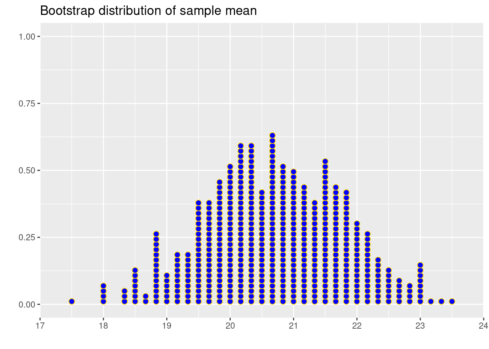
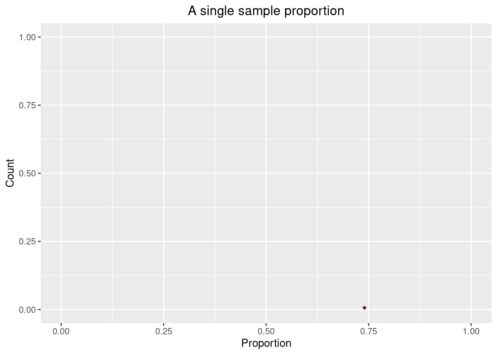
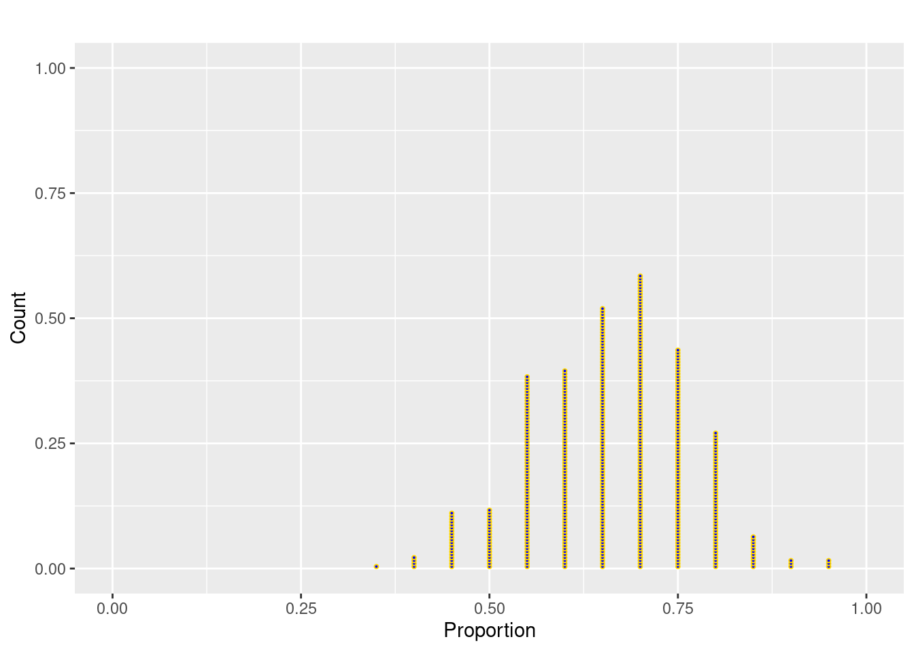
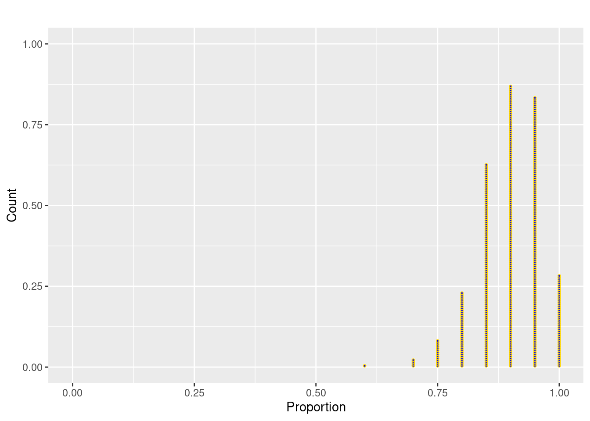

# Practice Problems 7


## Problem 1: Using Search Engines on the Internet

A 2012 survey of a random sample of 2253 US adults found that 1,329 of them reported using a search engine (such as Google) every day to find information on the Internet.  

### a).  Find the relevant proportion and give the correct notation with it.  

<details>
<summary><red>Click for answer</red></summary>
*Answer:* $\hat{p} = 1329/2253$


```r
p.hat <- 1329/2253
p.hat
```

```
[1] 0.5898802
```

</details><br>

### b).  Is your answer to part (a) a parameter or a statistic?  

<details>
<summary><red>Click for answer</red></summary>
*Answer:* Statistic
</details><br>

### c).  Give notation for and define the population parameter that we estimate using the result of part (a).

<details>
<summary><red>Click for answer</red></summary>
*Answer:* p = the proportion of all US adults that would report that they use an Internet search engine every day
</details><br>

## Problem 2: Bootstrapping mean

Let's visualize the distribution of the sample mean. The following is a vector X containing the $6$ data points:


```r
X <- c(20, 24, 19, 23, 22, 16)
mean(X)
```

```
[1] 20.66667
```


The bootstrap distribution from 500 bootstrap means from the above sample is:




*Question:* What does each dot represent?
<details>
<summary><red>Click for answer</red></summary>
*Answer:* One sample mean from the bootstrapped sample.
</details><br>
 *Question:* What is the shape of your sampling distribution?
<details>
<summary><red>Click for answer</red></summary>
*Answer:* Roughly symmetric.
</details><br>
*Question:* Where is your distribution centered?
<details>
<summary><red>Click for answer</red></summary>
*Answer:* About 20.5
</details><br>

*Question:* The distribution should be centered at the original sample mean. Do we know the population mean? If not, what does it tell us about the center of this distribution.
<details>
<summary><red>Click for answer</red></summary>
*Answer:* It is close to the original sample mean. We do not know the population mean, so the bootstrap distribution will carry the bias of the original sample mean.
</details><br>
*Question:* What is the standard deviation of this distribution? (Hint: use the 95% rule.) 
<details>
<summary><red>Click for answer</red></summary>
*Answer:* About 1.25, it looks like most of the bootstrapped sample means are between 18 to 23 so 2 standard deviations is about 2.5. This makes the SD about 1.25.
</details><br>
*Question:* The standard deviation of sampling distribution has a separate name. It is called the **Standard Error**. The standard deviation of this distribution is 1.1176842.
<details>
<summary><red>Click for answer</red></summary>
*Answer:* It's close.


</details><br>

## Problem 3: Simulation of a Sample Proportion

According to a PEW survey, $66\%$ of U.S. adult citizens casted a ballot in the 2020 election. Suppose we take a random sample of $n=100$ eligible U.S. voters and computed the sample proportion who voted. 


```r
# Define parameters
pop.prop <- .66 # Population proportion
n.size <- 100  # sample size
```

Let's plot this sample proportion in R.



Similarly, we can generate 5 random samples of size $n= 100$ and plot the sample proportions.


Continuing on, we can generate 500 random samples of size $n= 100$ and plot the sample proportions.


*Question:* What does each dot represent?
<details>
<summary><red>Click for answer</red></summary>
*Answer:* One sample proportion from a sample of n=100 eligible voters.
</details><br>
 *Question:* What is the shape of your sampling distribution?
<details>
<summary><red>Click for answer</red></summary>
*Answer:* Roughly symmetric.
</details><br>
*Question:* Where is your distribution centered?
<details>
<summary><red>Click for answer</red></summary>
*Answer:* About 0.66, which is the population proportion. 
</details><br>
*Question:* The distribution should be centered at the population proportion. Verify that the distribution is centered around the population proportion, $p = 0.66$. The mean of the sampling distribution of the proportion is 0.66298. 
<details>
<summary><red>Click for answer</red></summary>
*Answer:* The center of the distribution is close to 0.66.


```r
mean(sample.prop500)
```

```
[1] 0.66298
```


</details><br>

*Question:* What is the standard deviation of this distribution? (Hint: use the 95% rule.) 
<details>
<summary><red>Click for answer</red></summary>
*Answer:* About 0.05, it looks like most sample proportions are between 0.55 to 0.75 so 2 standard deviations is about 0.10. This makes the SD about 0.05. 
</details><br>
*Question:* The standard deviation of sampling distribution has a separate name. It is called the **Standard Error**. The standard deviation of this distribution is 0.0494673.
<details>
<summary><red>Click for answer</red></summary>
*Answer:*
The standard error is close.

</details><br>

### (d) Now, let's repeat part(c) with sample size 20 instead of 100 by generating and plotting 500 sample proportions.




*Question:*  How has the sampling distribution changed? (Shape? Center? Variability?)
<details>
<summary><red>Click for answer</red></summary>
*Answer:* The shape is slightly left skewed, still centered at 0.66 but with more variability that before (SD of about 0.10). This distribution is more discrete looking because there are just a few sample proportions possible with n=20 (e.g. 20/20, 19/20, 18/20, etc). 


```r
mean(sample.prop500_size10)
```

```
[1] 0.6603
```

```r
sd(sample.prop500_size10)
```

```
[1] 0.1024202
```

</details><br>

### (d) Now suppose the population proportion is $p=0.90$ instead of $p=0.66$ in part (e). Keep `n=20`. 



*Question:* How has the sampling distribution changed? (Shape? Center? Variability?)
<details>
<summary><red>Click for answer</red></summary>
*Answer:*  The shape is much more left skewed than when p=0.66. Center is around 0.90 and SD is around 0.07. Note that increasing the population proportion closer to 1 results in a decrease in the SD because most samples give proportion near 1.  


```r
mean(sample.prop500_size10_large_p)
```

```
[1] 0.8989
```

```r
sd(sample.prop500_size10_large_p)
```

```
[1] 0.06412499
```

</details><br>

