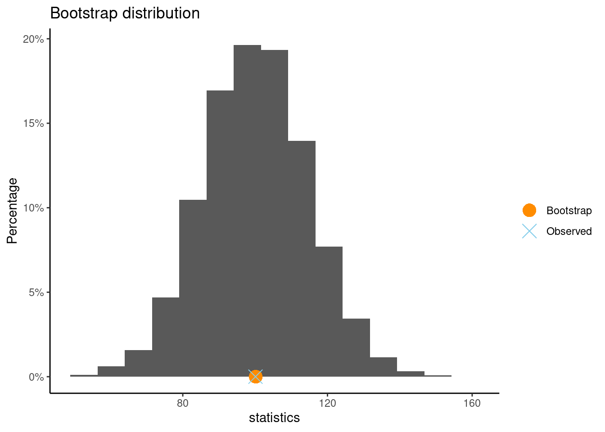
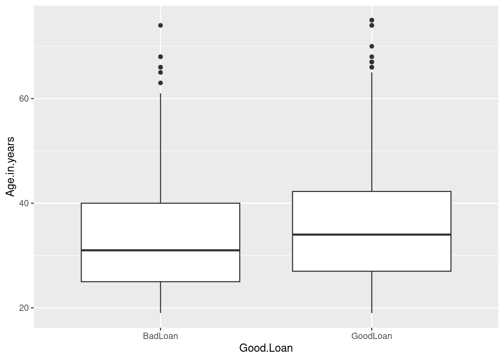
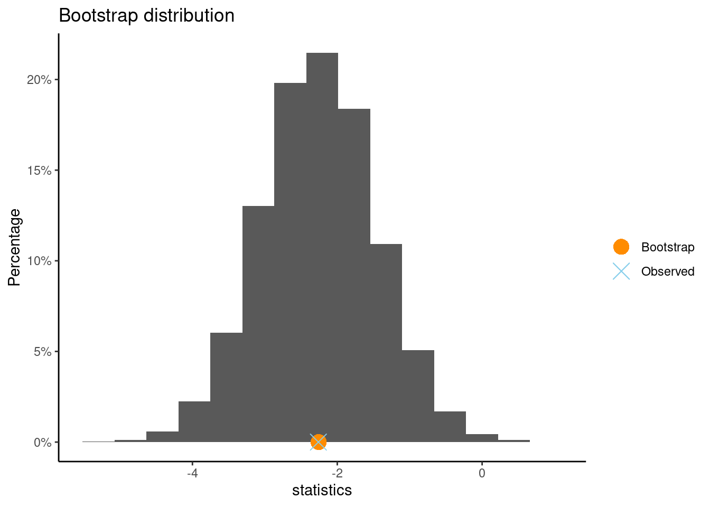

# Practice Problems 8

## Problem 1: Textbook Prices

Prices of a random sample of 10 textbooks (rounded to the nearest dollar) are shown:

$$ \$132 \quad \$87 \quad \$185 \quad \$52 \quad \$23 \quad \$147 \quad \$125 \quad \$93 \quad \$85 \quad \$72 $$ 

### (a). What is the sample mean? Verify using r-code.

<details>
<summary><red>Click for answer</red></summary>
*Answer:*  The sample mean is $\bar{x} = 100.1$
</details><br>


```r
prices <- c(132,87, 185, 52, 23, 147, 125, 93, 85, 72)
mean(prices)
```

```
[1] 100.1
```


### (b).  Describe carefully how we could use cards to create one bootstrap statistic from this sample.  Be specific.

<details>
<summary><red>Click for answer</red></summary>

*Answer:* We use 10 cards and write the 10 sample values on the cards. We then mix them up and draw one and record the value on it and put it back. Mix them up again, draw another, record the value, and put it back. Do this 10 times to get a “with replacement” sample of size 10. Then compute the sample mean of this bootstrap sample.

</details><br>


### (c). We can easily instruct R to do this with a simple code provided below. Will the mean of this resample be same as the original sample? What about the standsrd deviation?


```r
resample <- sample(prices, replace = TRUE)
resample
```

```
 [1]  72  23  85 147 185  72  72 132  85 185
```


Will the mean of this resample be same as the original sample? What about the standard deviation?

<details>
<summary><red>Click for answer</red></summary>

*Answer:* The mean of the resample, created using bootstrapping, could be the same, more than, or less than the mean of the original sample, depending on which values are randomly chosen during the resampling process. Bootstrapping involves randomly selecting observations from the original sample with replacement, so there's a chance the resample might have more of the higher values, more of the lower values, or a mix similar to the original sample.

As for the standard deviation, it also depends on the composition of the resampled data. If the resample ends up with values that are close to each other (less variability), its standard deviation might be lower than the original sample. Conversely, if the resample has a wider spread of values, the standard deviation could be higher. However, over many bootstrap samples, the average standard deviation will tend to be close to the standard deviation of the original sample.

</details><br>


### (d). Where will be bootstrap distribution be centered?  What shape do we expect it to have?

<details>
<summary><red>Click for answer</red></summary>

*Answer:* It will be centered approximately at the sample mean of 100.1 and we expect it to be roughly bellshaped (it may be a bit skewed since the sample size of 10 is smallish).

</details><br>


### (e). The function `boot` from `CarletonStats` R package creates a bootstrap distribution from the original sample of 10 textbook prices. What is the standard error of this bootrtrap distribution. Will this standard error be smaller or larger than the standard deviation of the original sample? Explain.


```r
library(CarletonStats)
boot(prices)
```

```

	** Bootstrap interval for mean 

 Observed  prices : 100.1 
 Mean of bootstrap distribution: 100.1627 
 Standard error of bootstrap distribution: 14.47578 

 Bootstrap percentile interval
    2.5%    97.5% 
 72.0000 128.6025 

		*--------------*
```




<details>
<summary><red>Click for answer</red></summary>

*Answer:* This standard error will typically be smaller than the standard deviation of the original sample because the standard error is estimating the variability of the sample mean, not individual observations. The sample mean tends to have less variability than individual data points, especially when averaged across multiple samples.

</details><br>

----------------------------------------------------------------

## Problem 2:  Statkey Atlanta Commute Distance

Go to the website at [Lock5Statkey](http://www.lock5stat.com/StatKey/).  Under the “Bootstrap Confidence Intervals” column, select the “CI for Single Mean, Median, St.Dev”. Change the data set to Atlanta Commute (Distance). This data set gives a random sample of 500 worker commute distances (miles) for metropolitan Atlanta

### (a). Use the “Original Sample” pane to determine the shape of these 500 commuter distances, along with their mean and standard deviation. Write down these stats using correct notation.

<details>
<summary><red>Click for answer</red></summary>

*Answer:*  The sample mean is $\bar{x} = 18.16$  and the sample standard deviation is $s = 13.798$.

</details><br>

### (b). Click “Generate 1 Sample” to create one bootstrap sample from this data. Explain how this sample was generated. Use the “Bootstrap Sample” pane to find the bootstrap statistic that was computed from this sample. What value is this bootstrap statistic? Repeat this a couple times.  

<details>
<summary><red>Click for answer</red></summary>
*Answer:*  The bootstrap sample was obtained by resampling from the 500 observed commute distances with
replacement. Basically we randomly select 500 distances from the data (with replacement).

The value of the bootstrap mean will vary.
</details><br>

### (c). Now click the “Generate 1000 Samples” to get 1000 bootstrap sample means. Is the bootstrap distribution centered at the population or sample mean commute distance?

<details>
<summary><red>Click for answer</red></summary>
*Answer:* The bootstrap distribution is always centered around the statistic that is being bootstrapped. Here it will be centered around the sample mean commute distance of about 18.16 miles. The population mean
commute distance is unknown!


</details><br>

### (d). What is the bootstrap SE for the sample mean?  
<details>
<summary><red>Click for answer</red></summary>
*Answer:* The standard error from the bootstrap distribution is about 0.628.
</details><br>

### (e). Compute a 95% confidence interval for the average commute distance in metropolitan Atlanta.  
<details>
<summary><red>Click for answer</red></summary>
*Answer:* The sample mean is $\bar{x} = 18.16$ and the standard error from the bootstrap distribution is about 0.618 so we compute the $95\%$ confidence interval using $18.16 \pm 2(0.628)$, giving an interval of 16.90 to 19.42 miles.
</details><br>

### (f). Interpret your answer to (e) in context.  
<details>
<summary><red>Click for answer</red></summary>
*Answer:* We are 95% confident that the average commuting distance in metropolitan Atlanta is between 16.90 and 19.42 miles.
</details><br>

------------------------------------------------------------------------------------

## Problem 3: Statkey Global Warming

What percentage of Americans believe in global warming?  A survey on 2,251 randomly selected individuals
conducted in October 2010 found that 1,328 answered Yes to the question “Is there solid evidence of global
warming?”   To compute a bootstrap confidence interval for the proportion of all Americans who believe in
global warming, go to the website at [Lock5Statkey](http://www.lock5stat.com/StatKey/).  Under the “Bootstrap Confidence Intervals” column, select the “CI for Single Proportion”.


### (a). Enter the data for this survey by clicking the “Edit Data” button. Enter 2251 as the sample size and 1328 as the count. What is the sample proportion of people who believe in global warming? Use correct notation!

<details>
<summary><red>Click for answer</red></summary>
*Answer:* The sample proportion is $\hat{p} = 0.59$.
</details><br>

### (b). Generate 1 bootstrap sample. Explain how this sample was generated. Use the “Bootstrap Sample” pane to find the bootstrap statistic that was computed from this sample. What value is this bootstrap statistic? Repeat this a couple times.  

<details>
<summary><red>Click for answer</red></summary>
*Answer:* The bootstrap sample was obtained by resampling the observed answers (“yes” and “no”) to the global warming question with replacement. Answers will vary for the bootstrap statistic (proportion)
</details><br>


### (c). Generate 1000 samples to get 1000 bootstrap sample proportions. Is the bootstrap distribution centered at the population or sample proportion? Describe the shape and center of this bootstrap distribution

<details>
<summary><red>Click for answer</red></summary>
*Answer:* The shape is symmetric around a center value of about 0.59, which is the sample proportion not the population proportion (which is unknown).


</details><br>


### (d). Compute a 95% confidence interval for the proportion of Americans who believe in global warming

<details>
<summary><red>Click for answer</red></summary>
*Answer:* The sample proportion is $\hat{p} = 0.59$ and the standard error from the bootstrap distribution is 0.010 so we compute the 95% confidence interval using $0.590 \pm 2(0.010),$ giving an interval of 0.57 to 0.61.
</details><br>

### (e). Interpret your interval from part (d).  

<details>
<summary><red>Click for answer</red></summary>
*Answer:* We are 95% confident that the proportion of Americans who believe there is solid evidence of global warming is between 0.57 and 0.61.
</details><br>

### (f). Does this data support a claim that a majority of Americans believe there is solid evidence of global warming? Explain.
<details>
<summary><red>Click for answer</red></summary>
*Answer:* Yes, the data does support this claim since we are confident that at least 50% of Americans believe in global warming since the lower bound on the CI is 57%. 

</details><br>

------------------------------------------------------------------------------------

## Problem 4. Statkey Global Warming by Political Party

Does belief in global warming differ by political party?  When the question “Is there solid evidence of global warming?” was asked, the sample proportion answering “yes” was 79% among Democrats and 38% among
Republicans.  To compute a bootstrap confidence interval for the difference in the proportion of Democrats
and Republicans who believe in global warming, go to the website  at [Lock5Statkey](http://www.lock5stat.com/StatKey/).  Under the “Bootstrap Confidence Intervals” column, select the “CI for Difference in Proportions”.

### (a). Enter the data for this survey by clicking the “Edit Data” button. One big assumption we will make is that the sample sizes for both groups (Dems and Reps) were each 1000. Enter the Democrat data into the “Group 1” boxes (count of 790 and size of 1000) and the Republican data into the “Group 2” boxes (count of 380 and size of 1000). Verify that the sample proportions for the two groups are 79% and 38%. What is the difference in the two sample proportions? Use correct notation.

<details>
<summary><red>Click for answer</red></summary>
*Answer:* The sample difference in proportions is $\hat{p}_{Dem} - \hat{p}_{Rep} = 0.79 - 0.38 = 0.41$
</details><br>

### (b). Generate 1 bootstrap sample. Explain how this sample was generated (give this some thought now that you have two samples of data). Use the “Bootstrap Sample” pane to find the bootstrap statistic that was computed from this sample. What value is this bootstrap statistic? Repeat this a couple times.

<details>
<summary><red>Click for answer</red></summary>
*Answer:* One bootstrap sample was obtained from the group 1 sample (resampling the observed “believe/not believe” responses with replacement) and a separate bootstrap sample was obtained from the group 2 sample. The difference in the bootstrap proportions for each group was computed for the bootstrap difference statistic.

For individual bootstrap samples: answers will vary.
</details><br>

### (c). Generate 1000 samples to get 1000 bootstrap sample proportion differences. Describe the shape and center of this bootstrap distribution

<details>
<summary><red>Click for answer</red></summary>
*Answer:* The shape is symmetric around a center value of about 0.41 (the sample difference in proportions).


</details><br>


### (d). Compute a 95% confidence interval for the difference between the proportion of Democrats and Republicans who believe in global warming.

<details>
<summary><red>Click for answer</red></summary>
*Answer:*
The sample difference in proportions is $\hat{p}_{Dem} - \hat{p}_{Rep} = 0.79 - 0.38 = 0.41$, the standard error from the bootstrap distribution is 0.020 so we compute the 95% confidence interval using $0.41 \pm 2(0.020)$ giving an interval of 0.37 to 0.45.
</details><br>

### (e). Interpret your interval from part (d) in context and without using the word difference!! (i.e. give a directional claim that uses words like “more” or “less”)  

<details>
<summary><red>Click for answer</red></summary>
*Answer:* We are 95% confident that the percent of Democrats who believe there is solid evidence of global warming is between 37 and 45 percentage points higher than the percent of Republicans who believe this.
</details><br>

### (f). To compute this interval, we assumed that 1000 people were sampled from each subpopulation (Dems and Reps). Suppose this sample size was just 500 people for each group. Would your 95% confidence interval be wider or shorter than the one computed in part (d)? Explain.

<details>
<summary><red>Click for answer</red></summary>
*Answer:* With fewer people in each group, we will get a larger bootstrap SE and hence a larger margin of error for the CI. Remember that the SE of a sampling distribution gets smaller as the sample size increases, the same behavior is seen in a bootstrap distribution.
</details><br>


---------------------------------------------------------------------------------------

## Problem 5: Credit Loan Data

The data set `CreditData.csv` contains records for 1000 loans that either defaulted (BadLoan) or did not default (GoodLoan). There are 300 loans that defaulted and 700 that did not. Let’s consider that the 300 loans that defaulted are random sample of loans that default and the 700 non-defaulting loans are a random sample of loans that don’t default.


```r
credit <- read.csv("https://raw.githubusercontent.com/deepbas/statdatasets/main/CreditData.csv")
table(credit$Good.Loan)
```

```

 BadLoan GoodLoan 
     300      700 
```


### (a) Visualize age vs. default

The variable `Age.in.years` gives the age of the person who received the loan. Construct a side-by-side boxplot of age by `Good.Loan` and compute the sample means for each group. 


```r
# Boxplot using ggplot2
ggplot(credit, aes(x = Good.Loan, y = Age.in.years)) +
  geom_boxplot()
```



```r
# Mean age for each Good.Loan category using dplyr
credit %>%
  group_by(Good.Loan) %>%
  summarize(mean_age = mean(Age.in.years))
```

```
# A tibble: 2 × 2
  Good.Loan mean_age
  <chr>        <dbl>
1 BadLoan       34.0
2 GoodLoan      36.2
```

- What are the mean ages in each group? 
<details>
<summary><red>Click for answer</red></summary>
*Answer:* 34.0 years for the bad loan group and 36.2 years for the good loan group.
</details>

- Describe the distribution of ages in each group. Are there any outliers that could be overly influential on the value(s) of the sample mean(s)?
<details>
<summary><red>Click for answer</red></summary>
*Answer:* Both age distributions are somewhat right skewed with a few outliers identified by the boxplot rule. But there aren't any extremely unusual cases.
</details>

#### (b) Bootstrap CI for a difference in means

The `boot(y ~ x, data=)` command  generates 10000 bootstrap samples for the true difference in means of `y` for each of the two groups in `x`. The command is contained in the `CarletonStats` package. Here we use it to compute the bootstrap distribution for the difference in mean ages of the two default groups:


```r
library(CarletonStats)
boot(Age.in.years ~ Good.Loan, data=credit)
```

```

	** Bootstrap interval for difference of mean 

 Observed difference of mean : BadLoan - GoodLoan = -2.26095 
 Mean of bootstrap distribution: -2.25718 
 Standard error of bootstrap distribution: 0.79433 

 Bootstrap percentile interval
      2.5%      97.5% 
-3.8166667 -0.6999048 

		*--------------*
```



- Give the difference in sample mean ages reported by the output. Use correct notation.
<details>
<summary><red>Click for answer</red></summary>
*Answer:* The average age of people with a bad loan is about 2.3 years less than the average age of people with a good loan.
</details>


- Give the 95% confidence interval for the  difference in mean ages using the percentile method 
<details>
<summary><red>Click for answer</red></summary>
*Answer:* The percentile interval is -3.8 to -0.7 years. 
</details>


- Compute the 95% confidence interval for the  difference in mean ages using the bootstrap SE. Is it similar to the CI from the percentile method?

<details>
<summary><red>Click for answer</red></summary>
*Answer:* The CI using the SE is -3.8 to -0.7. The intervals are very similar.

$$
-2.26095 \pm 2(0.77852) = (-3.81799,  -0.70391)
$$


```r
-2.26095 - 2*(0.77852)
```

```
[1] -3.81799
```

```r
-2.26095 + 2*(0.77852)
```

```
[1] -0.70391
```


</details>

#### (c) Interpret

Interpret your percentile interval in context using a directional statement. Does this interval suggest that the mean ages differ in the population of all good and bad loan holders?
<details>
<summary><red>Click for answer</red></summary>
*Answer:* We are 95% confident that the mean age of people who default on a loan for this population is about 0.7 to 3.8 years less than the mean age of people who do not default. This interval does support the notation that there is a difference in mean ages of these two groups in the population. It suggests that the average age of people who default is less than the average age of those who don't.
</details>

## Problem 6 : Credit data continued 

The variable `Telephone` tells us if the individual has a phone number on their loan file. Let's look at the proportion of individuals who have a phone number for each type of loan (default or not).

#### (a) Data clean up
The entries in the `Telephone` column are either `none` or `yes, registered under the customers name`.


```r
table(credit$Telephone)
```

```

                                    none 
                                     596 
yes, registered under the customers name 
                                     404 
```


```r
# Modify the Telephone variable levels using dplyr and forcats
credit <- credit %>%
  mutate(Telephone = recode(Telephone,
                            "none" = "no",
                            "yes, registered under the customers name" = "yes"))
# Convert the Telephone variable to a factor
credit$Telephone <- as.factor(credit$Telephone)
# Display the levels of the modified Telephone variable
levels(credit$Telephone)
```

```
[1] "no"  "yes"
```


#### (b) Phone rate by default type

Here we get the distribution of phone numbers (yes or no) by default type (good vs bad loan):


```r
prop.table(table(credit$Good.Loan, credit$Telephone),1)
```

```
          
                  no       yes
  BadLoan  0.6233333 0.3766667
  GoodLoan 0.5842857 0.4157143
```

```r
library(ggplot2)
ggplot(credit, aes(x=Good.Loan, fill=Telephone)) + geom_bar(position="fill")
```


- What proportion of bad loans have a phone number on the account?
<details>
<summary><red>Click for answer</red></summary>
*Answer:* About 37.7% of bad loans have a phone number.
</details>

- What proportion of good loans have a phone number on the account?
<details>
<summary><red>Click for answer</red></summary>
*Answer:* About 41.6% of good loans have a phone number.
</details>

- What is the sample difference in the proportion of good loans and bad loans that have a phone number? Use correct notation for this number. 
<details>
<summary><red>Click for answer</red></summary>
*Answer:* Here we get $\hat{p}_{good} - \hat{p}_{bad} =0.4157143 - 0.3766667 = 0.0390476$. 


```r
0.4157143 - 0.3766667
```

```
[1] 0.0390476
```

</details>

#### (c) Using the `boot` command with a categorical response

In order to get the bootstrap distribution for the sample difference in proportions, we need to recode the "response" variable `Telephone` to have a 1 indicating a "yes" response and 0 indicating a "no" response. This is done with an `ifelse` command:


```r
credit$Telephone_binary<- ifelse(credit$Telephone == "yes", 1, 0)
head(credit[,c("Telephone", "Telephone_binary")])
```

```
  Telephone Telephone_binary
1       yes                1
2        no                0
3        no                0
4        no                0
5        no                0
6       yes                1
```

which reads "if `Telephone` equals `yes` than assign a `1`, else assign a 0". These 0's and 1's are assigned to a variable called `Telephone_binary` that is now in your data frame (checked this with the `View(credit)` command). 

Check your work to make sure `Telephone_binary` records what you want it to record


```r
table(credit$Telephone)
```

```

 no yes 
596 404 
```

```r
table(credit$Telephone_binary)
```

```

  0   1 
596 404 
```

The mean of the 0/1  coded variable computes the proportion of "yes" responses:


```r
mean(credit$Telephone_binary)
```

```
[1] 0.404
```

```r
404/1000  # proportion of yes
```

```
[1] 0.404
```


Note: All examples in your **Lab Manual** already have this 0/1 recoding done in the lab manual data sets. But I thought you might want to learn how to do this recoding in case you plan to use this command with other, non-lab manual data sets!


#### (d) 95% confidence interval for the difference in phone

We can now use the 0/1 version of telephone in the `boot` command (like example 1) to compute a 95% bootstrap confidence interval for the difference in the population proportion of good loans and bad loans that have a phone number.


```r
boot(Telephone_binary ~ Good.Loan, data=credit)
```

```

	** Bootstrap interval for difference of mean 

 Observed difference of mean : BadLoan - GoodLoan = -0.03905 
 Mean of bootstrap distribution: -0.0391 
 Standard error of bootstrap distribution: 0.03379 

 Bootstrap percentile interval
       2.5%       97.5% 
-0.10476190  0.02666667 

		*--------------*
```


**Even though the language used in the output says "statistic" we are computing a difference in "proportions"!!**

- Give the 95% confidence interval for the difference in the population proportion of bad loans and good loans that have a phone number using the percentile method 
<details>
<summary><red>Click for answer</red></summary>
*Answer:* The percentile interval for Bad $-$ Good is -0.105 to 0.028. 
</details>


- Give the 95% confidence interval for the difference in the population proportion of bad loans and good loans that have a phone number using the bootstrap SE. Is it similar to the CI from the percentile method?
<details>
<summary><red>Click for answer</red></summary>
*Answer:* The SE method gives an interval for Bad $-$ Good of -0.107 to 0.028 which is very similar to the percentile interval.


```r
-0.03905 - 2* 0.03373 
```

```
[1] -0.10651
```

```r
-0.03905 + 2* 0.
```

```
[1] -0.03905
```

</details>


#### (e) Interpret

Interpret your percentile interval in context using a directional statement. Does this interval suggest that there is a difference in the percentage of bad loan holders who provided a phone number comapared to the percetage of good loan holders who gave a number? Explain.
<details>
<summary><red>Click for answer</red></summary>
*Answer:* We are 95% confident that the percentage of good loan accounts with a phone number is anywhere from 10.7 percentage points higher than to 2.8 percentage points less than the percentage of bad loans with a phone number. 
</details>


